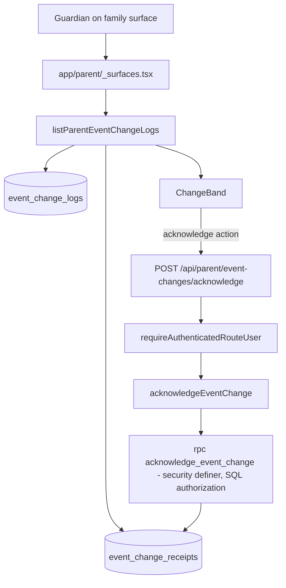

# Event Change Acknowledgment Design Document

## Overview

Replace the device-local `localStorage` watermark that drives the family "What changed" band with
server-side, per-guardian, per-change receipts, and add explicit acknowledgment for high-impact
schedule changes.

### Referenced UI Spec

None. This changes the state source and adds one control to an existing, already-accepted surface
(`components/family/change-band.tsx`, accepted under LP-UX-002 Saturday Ready). A UI Spec is not
created because no new screen, transition, or component decomposition is introduced.

## Design Summary (Meta)

| Field | Value |
| --- | --- |
| Feature | Server-side event change receipts and acknowledgment |
| Trigger | condition "storage location change" |
| Prerequisite ADR | `docs/adr/0002-server-side-event-change-receipts.md` (Accepted) |
| Approach | Vertical slice |
| Files touched | 6 source + 5 test (estimate) |
| Status snapshot | Implemented locally, merged to `origin/main` at `37cbfea`, and production migration `20260819084447_event_change_receipts.sql` applied/read back on 2026-08-19; explicit human production acceptance remains separate |
| Provider dependency | None. Independent of `DEC-PROVIDER` / `EXT-PROVIDER-SENDS`. |
| Domain dependency | None. No change to `lib/domain/`. |

## Background and Context

### Prerequisite ADRs

- ADR 0001 — Human-In-The-Loop Agents. Acknowledgment is a deliberate human action; nothing
  auto-acknowledges on a family's behalf.
- ADR 0002 — Server-Side Event Change Receipts. Establishes the table, the SQL-authorized RPC, and
  the derived (not stored) acknowledgment requirement.

### External Resources Used

None. No new dependency, provider, or external API.

### Agreement Checklist

#### Scope

- [x] Add `public.event_change_receipts` and its RLS policies
- [X ] Add a `security definer` RPC recording seen and acknowledged state with SQL authorization
- [X ] Extend `listParentEventChangeLogs` to return receipt state per change
- [X ] Replace the `localStorage` watermark in `ChangeBand` with server state
- [X ] Add an explicit acknowledgment control for high-impact change types
- [ X] Add a route for the acknowledgment write

#### Non-Scope (Explicitly not changing)

- [X ] `event_change_logs` schema, including its `change_type` check constraint
- X[ ] The write path in `lib/supabase/schedule-management.ts:722`
- [X ] Diff extraction, field labels, and formatting in `lib/supabase/event-change-log-reads.ts:108-125`
- [ X] Visual design, layout, or copy of the change band beyond the added control
- [X ] Anything in `lib/domain/`
- [ X] Provider delivery of any kind

#### Constraints

- [X ] Parallel operation: Yes — `localStorage` may remain an optimistic hint during rollout
- X[ ] Backward compatibility: Required — a guardian with no receipt rows sees all changes, as today
- [X ] Performance measurement: Not required — bounded by the existing limit of at most 50 changes

#### Applicable Standards

- X[X ] Migration filename `YYYYMMDDHHMMSS_description.sql` `[explicit]` — Source: `supabase/CLAUDE.md`
- [X ] RLS enabled with named policies on every new table `[explicit]` — Source: `supabase/CLAUDE.md`, enforced by `supabase/rls-policy.test.ts`
- [X ] `security definer` + `set search_path = public` + revoke from `public, anon` `[explicit]` — Source: `20260726143938_restrict_rls_helper_execution.sql`
- [ X] No Supabase client in UI `[explicit]` — Source: `docs/codex-rules.md` rule 4
- [ X Engagement records use `unique (subject_id, parent_user_id)` `[implicit]` — Evidence: `0023_operational_truth_hardening.sql:113-124` — Confirmed: Yes
- [X ] Acknowledgment RPCs are idempotent and return the original timestamp `[implicit]` — Evidence: `0024_coordination_loops.sql:888-898` — Confirmed: Yes

#### Assumed Behaviors

- [ ] `event_change_logs.change_type` is constrained to exactly `created`, `time_changed`, `location_changed`, `cancelled`, `completed`, `restored` — Evidence: `0002_platform_hardening.sql:156` — Confirmed: Yes
- [ ] `listParentEventChangeLogs` already resolves guardian-linked children and returns `childIds` — Evidence: `lib/supabase/event-change-log-reads.ts:80-92,136-144` — Confirmed: Yes
- [ ] The read path uses the service-role admin client, so RLS is not currently the enforcing layer here — Evidence: `lib/supabase/event-change-log-reads.ts` `dbClient()` — Confirmed: Yes
- [ ] `requireAuthenticatedRouteUser` is the established route auth helper — Evidence: `app/api/notifications/acknowledge/route.ts:5` — Confirmed: Yes
- [ ] The watermark advances inside `useEffect` on render rather than on user action — Evidence: `components/family/change-band.tsx:37-48` — Confirmed: Yes

#### Quality Assurance Mechanisms

- [X ] `npm run typecheck` — Enforces: type contracts — Config: `tsconfig.typecheck.json` — Covers: project-wide — Status: `adopted`
- [X ] `npm test` — Enforces: unit and policy assertions — Config: `vitest.config.ts` — Covers: project-wide — Status: `adopted`
- [X ] `supabase/rls-policy.test.ts` — Enforces: literal policy names exist in migrations — Covers: `supabase/migrations/*` — Status: `adopted`
- [ X] `npm run qa:rls-proof` — Enforces: RLS boundary proof — Config: `scripts/verify-rls-boundaries.mjs` — Covers: policy boundaries — Status: `adopted`
- [X ] `npm run lint` — Enforces: ESLint rules — Config: `eslint.config.mjs` — Covers: project-wide — Status: `adopted`
- [ ] Executed 403-denial test for the new write — Enforces: actual denial, not policy existence — Status: `adopted` (addresses the "four denial tests repo-wide" finding in `05-saturday-ready-current-state.md`)

### Problem to Solve

A guardian cannot rely on the "What changed" band, and the organization cannot prove a family saw a
change that affects where a child must be and when.

### Current Challenges

1. Awareness state is stored in `window.localStorage`, so it does not follow the guardian across
   devices (`components/family/change-band.tsx:44-46`).
2. The watermark advances on render rather than on a human action, so "seen" is not evidence.
3. No record exists that any family member saw a time, venue, or cancellation change.
4. Storage failure is silently swallowed, leaving the band in a state nobody can reason about
   (`components/family/change-band.tsx:46-48`).

### Requirements

#### Functional Requirements

- FR-1: Receipt state persists server-side per guardian per change and is returned with the read.
- FR-2: High-impact changes require an explicit human acknowledgment action.
- FR-3: Informational changes are marked seen without requiring an action.
- FR-4: A guardian may only record receipts for changes affecting their linked children.

#### Non-Functional Requirements

- NFR-1: The acknowledgment write is idempotent.
- NFR-2: A receipt failure never breaks the read surface.
- NFR-3: Authorization is enforced in SQL, not only in the route.
- NFR-4: The read adds at most one query to the existing path.

## Acceptance Criteria (AC) - EARS Format

### FR-1 Persistent receipt state

- [x] AC-001 — **When** a guardian loads the family surface on any device, the system shall show the
      same seen and acknowledged state for each change.
- [x] AC-002 — **If** a guardian has no receipt rows for a change, **then** the system shall present
      that change as unseen.
- [x] AC-003 — **While** the receipt query fails, the system shall render every change as unconfirmed
      and shall not error the surface.

### FR-2 Explicit acknowledgment

- [x] AC-004 — **When** a change has type `time_changed`, `location_changed`, or `cancelled`, the
      system shall present an acknowledgment control and shall not mark it acknowledged without
      activation.
- [x] AC-005 — **When** a guardian activates the acknowledgment control, the system shall persist
      `acknowledged_at` and reflect it without a full page reload.
- [x] AC-006 — **If** the same change is acknowledged again, **then** the system shall return the
      original timestamp and shall not create a second row.

### FR-3 Informational changes

- [x] AC-007 — **When** a change has type `created`, `completed`, or `restored`, the system shall
      record `seen_at` without presenting an acknowledgment control.

### FR-4 Scope enforcement

- [x] AC-008 — **If** a guardian submits a change id for a child they are not linked to, **then** the
      system shall deny the write and record no row, proven by an executed denial test.
- [x] AC-009 — (ubiquitous) The system shall never expose another family's receipt state.

## Existing Codebase Analysis

### Implementation Path Mapping

| Concern | Existing path | Disposition |
| --- | --- | --- |
| Change log write | `lib/supabase/schedule-management.ts:722` | Unchanged |
| Change log schema | `supabase/migrations/0002_platform_hardening.sql:150-161` | Unchanged |
| Change read + diffs | `lib/supabase/event-change-log-reads.ts` (360 lines) | Extended |
| Family surface data load | `app/parent/_surfaces.tsx:18,54` | Extended |
| Band rendering + watermark | `components/family/change-band.tsx` (133 lines) | Modified |
| Storage key construction | `components/parent-weekly-dashboard.tsx:270-276` | Removed as source of truth |
| Acknowledgment precedent | `lib/supabase/notification-receipts.ts:431`, `app/api/notifications/acknowledge/route.ts` | Pattern reused, not modified |
| Engagement-record precedent | `supabase/migrations/0023_operational_truth_hardening.sql:113-124` | Pattern reused |

### Integration Points

1. New migration → `supabase/migrations/` timestamped chain.
2. New RPC → called only from the new service module.
3. New service module → called only from the new route and the extended read.
4. New route → `app/api/parent/event-changes/acknowledge/route.ts`, guarded by `requireAuthenticatedRouteUser`.
5. `ChangeBand` → receives receipt state as props and calls the route; it imports no Supabase client.

### Code Inspection Evidence

| File | Lines inspected | Finding |
| --- | --- | --- |
| `supabase/migrations/0002_platform_hardening.sql` | 150-161, 367, 395, 481-484 | Table, index, RLS, and both policies exist |
| `supabase/migrations/0023_operational_truth_hardening.sql` | 105-141 | `parent_replay_engagement` shape; `acknowledged_at` added to delivery attempts |
| `supabase/migrations/0024_coordination_loops.sql` | 714, 854, 888-898 | Change-log insert inside RPC; idempotent acknowledgment precedent |
| `lib/supabase/event-change-log-reads.ts` | 80-145, 227 | Result contract, allowed-field map, admin client, `event_change_logs` query |
| `components/family/change-band.tsx` | 1-48, 110 | `useSyncExternalStore` watermark, render-time advance, swallowed failure |
| `components/parent-weekly-dashboard.tsx` | 202, 270-276, 365-379 | Storage key composition and `onVisibleChanges` wiring |
| `app/api/notifications/acknowledge/route.ts` | 1-23 | Route auth and delegation shape to copy |

### Fact Disposition Table

| Prior claim | Source | Disposition |
| --- | --- | --- |
| "`event_change_logs` is write-only; highest-leverage single upgrade" | `docs/product-experience/leaguepilot/00-engagement-status.md` | **Stale.** A full read path with field-level diffs exists and is wired to the family surface. Superseded by this document. |
| "What Changed is version-derived" | same | Accurate for derivation; awareness state is separate and is what this design addresses. |

## Design

### Change Impact Map

```yaml
Change Target: Family event-change awareness state
Direct Impact:
  - supabase/migrations/20260819084447_event_change_receipts.sql
  - lib/supabase/event-change-receipts.ts (new)
  - lib/supabase/event-change-log-reads.ts
  - app/api/parent/event-changes/acknowledge/route.ts (new)
  - components/family/change-band.tsx
  - components/parent-weekly-dashboard.tsx
Indirect Impact:
  - app/parent/_surfaces.tsx (passes receipt state through)
  - One additional query on family surface load
No Ripple Effect:
  - lib/domain/* (untouched)
  - schedule-management write path
  - notification receipts and official communications
  - coach and admin surfaces
  - provider delivery (independent of DEC-PROVIDER)
```

### Interface Change Matrix

| Existing | New | Conversion Required | Compatibility Method |
| --- | --- | --- | --- |
| `ParentEventChange` | adds `seenAt`, `acknowledgedAt`, `requiresAcknowledgment` | No | Additive optional-safe fields; existing consumers ignore them |
| `ChangeBand({changes, querySucceeded, storageKey, timeZone, onVisibleChanges})` | `storageKey` removed; `onAcknowledge` added | Yes | Single call site (`parent-weekly-dashboard.tsx:376`) updated in the same commit |
| none | `acknowledgeEventChange({parentUserId, eventChangeLogId})` | No | New |

### Architecture Overview



### Data Flow

1. Surface load resolves the session guardian and calls the extended read.
2. The read fetches changes as today, then fetches that guardian's receipts for those change ids.
3. Each change is returned with `seenAt`, `acknowledgedAt`, and derived `requiresAcknowledgment`.
4. Rendering a change records `seen_at`; only activation of the control records `acknowledged_at`.
5. The RPC re-derives guardian scope in SQL and rejects anything outside it.

### Data Representation Decision

`public.event_change_receipts`:

| Column | Type | Note |
| --- | --- | --- |
| `id` | uuid pk default `gen_random_uuid()` | |
| `event_change_log_id` | uuid not null → `event_change_logs(id)` on delete cascade | |
| `parent_user_id` | uuid not null → `profiles(id)` on delete cascade | |
| `organization_id` | uuid not null → `organizations(id)` on delete cascade | Tenant column, matching `event_change_logs` |
| `seen_at` | timestamptz | |
| `acknowledged_at` | timestamptz | |
| `created_at` / `updated_at` | timestamptz not null default `now()` | |
| | `unique (event_change_log_id, parent_user_id)` | Mirrors `parent_replay_engagement` |

Acknowledgment requirement is **derived** from `change_type`, not stored. This is deliberate: storing
it would create a second source of truth and would edge toward a new workflow state, which
`docs/codex-rules.md` rule 5 forbids without explicit approval.

### State Transitions and Invariants

```
(no row) --render--> seen_at set
seen_at set --activate control--> acknowledged_at set
acknowledged_at set --activate again--> unchanged (returns original timestamp)
```

- Invariant: `acknowledged_at` is never set without `seen_at`.
- Invariant: neither timestamp is ever cleared or moved backward.
- Invariant: at most one row per `(event_change_log_id, parent_user_id)`.
- These are timestamps on a receipt record, not states on the event lifecycle. No event workflow
  state is added.

### UI Error State Design

| Condition | Presentation |
| --- | --- |
| Receipt query fails | Existing warning band retained; changes render as unconfirmed; no acknowledgment control |
| Acknowledgment POST fails | Inline retry on the row; band content unchanged; polite `role="status"` announcement, matching `parent-weekly-dashboard.tsx:367` |
| Acknowledgment offline | Control disabled with explanation; no optimistic success |

### Client State Design

`ChangeBand` stops owning the watermark. It receives receipt state and reports acknowledgment
upward. `useSyncExternalStore` over `localStorage` is removed. If an offline hint is retained it is
labelled optimistic and is never read as the record.

### UI Action - API Contract Mapping

| Action | Endpoint | Request | Success | Failure |
| --- | --- | --- | --- | --- |
| Record seen or acknowledge | `POST /api/parent/event-changes/acknowledge` | `{ eventChangeLogId, operation?: "seen" | "acknowledged" }` (defaults to acknowledgment) | `200 { ok: true, seenAt, acknowledgedAt }` | `401` unauthenticated, `400` invalid, `403` out of guardian scope, `503` persistence unavailable |

### Error Handling

Receipt failures degrade the surface, never break it (NFR-2). The RPC raises on unauthorized scope;
the service maps that to a denial result rather than a 500.

### Logging and Monitoring

Acknowledgment of a high-impact change is an audit-relevant family action and is recorded with actor,
target change id, and timestamp, consistent with the Definition of Done in `AGENTS.md`.

## Implementation Plan

### Implementation Approach

Vertical slice. One value unit — a guardian's awareness of one change becomes durable and provable —
delivered through schema, service, route, and surface together.

### Technical Dependencies and Implementation Order

1. Migration: table, indexes, RLS, named policies, RPC, grants. Nothing else compiles meaningfully first.
2. `lib/supabase/event-change-receipts.ts`: RPC wrapper and receipt read.
3. `lib/supabase/event-change-log-reads.ts`: join receipts into the result contract.
4. Route: `app/api/parent/event-changes/acknowledge/route.ts`.
5. `components/family/change-band.tsx`: consume receipt state, emit acknowledgment.
6. `components/parent-weekly-dashboard.tsx` and `app/parent/_surfaces.tsx`: remove storage key, thread props.

### Migration Strategy

Additive. No backfill: absent receipts read as unseen, which is the correct default and matches
today's first-visit behavior. `localStorage` keys are abandoned in place, not migrated — a
one-time re-display of recent changes is acceptable and is safer than importing unverifiable
client state as server evidence.

## Security Considerations

- Guardian scope is re-derived in SQL; the route never decides scope.
- The RPC is `security definer` with `set search_path = public`, execution revoked from `public, anon`
  and granted to `authenticated, service_role`.
- RLS is enabled with named policies, asserted literally by `supabase/rls-policy.test.ts`.
- AC-008 requires an **executed** denial test. This is a deliberate response to finding 6 in
  `05-saturday-ready-current-state.md`: correct policies exist elsewhere but are bypassed by the
  service-role client and only four denial tests execute repo-wide.
- Receipt rows contain no child-identifying free text.

## Test Boundaries

### Mock Boundary Decisions

Service tests mock at the Supabase client boundary, matching
`lib/supabase/event-change-log-reads.test.ts`. Component tests intercept the route, matching the
LP-UX-004 interception approach. Policy tests assert literal migration text.

### Data Layer Testing Strategy

RPC authorization is asserted locally by migration-text tests and proven by execution on an isolated
QA target under `EXT-RLS-ACTOR-ACTION`. Local tests are spec-compatible evidence, not hosted
acceptance — no hosted or production claim is made by this document.

## Verification Strategy

### Correctness Proof Method

Correct means: two devices show one truth, acknowledgment is a human act, and an out-of-scope write
is denied in SQL. Proven by cross-device equivalence tests, an interaction test asserting no
acknowledgment without activation, and an executed 403-denial test.

### Early Verification Point

First target is the migration plus RPC with its denial test, before any UI work. Success: policy
assertions pass and the denial test denies. Failure response: stop and revise ADR 0002 before
building the surface — a receipt system that cannot deny is worse than the `localStorage` watermark,
because it manufactures evidence.
