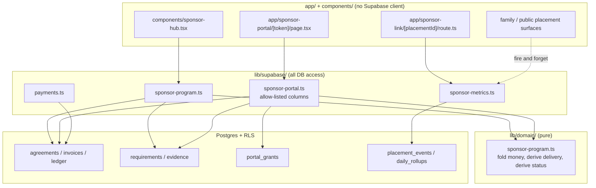

# Sponsor Program and Sponsor Portal Design Document

## Overview

Persists the sponsor commercial spine that `lib/domain/sponsor-program.ts` already models, adds
fulfillment evidence and person-free placement metrics, and exposes both to the sponsor through a
tokenized read-only portal. The result is a sponsor who can answer "what did I buy, what ran, and
what proof exists" without contacting the league.

### Referenced UI Spec

- UI Spec path: `docs/ui-spec/sponsor-portal-ui-spec.md`
- Component structure, state matrices, tokens, and accessibility are inherited from it and not
  restated here.

## Design Summary (Meta)

```yaml
design_type: "new_feature"
risk_level: "high"
complexity_level: "high"
complexity_rationale: >
  (1) AC-002 requires replay-safe append-only ledger semantics; AC-005/AC-006 require delivery state
  to be derived from evidence rather than stored; AC-010 requires a proven absence of family data on
  a new external surface; AC-012/AC-016 require a measurement system with no person identifier.
  (2) The constraints addressed are hard rule 2 (no new workflow states), hard rule 6 (child privacy),
  hard rule 7 (visible role boundaries) against a new non-user principal, and the retirement of one
  of three competing money vocabularies without breaking the live Stripe Checkout path.
main_constraints:
  - "USER_ROLES is frozen at admin|coach|parent; the sponsor must not become a fourth role"
  - "No new enum value or workflow-state column for sponsor status (hard rule 2)"
  - "No Supabase client in app/ or components/ (hard rule 3)"
  - "No provider sends; portal links are copied by an admin (hard rule 5)"
  - "Live Stripe collection stays behind loadPaymentGate"
biggest_risks:
  - "A portal read path widening over time until family data becomes reachable"
  - "sponsors.status narrowing changing existing public placement output"
  - "A write on the read path of family-facing surfaces degrading page performance"
unknowns:
  - "Whether leagues capture fulfillment evidence reliably by hand"
  - "Whether small-league metric volumes clear the suppression threshold often enough to be useful"
```

## Background and Context

### Prerequisite ADRs

- `docs/adr/0003-sponsor-revenue-spine-persistence.md` — persistence, single money vocabulary,
  derived status, gated collection.
- `docs/adr/0004-sponsor-portal-access-without-a-fourth-role.md` — tokenized grant as the sponsor
  principal.
- `docs/adr/0005-privacy-safe-sponsor-placement-metrics.md` — renders and outbound clicks only;
  refusal set; suppression threshold.
- `docs/adr/0001-human-in-the-loop-agents.md` — renewal recommendations recommend; humans approve.
- `docs/adr/0002-server-side-event-change-receipts.md` — SQL-authorized `security definer` RPC
  posture, idempotent write semantics, degrade-don't-error read behaviour.

### External Resources Used

| Resource (project-tier label) | Feature-specific identifier | Notes |
|---|---|---|
| Payment provider | Stripe Connect Standard via `lib/supabase/payments.ts:165` `createSponsorInvoiceCheckout` | Existing path; retargeted at `sponsorship_invoices`; remains gated |
| Design System | `components/ui/primitives.tsx` | See UI Spec reuse map |
| Visual Verification Environment | `output/playwright/sponsor-portal/` | Local browser evidence only |

### Agreement Checklist

#### Scope

- [ ] Add `sponsorship_agreements`, `sponsorship_invoices`, `sponsor_payment_ledger_entries`,
      `sponsor_fulfillment_requirements`, `sponsor_fulfillment_evidence`, `sponsor_portal_grants`,
      `sponsor_placement_events`, `sponsor_placement_daily_rollups`, `sponsor_recap_reports`,
      `sponsor_renewal_reviews`
- [ ] Extend `public.sponsor_packages` with `season_id` and a typed `benefits` contract
- [ ] Extend `lib/domain/sponsor-program.ts` with delivery state, metric contracts, and portal view
      derivation
- [ ] Retire `lib/domain/sponsor-billing.ts`
- [ ] Add `lib/supabase/sponsor-program.ts`, `lib/supabase/sponsor-portal.ts`,
      `lib/supabase/sponsor-metrics.ts`
- [ ] Add `app/sponsor-portal/[token]/page.tsx` and `app/sponsor-link/[placementId]/route.ts`
- [ ] Extend `components/sponsor-hub.tsx` with grant management and evidence capture

#### Non-Scope (Explicitly not changing)

- [ ] `USER_ROLES` and `lib/domain/roles.ts`
- [ ] Existing RLS helper functions `current_user_is_org_admin`, `current_user_can_access_team`
- [ ] `app/sponsors/page.tsx` public marketing copy
- [ ] `loadPaymentGate` default state
- [ ] `public/prototype/` — frozen, never edited
- [ ] Existing `sponsor_assets` review workflow semantics
- [ ] Team portal and parent surfaces, other than the added fire-and-forget render count

#### Constraints

- [ ] Parallel operation: Yes — `sponsor_billing_records` remains readable during migration
- [ ] Backward compatibility: Required for `getSponsorPlacement` output and the Stripe Checkout path
- [ ] Performance measurement: Required — placement counting must add < 15 ms p95

#### Applicable Standards

- [ ] Hard rules 1–8 `[explicit]` — Source: `CLAUDE.md`
- [ ] Documentation gate `[explicit]` — Source: `CLAUDE.md`, `documentation-criteria` skill
- [ ] `security definer` + `set search_path = public` + execution revoked from `public, anon`
      `[explicit]` — Source: `20260726143938_restrict_rls_helper_execution.sql`
- [ ] Token-hash access pattern `[implicit]` — Evidence: `0026_parent_invite_acceptance.sql`,
      `0029_temporary_caregiver_authorizations.sql:45`, `lib/supabase/invite-acceptance.ts:5` —
      Confirmed: Yes
- [ ] Adapter reads return a fail-closed unavailable shape rather than throwing `[implicit]` —
      Evidence: `lib/supabase/sponsors.ts:32` `unavailableSponsorData` — Confirmed: Yes
- [ ] `withSupabaseTimeout(..., 7000)` on adapter queries `[implicit]` — Evidence:
      `lib/supabase/sponsors.ts:74` — Confirmed: Yes
- [ ] Audit writes use `audit_events` with `action`/`target_type`/`target_id`/`summary` `[implicit]`
      — Evidence: `lib/supabase/guardian-links.ts:163` — Confirmed: Yes

#### Assumed Behaviors

- [ ] `sponsor_packages.benefits` is `jsonb default '[]'` and currently holds no production rows —
      Evidence: `0002_platform_hardening.sql:303`; only writer is
      `scripts/bootstrap-demo-tenant.mjs:972` — Confirmed: Yes
- [ ] `sponsors.package_id` is referenced by no application code — Evidence: repo-wide grep for
      `package_id|packageId` returns only `lib/domain/sponsor-program.ts:34` and
      `lib/domain/domain.test.ts:996` — Confirmed: Yes
- [ ] The Stripe Checkout path writes settlement back to `sponsor_billing_records` — Evidence:
      `lib/supabase/payments.ts:226,289,303` — Confirmed: Yes
- [ ] `buildSponsorshipProgramSummary` already folds paid/refunded/disputed correctly and is covered
      by tests — Evidence: `lib/domain/sponsor-program.ts:139`, `lib/domain/domain.test.ts:996` —
      Confirmed: Yes
- [ ] Next.js server components can perform a fire-and-forget write without blocking the response —
      Confirmed: No — see Risks row "fire-and-forget write semantics"

#### Quality Assurance Mechanisms

- [ ] `npm run typecheck` — Enforces: type contracts — Config: `tsconfig.json` — Covers: project-wide — Status: `adopted`
- [ ] `npm test` — Enforces: unit/component behaviour — Covers: project-wide — Status: `adopted`
- [ ] `npm run build` — Enforces: route and render integrity — Covers: project-wide — Status: `adopted`
- [ ] `npm run lint` — Covers: project-wide — Status: `adopted`
- [ ] `supabase/rls-policy.test.ts` — Enforces: literal policy-name assertions — Covers: new tables — Status: `adopted`
- [ ] `npm run qa:sponsor-stripe-readiness` — Covers: `scripts/verify-sponsor-stripe-readiness.mjs` source contracts — Status: `adopted` (contract paths updated)
- [ ] `npm run qa:sponsor-fulfillment-readiness` — Covers: `scripts/verify-sponsor-fulfillment-readiness.mjs` source contracts — Status: `adopted` (extended with evidence and metrics contracts)
- [ ] New: sponsor privacy schema assertion — Enforces: no person-identifying column on `sponsor_placement_*` — Covers: migrations — Status: `adopted`

### Problem to Solve

A sponsor cannot see anything. The commercial model that would let them see something exists only in
memory. Delivery cannot be distinguished from scheduling. Nothing measures whether a placement ever
rendered.

### Current Challenges

1. Three money vocabularies (`lib/domain/sponsor-billing.ts`, `sponsor_billing_records.status`,
   `lib/domain/sponsor-program.ts`) describe the same facts differently.
2. `sponsors.status` conflates business-entity state, deal state, and display eligibility.
3. `sponsor_packages` and `sponsors.package_id` are dead schema.
4. `readyForPlacement` (`lib/domain/sponsor-program.ts:161`) means "paid and unblocked" — it does not
   mean anything rendered, but its name invites that reading.
5. No surface exists for the party who paid.

### Requirements

#### Functional Requirements

Inherited from PRD FR-1 through FR-7.

#### Non-Functional Requirements

- **Performance**: portal p95 < 800 ms; placement counting < 15 ms added p95; admin summary for 100
  sponsors < 2 s.
- **Scalability**: raw events retained 90 days; all reads served from daily rollups.
- **Reliability**: metric writes best-effort; ledger writes idempotent; portal degrades rather than errors.
- **Maintainability**: one money vocabulary; column allow-lists in the portal adapter.

## Acceptance Criteria (AC) - EARS Format

### FR-1 Persisted commercial spine

- [ ] **When** an active organization admin creates an agreement from a package, the system shall
      persist a `sponsorship_agreements` row scoped to that organization with status `draft`. (AC-001)
- [ ] **If** a ledger entry is written twice with the same `(provider, provider_event_id)`, **then**
      the system shall persist exactly one row and return success on the second attempt. (AC-002)
- [ ] **When** an invoice of 50000 cents has one `PaymentSucceeded` of 50000 cents, the system shall
      report `paymentState = "paid"` and `outstandingCents = 0`. (AC-003)
- [ ] **While** a `DisputeOpened` entry exists on an invoice, the system shall report
      `paymentState = "disputed"` regardless of prior paid total. (AC-004)
- [ ] (ubiquitous) The system shall store no balance column on any sponsor table.

### FR-2 Scheduled is not delivered

- [ ] **If** a placement row exists with an open window and no evidence row, **then** the system
      shall report that deliverable as `scheduled`. (AC-005)
- [ ] **When** at least one evidence row exists for a requirement, the system shall report that
      deliverable as `delivered` with the evidence `observed_at`. (AC-006)
- [ ] (ubiquitous) The system shall render `scheduled` and `delivered` with distinct labels and
      distinct fill treatments. (AC-007)

### FR-3 Portal without an account

- [ ] **When** a valid unexpired grant token is presented, the system shall render exactly one
      agreement's data. (AC-008)
- [ ] **If** a token is invalid, expired, or revoked, **then** the system shall return one
      indistinguishable notice and render no sponsor data. (AC-009)
- [ ] (ubiquitous) The portal response shall contain no value originating from `players`,
      `profiles`, `guardian_authorizations`, `emergency_contacts`, `player_health_notes`,
      `team_memberships`, or any media table. (AC-010)
- [ ] **When** a sponsor submits an asset, the system shall create a `sponsor_assets` row with
      status `pending` and shall not transition any placement to live. (AC-011)

### FR-4 Honest metrics

- [ ] (ubiquitous) The system shall count placement renders server-side with no cookie, no client
      script, no fingerprint, and no persisted IP address. (AC-012)
- [ ] **When** a sponsor link is followed, the system shall issue a 302 to the stored HTTPS sponsor
      URL and persist no visitor identity. (AC-013)
- [ ] **If** a rollup bucket contains fewer than 25 events, **then** the system shall display
      "below reporting threshold" instead of the count. (AC-014)
- [ ] (ubiquitous) Every metric block shall render a non-empty "what this does not measure" list. (AC-015)
- [ ] (ubiquitous) No sponsor metrics table shall contain a person-identifying column. (AC-016)

### FR-5 Derived state

- [ ] (ubiquitous) The system shall introduce no new enum value and no new workflow-state column for
      sponsor-facing status. (AC-017)

## Existing Codebase Analysis

### Implementation Path Mapping

| Type | Path | Description |
|---|---|---|
| Existing | `lib/domain/sponsor-program.ts` | Pure spine; extended with delivery state, metrics, portal view |
| Existing | `lib/domain/sponsor-billing.ts` | **Retired** |
| Existing | `lib/domain/sponsors.ts` | Placement helpers; unchanged behaviour, verified by output comparison |
| Existing | `lib/supabase/sponsors.ts` | Admin read; extended to join agreements and requirements |
| Existing | `lib/supabase/operations.ts:1589` `saveSponsor` | Unchanged signature; `status` semantics narrowed |
| Existing | `lib/supabase/payments.ts:165` | Retargeted from `sponsor_billing_records` to `sponsorship_invoices` |
| Existing | `components/sponsor-hub.tsx` | Extended with grants and evidence capture (Phase 2+) |
| Existing | `components/feature-panels.tsx:4022` | Real consumer of the retired `buildSponsorBillingProofs`; moved to the program vocabulary |
| Existing | `lib/domain/money-sponsors.ts:192` | Real consumer of the retired `buildSponsorBillingProofs`; moved to the program vocabulary |
| Existing | `lib/domain/contracts.ts` | Dead `SponsorBillingProof` / `SponsorBillingInput` / workflow-state declarations removed |
| New | `lib/supabase/sponsor-program.ts` | Agreement/invoice/ledger/requirement adapter |
| New | `lib/supabase/sponsor-portal.ts` | Grant resolution + allow-listed portal read |
| New | `lib/supabase/sponsor-metrics.ts` | Event write, rollup read, suppression |
| New | `lib/services/sponsor-recap/` | Recap artifact assembly (provider-free) |
| New | `app/sponsor-portal/[token]/page.tsx` | Server-rendered portal |
| New | `app/sponsor-link/[placementId]/route.ts` | 302 redirect + click count |
| New | `app/api/admin/sponsors/grants/route.ts` | Grant create / revoke |
| New | `app/api/admin/sponsors/evidence/route.ts` | Evidence capture |
| New | `supabase/migrations/<ts>_sponsor_program_spine.sql` | Tables, RLS, RPC |
| New | `supabase/migrations/<ts>_sponsor_portal_grants.sql` | Grant table + resolution RPC |
| New | `supabase/migrations/<ts>_sponsor_placement_metrics.sql` | Events, rollups, retention |

### Integration Points

- **Integration Target**: `components/sponsor-hub.tsx` — **Invocation**: server props from
  `listSponsorAdminData`, extended shape.
- **Integration Target**: `lib/supabase/payments.ts` webhook settlement — **Invocation**: writes a
  ledger entry through `normalizeSponsorProviderPaymentEvent` instead of mutating a status column.
- **Integration Target**: family/public surfaces rendering placements — **Invocation**:
  fire-and-forget `recordPlacementRender` from the server render path.
- **Integration Target**: `lib/navigation/route-topology.ts` — **Invocation**: register
  `/sponsor-portal/[token]` and `/sponsor-link/[placementId]` as public, unauthenticated,
  nav-excluded.

### Code Inspection Evidence

| File/Function | Relevance |
|---|---|
| `lib/domain/sponsor-program.ts:139` `buildSponsorshipProgramSummary` | Money folding to preserve verbatim |
| `lib/domain/sponsor-program.ts:186` `normalizeSponsorProviderPaymentEvent` | Provider→ledger mapping, reused unchanged |
| `lib/supabase/sponsors.ts:32` `unavailableSponsorData` | Fail-closed read shape to replicate |
| `lib/supabase/payments.ts:165` `createSponsorInvoiceCheckout` | Idempotency key `sponsor-billing:{id}`; must be preserved or deliberately versioned |
| `lib/supabase/access-control.ts:165` `requireActiveOrganizationAdmin` | Admin authorization for every write |
| `lib/supabase/invite-acceptance.ts:5` `tokenHash` | SHA-256 hashing to reuse |
| `lib/supabase/public-rate-limit.ts:26` `PUBLIC_RATE_LIMITS` | Add `sponsorPortalLookup` and `sponsorLinkRedirect` policies |
| `0002_platform_hardening.sql:321` | Existing five-value `placement_key` taxonomy, reused as `surface_key` |
| `0017_sponsor_billing_and_team_builder.sql` | RLS posture to mirror |
| `0029_temporary_caregiver_authorizations.sql:45` | `token_hash ~ '^[0-9a-f]{64}$'` constraint form |

### Fact Disposition Table

| Fact ID | Focus Area | Disposition | Rationale | Evidence |
|---|---|---|---|---|
| F-01 | `sponsors.status` triple duty | transform | Narrows to entity state; deal state moves to agreements | `0007_sponsor_v2_status.sql` |
| F-02 | `sponsor_packages` orphan table | transform | Adopted as the package table, gains `season_id` | `0002_platform_hardening.sql:298` |
| F-03 | `sponsor_billing_records` | transform | Migrated into `sponsorship_invoices`, Stripe ids preserved | `0017_sponsor_billing_and_team_builder.sql` |
| F-04 | `lib/domain/sponsor-billing.ts` | remove | Duplicate vocabulary; ADR 0003 selects `sponsor-program.ts` | `lib/domain/sponsor-billing.ts:3` |
| F-05 | `getSponsorPlacement` filters | preserve | Public placement output must not change | `lib/domain/sponsors.ts:11` |
| F-06 | `sponsor_assets` review workflow | preserve | Sponsor uploads join the existing queue unchanged | `0002_platform_hardening.sql:329` |
| F-07 | Stripe Checkout path | preserve | Behaviour identical; only the row it reads changes | `lib/supabase/payments.ts:165` |
| F-08 | `USER_ROLES` | preserve | ADR 0004 keeps three roles | `lib/domain/contracts.ts:1` |
| F-09 | `app/sponsors/page.tsx` | out-of-scope | Public marketing copy is outside this feature's scope boundary | `app/sponsors/page.tsx` |

## Design

### Change Impact Map

```yaml
Change Target: Sponsor commercial and delivery model, plus a new external read surface
Direct Impact:
  - lib/domain/sponsor-program.ts (extended)
  - lib/domain/sponsor-billing.ts (deleted)
  - lib/supabase/sponsors.ts (extended read)
  - lib/supabase/payments.ts (settlement target retargeted)
  - components/sponsor-hub.tsx (grants, evidence)
  - lib/navigation/route-topology.ts (two new public routes)
  - three new migrations, three new adapters, four new routes
Indirect Impact:
  - Family and public surfaces rendering placements gain a fire-and-forget write
  - Admin sponsor page load gains agreement and requirement joins
  - Data volume: one event row per placement render, retained 90 days
No Ripple Effect:
  - Authentication, session handling, USER_ROLES
  - Registration, scheduling, RSVP, chat, media, weather
  - Team portal content other than the placement render count
  - public/prototype/
  - loadPaymentGate default
```

### Interface Change Matrix

| Existing | New | Conversion Required | Compatibility Method |
|---|---|---|---|
| `buildSponsorBillingProof(sponsor, input)` | `buildSponsorshipProgramSummary(input)` | Yes | Delete call sites; no adapter shim — the two vocabularies must not coexist |
| `buildSponsorBillingProofs(sponsors)` | `buildSponsorProgramSummaries(sponsors, records?)` | Yes | Replaced in `components/feature-panels.tsx` and `lib/domain/money-sponsors.ts`; returns `agreementRecorded: false` when no agreement exists, so seed-backed surfaces stay honest instead of inventing a billing state |
| `SponsorBillingRecord` (`lib/supabase/sponsors.ts:22`) | `SponsorshipInvoice` + ledger entries | Yes | Adapter maps legacy rows during migration window |
| `createSponsorInvoiceCheckout({sponsorBillingRecordId})` | `createSponsorInvoiceCheckout({invoiceId})` | Yes | Parameter rename with a migration-window fallback resolving legacy ids |
| `buildSponsorshipProgramSummary` | unchanged signature, extended return | No | Additive fields only |
| `SponsorAdminData` | extended with `agreements`, `requirements`, `grants` | No | Additive |

### Architecture Overview



### Data Flow

**Payment settlement (existing Stripe path, retargeted)**

```
Stripe webhook (signature verified, lib/supabase/payments.ts)
  -> normalizeSponsorProviderPaymentEvent(event)        [pure, lib/domain]
  -> insert sponsor_payment_ledger_entries              [unique (provider, provider_event_id)]
  -> on unique violation: return success, no second row
  -> reads fold ledger at query time; no status column is written
```

**Manual payment (gate closed)**

```
Admin records payment -> requireActiveOrganizationAdmin
  -> insert ledger entry { provider: "manual", kind: "PaymentSucceeded" }
  -> audit_events row
  -> summary recomputes paymentState on next read
```

**Delivery state derivation**

```
requirement row
  + placement rows (window open?)          -> scheduled
  + evidence rows (>= 1)                   -> delivered (observed_at = min evidence.observed_at)
  + blocked flag                           -> blocked
  else                                     -> not started / awaiting assets
```

**Placement render counting**

```
server renders a surface containing an approved active placement
  -> recordPlacementRender({organizationId, sponsorId, placementId, surfaceKey})
  -> buffered, fire-and-forget; failure is swallowed and logged at WARN
  -> insert sponsor_placement_events { occurred_on: current_date, event_kind: 'render' }
  -> nightly rollup -> sponsor_placement_daily_rollups
  -> portal and recap read rollups only, with suppression applied in the adapter
```

**Portal resolution**

```
GET /sponsor-portal/[token]
  -> rate limit check (PUBLIC_RATE_LIMITS.sponsorPortalLookup)
  -> tokenHash(token)  [sha256, lib/supabase/invite-acceptance.ts:5 pattern]
  -> rpc resolve_sponsor_portal_grant(target_token_hash)   [security definer]
       returns null when revoked_at is not null or expires_at <= now()
  -> null  -> render LinkNoLongerActive (identical for all failure causes)
  -> scope -> allow-listed reads for exactly that agreement_id
  -> buildSponsorshipProgramSummary + delivery derivation + suppressed metrics
  -> update last_accessed_at, access_count (fire-and-forget)
```

### Integration Points List

| Integration Point | Location | Old Implementation | New Implementation | Switching Method | Verification Method |
|---|---|---|---|---|---|
| Sponsor money model | `components/feature-panels.tsx:4022`, `lib/domain/money-sponsors.ts:192` | `buildSponsorBillingProofs` | `buildSponsorProgramSummaries` | Direct replacement | Component and domain tests assert the program vocabulary |
| Stripe settlement target | `lib/supabase/payments.ts:289` | update `sponsor_billing_records` | insert ledger entry | Direct replacement | Duplicate-event test yields one row |
| Checkout source row | `lib/supabase/payments.ts:178` | `sponsor_billing_records` | `sponsorship_invoices` | Parameter rename + legacy id fallback | Existing checkout test passes with both id forms |
| Placement render | family/public placement render paths | none | `recordPlacementRender` | Additive call | Test proves write failure leaves response unchanged |
| Sponsor outbound link | placement anchor `href` | direct sponsor URL | `/sponsor-link/[placementId]` | Href replacement | 302 test asserts destination and no identity persisted |
| Route registration | `lib/navigation/route-topology.ts` | n/a | two public entries | Additive | `lib/navigation/route-topology.test.ts` |

### Main Components

#### `lib/domain/sponsor-program.ts` (extended)

- **Responsibility**: All sponsor money folding, delivery-state derivation, portal-status derivation,
  and metric suppression policy. Pure; no I/O.
- **Interface**: existing `buildSponsorshipProgramSummary`, plus
  `deriveDeliverableState(requirement, placements, evidence)`,
  `derivePortalStatus(summary, deliverables)`, `applyMetricSuppression(rollups, threshold)`,
  `buildSponsorPortalView(input)`.
- **Dependencies**: `lib/domain/types`. None outward.

#### `lib/supabase/sponsor-portal.ts` (new)

- **Responsibility**: Resolve a grant by hash and perform the allow-listed portal read.
- **Interface**: `resolveSponsorPortalGrant(token)`, `loadSponsorPortalView(grantScope)`.
- **Dependencies**: admin client, `withSupabaseTimeout`, `lib/domain/sponsor-program.ts`.
- **Constraint**: `select("*")` is prohibited in this module; every query names its columns.

#### `lib/supabase/sponsor-metrics.ts` (new)

- **Responsibility**: Best-effort event writes, rollup reads, suppression enforcement, bot exclusion.
- **Interface**: `recordPlacementRender(input)`, `recordOutboundClick(input)`,
  `loadPlacementMetrics(agreementId, window)`.
- **Constraint**: Every write is wrapped so no caller can await a rejection.

### Data Representation Decision

Introducing `sponsorship_invoices` where `sponsor_billing_records` exists.

| Criterion | Assessment | Reason |
|---|---|---|
| Semantic Fit | No | `sponsor_billing_records` has no agreement, so it cannot express a per-season deal |
| Responsibility Fit | No | It mixes Stripe product/price identity with invoice state |
| Lifecycle Fit | No | An invoice belongs to an agreement's lifecycle, not a sponsor's |
| Boundary/Interop Cost | Medium | The Stripe Checkout path must be retargeted, with a legacy id fallback |

**Decision**: new — `sponsorship_invoices` with `agreement_id`, migrating `sponsor_billing_records`
rows and preserving `stripe_product_id`, `stripe_price_id`, `stripe_invoice_id`, and
`invoice_reference`. ADR 0003 Option D records why extending in place was rejected.

### Design Convergence

1. **Direct MVP**: persist agreements, invoices, ledger, requirements; derive delivery from evidence;
   render a tokenized read-only portal from those rows.
2. **Failed Items**: the Direct MVP gives a sponsor no volume signal, so a renewal conversation has
   nothing to compare year over year — PRD success criterion 3 (60% renewal review rate) is unmet
   against an offer with no measurable scale.
3. **Adopted Additions**: placement metrics (renders, outbound clicks) → resolves the Failed Item →
   lower-surface resolutions fail because evidence rows prove *that* something ran but carry no
   magnitude, and the sponsor's comparison question is about magnitude → removing metrics returns
   success criterion 3 to unmet.
4. **Rejected Additions**: client-side analytics (ADR 0005 Option B, privacy); authenticated-user
   attribution (ADR 0005 Option D, privacy); sponsor accounts (ADR 0004 Option A, cost and role
   surface); automated sponsor email (hard rule 5); PDF recap generation (new dependency, deferred to
   TBD-03).

### Data Contracts

#### Portal read boundary

```yaml
Contract: loadSponsorPortalView(grantScope)
Input:
  Type: { agreementId: string; organizationId: string; sponsorId: string }
  Preconditions: grant resolved, not revoked, not expired
  Validation: performed in SQL by resolve_sponsor_portal_grant; the route validates nothing itself

Output:
  Type: SponsorPortalView
  Guarantees:
    - Contains data for exactly one agreementId
    - Contains no field sourced from players, profiles, guardian_authorizations,
      emergency_contacts, player_health_notes, team_memberships, or any media table
    - Every metric value is either suppressed, unavailable, or a rollup-derived number
  On Error: returns { available: false, reason } — never throws, never partially populated

Invariants:
  - deliverable.state === "delivered" implies evidence.length >= 1
  - portalStatus is a pure function of its inputs and is never read from a column
```

#### Ledger write boundary

```yaml
Contract: recordSponsorPaymentEvent(entry)
Input:
  Type: SponsorPaymentLedgerEntry
  Preconditions: invoiceId exists; amountCents >= 0
  Validation: unique (provider, provider_event_id) enforced in SQL

Output:
  Type: { ok: true; deduplicated: boolean }
  Guarantees: exactly one row per (provider, provider_event_id)
  On Error: unique violation is success with deduplicated=true

Invariants:
  - No update or delete is ever issued against the ledger
  - No balance is written anywhere as a consequence of this call
```

#### Metric write boundary

```yaml
Contract: recordPlacementRender(input)
Input:
  Type: { organizationId, sponsorId, placementId, surfaceKey }
  Preconditions: placement is approved and active
  Validation: bot/prefetch exclusion applied before write

Output:
  Type: void
  Guarantees: never throws; never returns a rejected promise to a render path
  On Error: swallowed, logged at WARN, response unaffected

Invariants:
  - No person-identifying value is passed in, derived, or stored
  - occurred_on has date granularity, never per-second
```

### Field Propagation Map

| Field | Boundary | Status | Serialized Format | Consumer Parse Rule | Detail |
|---|---|---|---|---|---|
| `token` | admin UI → sponsor → URL path | transformed | URL path segment, base64url, ≥ 43 chars | `tokenHash()` SHA-256 to 64 lowercase hex, matched against `token_hash` | Plaintext never persisted or logged |
| `agreement_id` | grant RPC → portal adapter | preserved | — | — | Sole scope key for every portal query |
| `provider_event_id` | Stripe → ledger | preserved | Stripe event id string | Composite unique with `provider` | Replay guard |
| `placementId` | placement render → `/sponsor-link/[placementId]` | preserved | URL path segment, uuid | uuid parse; unknown id returns 404 without a write | Redirect target resolved server-side from the stored HTTPS URL, never from a query parameter |
| `occurred_on` | metric write → rollup | transformed | `date` | Grouped by `(placement_id, surface_key, event_kind, occurred_on)` | Deliberate precision loss; per-second timestamps are correlatable at league scale |
| `amount_cents` | invoice → portal display | preserved | integer cents | Formatted at render only | Never rounded in storage |

### State Transitions and Invariants

```yaml
State Definition:
  Agreement: draft -> sent -> signed -> active -> expired | cancelled   [existing scaffold vocabulary]
  Deliverable (derived, never stored):
    not_started | awaiting_assets | scheduled | delivered | blocked
  PaymentState (derived, never stored):
    not_invoiced | awaiting_payment | partially_paid | paid | refunded | disputed

State Transitions:
  requirement + no assets approved        -> awaiting_assets
  requirement + placement window open     -> scheduled
  scheduled + >= 1 evidence row           -> delivered
  any + blocked flag                      -> blocked

System Invariants:
  - No column anywhere stores a deliverable state or a payment state
  - delivered is unreachable without an evidence row
  - A dispute changes payment state only; it never changes a deliverable state
  - The ledger is append-only; enforced by a `before update or delete` trigger that raises, because
    the service-role adapter client bypasses RLS
  - A portal grant resolves to exactly one agreement
```

### UI Error State Design

Inherited from the UI Spec state x display matrices. The two design-level rules that bind
implementation:

| Component / Screen | Loading | Empty | Error | Partial |
|---|---|---|---|---|
| `MetricBlock` | `SkeletonBlock variant="card"` | "No measurement recorded" + "not measured" list | "Measurement temporarily unavailable" — **never 0** | Per-metric independence; list always renders |
| `DeliverableRow` | `SkeletonBlock variant="table-row"` | `EmptyState`, no CTA | Label and dates render; state badge `unavailable` | Never upgrades an unknown state to `delivered` |

### Client State Design

| State Category | State | Management Method | Sync Strategy | Reset/Clear Behavior |
|---|---|---|---|---|
| Server state | Portal view | Server component props | Full server render per request; no client fetch | n/a — no client cache exists |
| Local UI state | Active tab, expanded rows | `useState` in a small client island | — | Resets on navigation |
| Temporary state | Asset upload form | `useState` | Manual submit | Cleared on successful submit; the resulting `pending` state comes from the server, never from local state |

The portal is server-rendered by default. Only the tab strip, row expansion, and the upload form are
client components, and none of them holds sponsor commercial state.

### UI Action - API Contract Mapping

| UI Action | API Endpoint | Request | Response | Error Contract |
|---|---|---|---|---|
| Sponsor submits asset | `POST /api/sponsor-portal/asset` | `{ token, assetType, url \| file }` | `{ ok, status: "pending" }` | 400 with specific reason; 429 rate limited; 404-equivalent neutral notice for a dead grant |
| Sponsor follows placement | `GET /sponsor-link/[placementId]` | — | 302 to sponsor HTTPS URL | 404 without a write for unknown or inactive placement |
| Admin creates grant | `POST /api/admin/sponsors/grants` | `{ organizationId, agreementId, label, expiresAt }` | `{ ok, token }` — token returned exactly once | 401 unauthenticated; 403 not an active org admin |
| Admin revokes grant | `DELETE /api/admin/sponsors/grants` | `{ grantId }` | `{ ok }` | 401/403; revoking an already-revoked grant is idempotent success |
| Admin captures evidence | `POST /api/admin/sponsors/evidence` | `{ requirementId, kind, observedAt, artifactUrl?, note? }` | `{ ok, evidenceId }` | 400 when `observedAt` is in the future |

### Error Handling

| Error Category | Example | Detection | Recovery Strategy | User Impact |
|---|---|---|---|---|
| Business logic | Duplicate provider event | Unique violation | Treat as success, `deduplicated: true` | None |
| Validation | Non-HTTPS sponsor asset URL | URL parse, matching `saveSponsor` at `lib/supabase/operations.ts:1613` | Reject inline | Specific field message |
| Infrastructure | Metric write fails | Caught in adapter | Swallow, log WARN | None — page renders |
| Infrastructure | Rollup read fails | Caught in adapter | Return unavailable | "Measurement temporarily unavailable", never 0 |
| Authorization | Expired or revoked grant | RPC returns null | Neutral notice | Indistinguishable from invalid |
| Authorization | Non-admin write | `requireActiveOrganizationAdmin` | 403 | Existing admin error copy |
| Infrastructure | Portal commercial read fails | Adapter catch | `{ available: false }` | "Temporarily unavailable" page, no partial data |

### Logging and Monitoring

- **Log events**: grant created / revoked / resolved (by grant id, never token), ledger dedupe hits,
  evidence captured, metric write failures, rollup job outcome, rate-limit rejections.
- **Log levels**: DEBUG rollup counts; INFO grant lifecycle and evidence capture; WARN metric write
  failure and rate-limit rejection; ERROR rollup job failure and portal commercial read failure.
- **Sensitive data**: plaintext tokens are never logged in any path including errors. No requester
  attribute — IP, user agent, referrer — is logged on portal or redirect routes.
- **Audit**: `audit_events` rows for grant create, grant revoke, evidence capture, manual payment
  recording, and agreement status change, using the `guardian-links.ts:163` shape.
- **Monitoring**: rollup job success; p95 added latency on placement-rendering surfaces; count of
  requirements marked `delivered` with zero evidence rows, which must be permanently 0.

## Implementation Plan

### Implementation Approach

**Selected Approach**: Vertical Slice.

**Selection Reason**: Each of the four slices is independently shippable and independently valuable,
and slice 1 deliberately has no sponsor-facing surface — it proves the money model against real rows
before anyone external can see anything. A horizontal approach would build all contracts first and
expose the riskiest surface (the external portal) last against unproven data.

### Technical Dependencies and Implementation Order

1. **Spine tables + domain extension + admin read**
   - Technical Reason: everything else hangs off `agreement_id`; the money folding must be proven
     against persisted rows before any external surface exists.
   - Prerequisites: none. Dependents: all.
2. **Fulfillment evidence + delivery derivation + admin capture**
   - Technical Reason: `delivered` cannot be derived without evidence rows, and the portal's core
     claim is this distinction.
   - Prerequisites: 1. Dependents: 3, 4.
3. **Portal grants + portal read surface**
   - Technical Reason: needs real agreements and real delivery state to render anything truthful.
   - Prerequisites: 1, 2. Dependents: 4.
4. **Metrics + recap + renewal review**
   - Technical Reason: metrics need placements and a portal to display on; recap needs both evidence
     and metrics; renewal needs recap.
   - Prerequisites: 1, 2, 3.

### Migration Strategy

- `sponsor_billing_records` is **not** dropped in the same migration that creates
  `sponsorship_invoices`. Rows are copied with a `legacy_billing_record_id` column preserved on the
  new table, and the old table is retained read-only for one release.
- `createSponsorInvoiceCheckout` accepts either `invoiceId` or a legacy `sponsorBillingRecordId`
  during the migration window, resolving the latter through `legacy_billing_record_id`. The
  idempotency key remains `sponsor-billing:{legacyId}` for migrated rows and becomes
  `sponsor-invoice:{invoiceId}` for new ones, so no in-flight session is duplicated.
- `sponsors.status` narrowing is a **semantic** change, not a constraint change. The column keeps
  `pending | active | expired` and every existing value; what changes is that deal state is read from
  `sponsorship_agreements.status` instead. Keeping the stored values identical is what makes the
  output comparison meaningful rather than circular. Narrowing runs after agreements are backfilled. Each existing `active` sponsor
  receives a backfilled `active` agreement for the current season so `getSponsorPlacement` output is
  unchanged; this is verified by output comparison, not asserted.
- `lib/domain/sponsor-billing.ts` is deleted only once `components/sponsor-hub.tsx` has no remaining
  reference, in the same commit, so the two vocabularies never both compile.

## Security Considerations

- **Authentication & Authorization**: Two new public entry points. `/sponsor-portal/[token]`
  authorizes through the grant RPC in SQL, never in the route. `/sponsor-link/[placementId]`
  authorizes nothing but must confirm the placement is approved and active before redirecting, and
  must redirect only to the stored HTTPS URL — never to a value from the request. All admin writes
  pass `requireActiveOrganizationAdmin`.
- **Input Validation**: Token must match `^[A-Za-z0-9_-]{43,}$` before hashing, so malformed input
  never reaches the database. `placementId` must parse as a uuid. Sponsor asset URLs must be HTTPS,
  reusing the `saveSponsor` validation at `lib/supabase/operations.ts:1613`. Both public routes are
  rate-limited through `PUBLIC_RATE_LIMITS`.
- **Sensitive Data Handling**: Portal tokens are stored as SHA-256 hash only and never logged.
  Commercial amounts are visible to the grant holder by design and to nobody else. No requester
  attribute is persisted anywhere in this feature. The portal read adapter uses column allow-lists so
  that a future column addition cannot silently widen sponsor exposure.
- **Open redirect**: the redirect destination is read from `sponsors.url` server-side. No request
  parameter influences it.

## Test Boundaries

### Mock Boundary Decisions

| Component/Dependency | Mock? | Rationale |
|---|---|---|
| Supabase client in adapter unit tests | Yes | Matches existing `lib/supabase/sponsors.test.ts` fixture style |
| `lib/domain/sponsor-program.ts` | No | Pure; tested directly, as `lib/domain/domain.test.ts` already does |
| Stripe | Yes | Live collection stays gated; sandbox proof is a separate external gate |
| RLS policies | No | Must be proven by executed denial tests against a real target, not mocked |
| Rollup job | No | Tested against seeded event rows so suppression is proven on real aggregation |

### Data Layer Testing Strategy

- **Schema dependencies**: `sponsors`, `sponsor_packages`, `sponsor_placements`, `sponsor_assets`,
  `sponsor_billing_records`, `organization_memberships`, `audit_events`, plus the ten new tables.
  Definitions in `supabase/migrations/`.
- **Test data approach**: extend `scripts/bootstrap-demo-tenant.mjs` — which is already the sole
  writer of `sponsor_packages` — to seed a complete agreement with mixed delivery states, so golden
  states 1–6 in the UI Spec are all reachable in the demo tenant.
- **Mock limitations acknowledged**: mocks cannot prove RLS denial, cannot prove the unique
  constraint on the ledger, and cannot prove the absence of family data in a real query plan. Those
  three require executed tests against a real target and are recorded as external gates.

### Integration Verification Points

- Portal leak test against a demo tenant with populated children, guardians, media, and rosters.
- Duplicate Stripe event replay producing one ledger row.
- Cross-organization denial on all ten new tables.
- Placement render write failure leaving a family page response byte-identical.
- Output comparison of `getSponsorPlacement` before and after the `sponsors.status` narrowing.

## Verification Strategy

### Correctness Proof Method

- **Correctness definition**: (a) every money figure the portal shows equals the fold of the ledger
  for that invoice; (b) no deliverable reports `delivered` without an evidence row; (c) the portal
  response contains no family-originated value; (d) no metrics table contains a person-identifying
  column; (e) existing public placement output is unchanged.
- **Verification method**: (a) property test folding random ledger sequences against
  `buildSponsorshipProgramSummary`; (b) invariant query asserting zero rows where state is
  `delivered` and evidence count is 0; (c) executed leak test against a fully populated demo tenant;
  (d) CI schema assertion over `sponsor_placement_*`; (e) output comparison before and after
  migration.
- **Verification timing**: (a) and (b) at the end of slice 2; (c) at the end of slice 3; (d) on every
  migration from slice 4 onward; (e) during slice 1, before the narrowing is merged.

### Early Verification Point

- **First verification target**: slice 1 — the admin Sponsor Hub reading a real persisted agreement,
  invoice, and ledger, with a manually recorded payment moving `paymentState` from
  `awaiting_payment` to `paid` and a dispute entry moving it to `disputed`.
- **Success criteria**: the state transitions occur with **no status column written anywhere**,
  provable by a database diff showing only ledger inserts, and `getSponsorPlacement` output is
  byte-identical before and after.
- **Failure response**: if paid state cannot be derived correctly from folded ledger rows at
  realistic data volumes, stop and reassess before building evidence or the portal. Every later
  slice assumes derivation is cheap and correct.

### Output Comparison

- **Comparison input**: the demo tenant sponsor set, before and after the `sponsors.status`
  narrowing and agreement backfill.
- **Expected output fields**: the full result of `getSponsorPlacement`,
  `getTeamPortalSponsorPlacement`, `getScheduleSponsorPlacement`,
  `getMediaGallerySponsorPlacement`, `getEmailSponsorPlacement`, `getBannerSponsorPlacement` —
  sponsor id, name, url, placementKey, logoUrl, and result ordering.
- **Diff method**: JSON field-by-field comparison of serialized results, asserting an empty diff.
- **Transformation pipeline coverage**: covers sponsor row → placement filter → public display. Does
  not cover the new agreement join, which has no existing equivalent.

## Future Extensibility

- **Deferred possibilities**: multi-season sponsor history (serves PRD P3, deferred);
  per-deliverable admin reminders (serves PRD P3, deferred); package builder UI (serves PRD P3,
  deferred); PDF recap generation (deferred pending TBD-03, requires its own ADR for the new
  dependency); sponsor-initiated renewal acceptance (speculative).
- **Intentional limitations**: one grant resolves to one agreement, deliberately — ADR 0004 names
  broadening this as requiring a new ADR. Metrics are two counters and will stay two counters.
- **Extension points (existing, with current consumers)**: `buildSponsorshipProgramSummary`
  (consumer: `components/sponsor-hub.tsx` after slice 1, portal after slice 3);
  `normalizeSponsorProviderPaymentEvent` (consumer: `lib/supabase/payments.ts` webhook path);
  `sponsor_assets` review queue (consumer: existing admin media/asset review).

## Risks and Mitigation

| Risk | Impact | Probability | Mitigation |
|---|---|---|---|
| Portal read widens over time until family data is reachable | High | Medium | Column allow-list plus an executed leak test in CI; ADR 0004 requires a new ADR to broaden grant scope |
| `sponsors.status` narrowing changes public placement output | High | Medium | Output comparison across all six placement helpers before merge; agreement backfill precedes narrowing |
| Fire-and-forget write semantics in Next.js server components not confirmed | Medium | Medium | Assumed Behaviors records this as Confirmed: No. Spike in slice 4 before wiring any family surface; if unconfirmed, route counting through the redirect endpoint and an explicit non-blocking queue instead of the render path |
| Stripe idempotency key change duplicates an in-flight session | High | Low | Legacy rows keep `sponsor-billing:{legacyId}`; only new invoices use the new key form |
| Two money vocabularies coexisting during migration | Medium | Medium | `sponsor-billing.ts` deletion and its last call-site removal ship in one commit |
| Metric volumes stay below threshold, portal looks empty | Medium | High | Days-live, surfaces-live, and evidence counts carry the value story; threshold copy explains rather than hides |
| Leagues do not capture evidence | High | Medium | Portal shows the gap to the sponsor; ADR 0003 kill criteria makes this measurable after one season |

## References

- `docs/prd/sponsor-program-prd.md`
- `docs/adr/0003-sponsor-revenue-spine-persistence.md`
- `docs/adr/0004-sponsor-portal-access-without-a-fourth-role.md`
- `docs/adr/0005-privacy-safe-sponsor-placement-metrics.md`
- `docs/ui-spec/sponsor-portal-ui-spec.md`
- `docs/production-task-board.md` — LP-020, LPM-010
- `docs/capability-matrix.md` — sponsor management row

## Update History

| Date | Version | Changes | Author |
|---|---|---|---|
| 2026-08-19 | 1.0 | Initial version | Michael Major |
