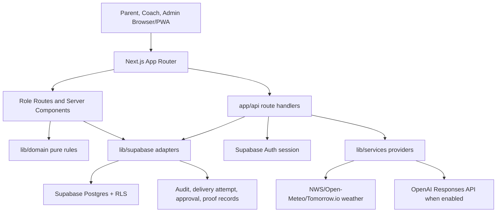
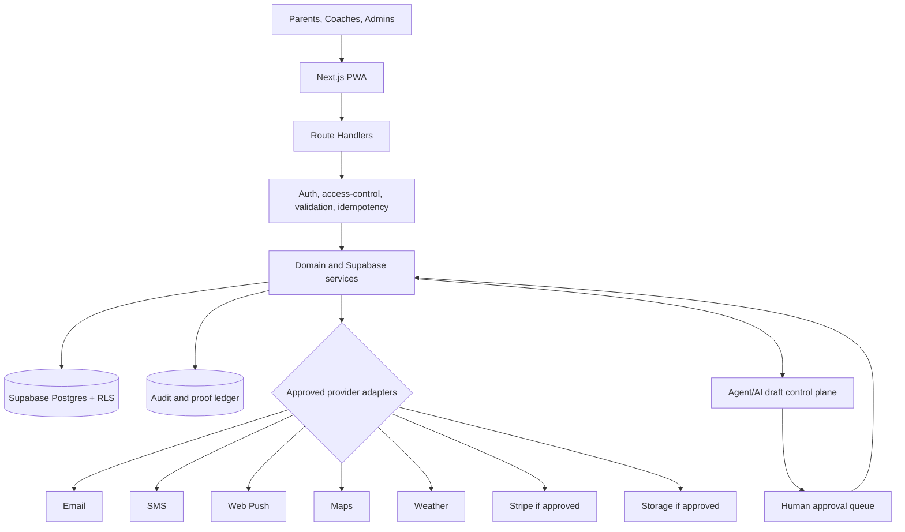

# Architecture And Integration Artifacts

Status: draft. This document summarizes current and target architecture while preserving provider and proof boundaries.

## Solution Overview

LeaguePilot is a Next.js App Router application backed by Supabase Auth, Postgres, RLS, and service adapters. The app serves admin, coach, and parent/guardian users through role-scoped route families. Domain rules live in `lib/domain/`; Supabase access, route auth, RLS-sensitive adapters, provider-boundary services, and timeout helpers live in `lib/supabase/` and `lib/services/`.

## Current State Architecture

Current boundary: several workflows are Supabase-backed and proven. Some surfaces retain typed seed fallback for unavailable live reads. Provider delivery records can be created and reviewed, but live email/SMS/Web Push sends remain disconnected.

## Target State Architecture

Target boundary: provider adapters execute only after consent, preference, approval, audit, retry, and webhook/idempotency controls are implemented and tested.

## Technology Reference Model

| Layer | Standard |
| --- | --- |
| Web/runtime | Next.js App Router, React, TypeScript. |
| Styling | Existing CSS tokens, dark mode, team brand presets. |
| Domain | Pure TypeScript modules in `lib/domain/`; no Next.js or provider imports. |
| Persistence | Supabase Postgres with migrations and generated TypeScript types. |
| Auth | Supabase Auth sessions. |
| Authorization | Route handlers and Supabase adapters plus RLS policies. |
| Realtime | Supabase Realtime for Team Chat. |
| Weather | NWS first, Open-Meteo fallback, optional Tomorrow.io. |
| AI | Deterministic first; OpenAI Responses API rewrite path only through server route when enabled. |
| Mobile | PWA first; Expo deferred until usage evidence justifies native scope. |
| Deployment | Vercel plus Supabase HTTPS APIs or Docker-capable Node host. |

## Integration Reference Architectures

| Integration | Current pattern | Target pattern |
| --- | --- | --- |
| Supabase Auth/Postgres | Route handlers verify session; adapters enforce role/team scope; RLS protects rows. | Keep same; add proof whenever schema, RLS, or auth scopes change. |
| Provider delivery | Draft/review/delivery-attempt rows; no live send. | Approved worker/adapters with opt-in, suppression, retries, webhooks, audit, and hosted proof. |
| Weather | Provider-order fetch normalizes into draft weather rows. | Credential readiness proof, fallbacks, and parent sends only after approval. |
| AI Coach | Server-side OpenAI rewrite only when enabled; `store: false`; review-only output. | Continue eval-gated, tenant-scoped provider calls; no automatic publish. |
| Media | Google Photos/YouTube link metadata, reports, moderation. | Storage provider only if scoped with tenant paths, scanning, review, deletion, and proof. |
| Sponsors/billing | Sponsor records and billing-proof references. | Stripe only if real collection is approved, with restricted keys and webhook signature proof. |
| Mobile | PWA install/offline/usage metrics. | Expo only after PWA evidence justifies native requirements. |

## Architecture Decisions

Existing ADR:

- `docs/adr/0001-human-in-the-loop-agents.md`: agents assist but do not independently perform sensitive actions.

ADR backlog:

- Supabase Auth and RLS as the authorization backbone.
- Provider sends deferred until explicit send-worker implementation.
- PWA-first mobile architecture with Expo deferred.
- Link-based media launch posture versus private upload storage.
- Sponsor billing proof-only posture versus live Stripe collection.
- Vercel plus Supabase HTTPS deployment and no static-egress requirement unless direct DB allowlisting is introduced.

## Solution Design Boundaries

- UI routes/components do not invent access grants.
- Route handlers parse transport, verify sessions, validate request shape, map status, and delegate to services.
- Supabase adapters enforce tenant/team/guardian access, persistence, and audit/provider-safe records.
- Domain modules own deterministic business rules and remain provider/runtime independent.
- Providers are called only from server-side services or route handlers after policy checks.
