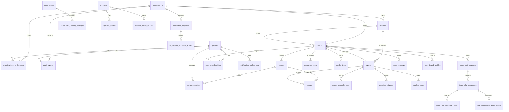

# Data Model And ERD

Status: draft overview. Canonical schema truth remains `supabase/migrations/`, `docs/supabase-data-model.md`, and `lib/supabase/database.types.ts`.

## Domain Areas

| Area | Representative tables |
| --- | --- |
| Identity and tenant access | `profiles`, `organizations`, `organization_memberships`, `team_memberships` |
| League structure | `seasons`, `teams`, `players`, `player_guardians`, `parent_invites` |
| Registration | `registration_requests`, `registration_approval_actions` |
| Schedule and participation | `events`, `event_series`, `field_locations`, `field_reservations`, `rsvps`, `snack_schedule_slots`, `volunteer_signups` |
| Team operations | `announcements`, `media_items`, `team_brand_profiles`, `team_brand_surface_validation_runs` |
| Chat and retention | `team_chat_channels`, `team_chat_messages`, `team_chat_message_reads`, `chat_moderation_audit_events` |
| Provider and notifications | `notifications`, `notification_preferences`, `notification_delivery_attempts`, `push_subscriptions`, `weather_alerts` |
| Differentiators | `parent_replays`, `parent_replay_templates`, `ai_generation_runs`, `learning_plans` |
| Sponsors and billing proof | `sponsors`, `sponsor_packages`, `sponsor_placements`, `sponsor_assets`, `sponsor_billing_records` |
| Audit and exports | `audit_events`, export service rows/results where applicable |

## High-Level ERD

## Core Data Flows

| Flow | Data path |
| --- | --- |
| Parent RSVP | Verified parent session -> route handler -> guardian/player/event access check -> `rsvps` row -> coach aggregate view. |
| Registration approval | Public request -> admin review -> approval RPC/service -> player/guardian/membership/invite rows -> approval action and audit rows. |
| Weekly update | Coach session -> assigned-team check -> `announcements` row -> pending `notifications` draft -> provider review. |
| Parent Replay | Coach/admin session -> deterministic draft -> reviewed publish -> `parent_replays` and pending notification draft. |
| Provider delivery review | Reviewer session -> notification/preference/provider-readiness check -> `notification_delivery_attempts` queued/rejected/suppressed row. |
| Media moderation | Reporter/reviewer session -> media governance service -> report/moderation/audit rows -> filtered parent/team reads. |

## Data Governance Rules

- Service-role access is server-only or CI-only.
- RLS remains the database backstop for tenant/team/guardian isolation.
- Children are `players`, not auth users.
- Parent/guardian access is explicit through linked rows, not inferred from UI state.
- Draft/provider records are not evidence of external delivery.
- Billing-proof records are not settled payments.
- Archive state makes season records read-only and applies chat retention policy.
