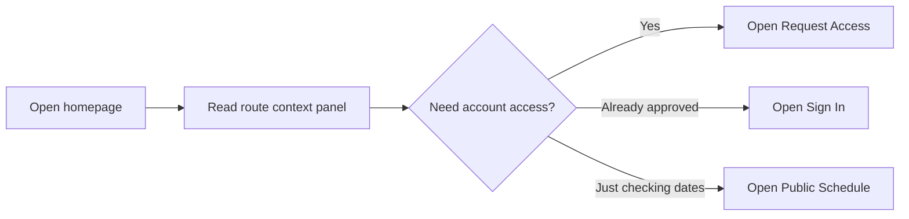
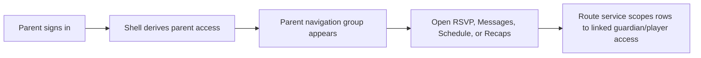
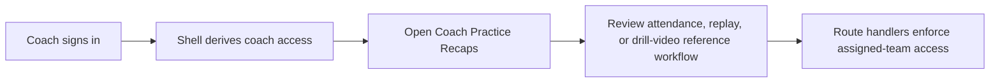
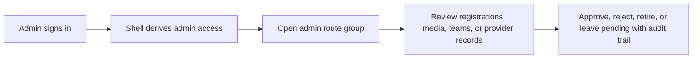
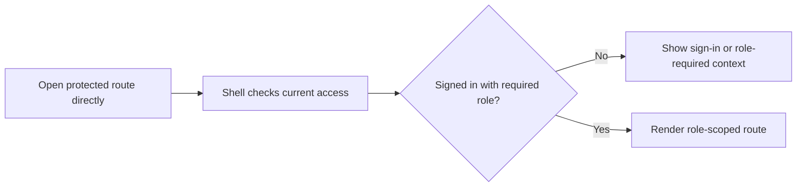
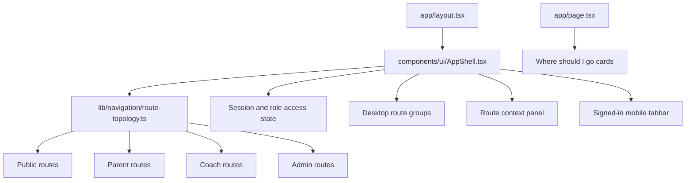

# Kid-Friendly Navigation And Wayfinding Artifacts

Status: implementation-aligned snapshot prepared 2026-07-17.

This artifact documents the family-friendly navigation pass across the shared shell and homepage. "Kid-friendly" means clear, calm, adult-operated youth-sports workflows. Children do not log in, and private team surfaces remain gated behind parent/guardian, coach, or admin access.

## Screenshot Evidence

| View | Local artifact | What it proves |
| --- | --- | --- |
| Desktop homepage | `output/playwright/kid-friendly-wayfinding-home-desktop.png` | Public homepage shows role-aware route context, clear primary actions, high-contrast navigation, and "Where should I go?" cards. |
| Mobile homepage | `output/playwright/kid-friendly-wayfinding-home-mobile.png` | Public mobile entry keeps actions stacked and readable without crowding the bottom of the screen. |
| Mobile registration | `output/playwright/kid-friendly-registration-mobile.png` | Registration remains a request-access flow with readable fields and no public bottom-tab overlap. |

## Primary Users

| User | Goal | Navigation need | Privacy boundary |
| --- | --- | --- | --- |
| Parent or guardian | Find schedule, RSVP, messages, recaps, and child-linked team updates. | Plain labels, one obvious next action, and no coaching/admin tools in the default path. | Child access is owned by parent/guardian accounts; child display remains limited. |
| Coach | Reach attendance, weekly update, practice recap, drill reference, and team-planning workflows. | Fast coach route grouping and context that confirms team-scoped access. | Coach tools stay assigned-team scoped. |
| Admin | Review registrations, media, teams, safety, and provider-boundary work. | Admin routes must be discoverable without mixing into parent or coach tasks. | Organization-level actions require active admin access and audit-sensitive handling. |
| Pending adult user | Understand what is available before account approval. | Clear sign-in or request-access prompts. | Private routes explain the missing role instead of exposing private data. |

## User Journeys

### Journey A: Signed-Out Adult Finds The Right Start

Acceptance rule: public navigation can guide users to the right action, but it must not imply access to private team content.

### Journey B: Approved Parent Gets To Family Tasks

Acceptance rule: parent routes stay family-oriented and do not expose coach/admin task labels as primary actions.

### Journey C: Coach Reaches Practice Planning

Acceptance rule: coach practice tools remain planning tools in v1; drill-video embeds are coach-side references unless a later reviewed release enables family visibility.

### Journey D: Admin Reviews And Approves Work

Acceptance rule: admin actions remain separated from parent and coach day-to-day workflows.

### Journey E: Protected Route Deep Link

Acceptance rule: protected pages should explain what is needed before the user fills out a form or attempts an action.

## Information Architecture

`lib/navigation/route-topology.ts` is the source of truth for route labels, role grouping, and shell navigation metadata.

| Route family | Examples | Primary audience |
| --- | --- | --- |
| Public entry | `/`, `/auth`, `/registration`, `/schedule` | Signed-out adults, pending users, approved users who need public info. |
| Parent tools | `/parent`, `/parent/rsvp`, `/parent/messages`, `/parent/schedule`, `/parent/recaps` | Parent/guardian users with linked player access. |
| Coach tools | `/coach`, `/coach/rsvps`, `/coach/practice-recaps`, `/coach/replay` | Assigned coaches and admins when acting operationally. |
| Admin tools | `/admin`, `/admin/registrations`, `/admin/media-review`, `/admin/teams` | Active organization admins. |
| Shared team surfaces | `/team-chat`, `/team-portal` | Role-scoped users on an active team. |

## Navigation Architecture

The mobile tabbar is intentionally limited to signed-in users with an active parent, coach, or admin role. Public and registration routes use normal page actions instead, which prevents a bottom navigation bar from covering forms or confusing first-time users.

## Implementation Touchpoints

| File | Responsibility |
| --- | --- |
| `components/ui/AppShell.tsx` | Route-aware context panel, role labels, access badges, desktop route groups, and signed-in-only mobile tabbar. |
| `app/page.tsx` | Homepage role wayfinding cards and first actions. |
| `app/globals.css` | High-contrast color treatment, readable navigation states, cards, forms, and mobile layout rules. |
| `app/layout.tsx` | Critical CSS palette aligned with the accessible visual refresh. |
| `app/routes-smoke.test.ts` | Route reachability and shell behavior coverage for the changed navigation surface. |

## Acceptance Criteria

- Public users can identify whether to sign in, request access, or view public schedule information from the first screen.
- Parent, coach, and admin users see role-appropriate route groups without losing access to shared team surfaces.
- Mobile public and registration pages do not render a bottom tabbar over page content.
- Text, buttons, route badges, and helper copy use strong contrast and readable spacing on desktop and mobile.
- No navigation copy suggests that children log in, that provider sends are enabled, or that coach-only drill-video references are family-facing.
