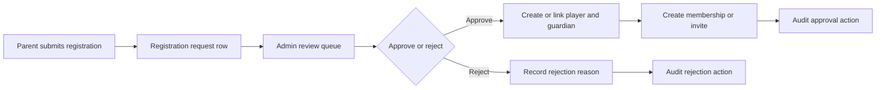
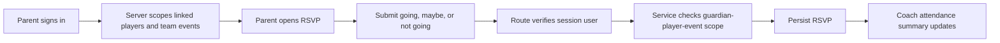
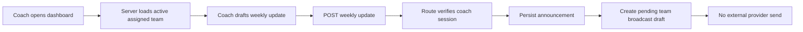
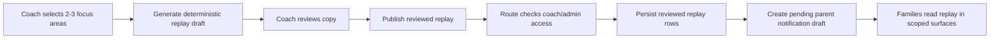
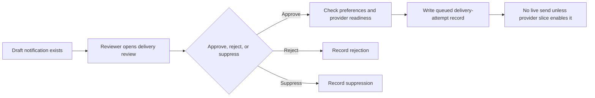
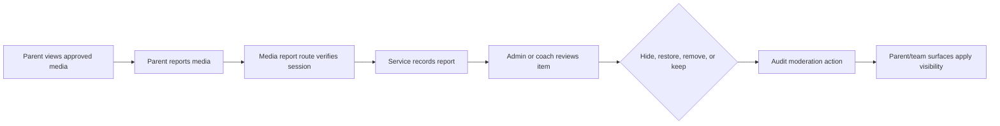
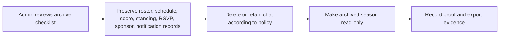

# Use Cases, User Journeys, And Process Maps

Status: draft. These journeys describe the expected enterprise workflows and the current proof boundaries.

## Journey 1: Parent Registration To Approved Access

Actors: anonymous parent, organization admin, Supabase Auth/session, audit service.

Proof status: API and RPC flow exists; hosted browser-level approval/rejection proof remains a production task.

## Journey 2: Parent Game-Day RSVP

Actors: parent/guardian, player, event, coach aggregate view.

Proof status: QA browser proof covers parent RSVP writes and Supabase readback.

## Journey 3: Coach Weekly Update

Actors: assigned coach, team, notification draft, provider boundary.

Proof status: hosted browser proof covers the weekly update row plus pending notification draft, with no provider delivery attempt.

## Journey 4: Parent Replay Draft And Publish

Actors: assigned coach/admin, team, Parent Replay service, parent notification draft.

Proof status: hosted browser proof covers publish rows and pending provider-review boundary rows. External sends remain disconnected.

## Journey 5: Provider Delivery Review

Actors: admin/coach reviewer, provider-delivery service, notification preferences.

Proof status: provider-review rows are tested and hosted proof exists for review records. Live email/SMS/Web Push sends are deferred.

## Journey 6: Media Report And Moderation

Actors: parent/guardian, coach/admin reviewer, media governance service.

Proof status: APIs and services exist; hosted browser proof for report/moderation is still open.

## Journey 7: Season Archive

Actors: admin, retention policy, export/audit service.

Proof status: archive checklist and admin surfaces exist; full hosted archive smoke proof remains a future hardening task.

## User Manual Gap

The journeys above are process-level docs. A role-by-role end-user guide is still needed before broader rollout:

- Parent guide: RSVP, schedule, snacks, volunteers, messages, media reports, preferences.
- Coach guide: attendance, weekly update, practice recap, weather draft, roster view.
- Admin guide: registration approval, teams, branding, operations, exports, media moderation, provider review.
