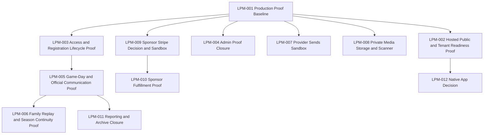

# Missing Production Slices Work Plan

Status: active
Created: 2026-07-29
Repository: LeaguePilot / Little League HQ
Protected source checkout: `/home/administrator/projects/youth-sports-platform-mvp-v3`
Clean AgentFlow execution checkout: `/home/administrator/projects/leaguepilot-missing-production-agentflow-20260729`
Baseline ledger: `docs/production-proof-baseline-2026-07-29.md`

This work plan turns the known missing or gated pieces into dependency-aware execution tasks. It does not treat local UI, seed fallback, provider configuration, or preview evidence as production acceptance. Each task must preserve child privacy defaults, role boundaries, human approval, auditability, and provider/payment/storage gates.

## Local Readiness Completion Ledger

The AgentFlow missing-production sequence is locally complete through LPM-012 as local repository readiness proof only. LPM-002 through LPM-012 are reconciled as `local repository readiness complete - external proof open` for the source contracts covered by their no-mutation verifiers, verifier failure-mode tests, and focused local tests; they are not sandbox, hosted, Supabase, RLS, provider, Stripe, storage/scanner, sponsor, archive/restore, native/app-store, accessibility, or production acceptance. LPM-013A is a ledger/verifier only; it reads repository files and records blockers before any operator chooses a separate proof run. The continued-execution invariant is that continued one-task-at-a-time execution accepts exactly one executable queue heading, either LPM-013A or LPM-014 or later; LPM-001 through LPM-012 remain completed records only and their A-variants must not be re-executed. LPM-018 is integrated in AgentFlow build `build_faa1c28e-cc9d-4912-9529-0df1240963da` at integration commit `50e56d2d33cd04dc869483a1f99b6583fd9cc36b`; external proof and production acceptance remain separate authorized follow-up lanes.

- Protected source checkout boundary: `/home/administrator/projects/youth-sports-platform-mvp-v3` is the source checkout boundary. Its live checkout state must be re-read before every task.
- Clean AgentFlow execution checkout: `/home/administrator/projects/leaguepilot-missing-production-agentflow-20260729` is the clean execution checkout. Its live checkout state must be re-read before every task.
- Both checkout rule: both checkout states must be re-read before every task.
- no-push/no-deploy/no-provider/no-production-mutation boundary: LPM-013A must not push, deploy, call providers, configure secrets, seed, mutate hosted records, upload or download media, collect analytics, run browser proof, run archive close, or claim production acceptance.
- Final integration commit through LPM-018: `50e56d2d33cd04dc869483a1f99b6583fd9cc36b`. This is historical integration evidence through LPM-018, not the queue commit and not a promise about any future final HEAD.
- Open external gate families after LPM-012: hosted browser proof open; Supabase readback open; RLS open; provider sandbox/webhooks open; Stripe settlement open; private media storage/scanner open; sponsor rendering/report/finance open; archive retention/restore open; native/app-store open; accessibility open; production acceptance open.
- LPM-015 local weather verifier boundary: `npm run qa:weather-provider-readiness` reads repository source only and checks provider order, draft enforcement, session-derived reviewer authority, event/team scope, provider fallback, idempotent/auditable draft creation boundary, and provider-send separation. Hosted weather credential proof, fallback behavior, signed-in coach/admin draft proof, Supabase readback, parent delivery, provider sandbox/webhook proof, realtime/offline behavior, accessibility, and production acceptance remain open gates.

## Execution Rules

- Use the smallest coherent slice; do not combine provider sends, Stripe, private media, native app, and hosted proof in one change.
- Do not mutate production, enable provider sends, enable payments, or enable uploads without explicit approval and a rollback path.
- Route handlers derive actor identity from a verified Supabase session. Services and Supabase adapters enforce role, team, guardian, and organization authority.
- UI never calls Supabase directly and never invents access grants.
- Live email, SMS, push, Stripe, storage, media scanning, AI family publishing, and native distribution require separate sandbox or hosted proof before production claims.
- Every completed task records validation commands, evidence paths, residual risk, and whether proof is local, hosted, provider, or production.

## Task Status Legend

- `planned`: structured and ready for scheduling.
- `in_progress`: active bounded slice.
- `blocked`: cannot proceed without external approval, credentials, provider access, or production-state change.
- `local repository readiness complete - external proof open`: local repository/source-contract readiness is complete, while hosted, Supabase, RLS, provider, Stripe, storage/scanner, sponsor, archive/restore, native/app-store, accessibility, and production acceptance remain open.
- `done`: end-to-end acceptance criteria met and evidence recorded, including any required external proof.

## Dependency Map

## LPM-001 - Production Proof Baseline

Status: `done`
Priority: P0
Governing rows: `docs/production-task-board.md` Active Goal - Operational-Truth Hardening and Gated Enhancements; `docs/capability-matrix.md` Security, RLS, and platform foundation.

Objective:
Establish the current proof baseline before any missing provider, payment, media, or native slice begins.

Local baseline ledger:
`docs/production-proof-baseline-2026-07-29.md` records the isolated AgentFlow branch, current HEAD, missing upstream, dirty-source caveats, local/external proof boundary, required RLS QA variables, skipped external proof, and open remote gates.

Tenant context:
Organization, season, team, player, guardian, and user scopes across parent, coach, admin, caregiver, and signed-out routes.

Actor authorization:
Signed-out public user; signed-in parent with active guardian link; assigned coach; active organization admin; temporary caregiver with accepted least-privilege authorization.

Seams:
`lib/supabase/shell-access.ts`, `lib/supabase/access-control.ts`, `lib/supabase/route-auth.ts`, `supabase/migrations/*`, `supabase/rls-policy.test.ts`, `scripts/verify-rls-boundaries.mjs`, `docs/supabase-migration-rehearsal-2026-07-26.md`, `docs/capability-matrix.md`, `docs/production-task-board.md`.

Acceptance criteria:

- AC-001: Current branch, upstream status, dirty-tree state, and unmerged branch caveats are recorded before proof work.
- AC-002: `npm run check:skills`, `npm run typecheck`, focused tests, and `npm run build` either pass or have exact blockers recorded.
- AC-003: Current RLS proof command and required QA environment variables are identified; if runnable, `npm run qa:rls-proof` passes with no provider sends or production mutations.
- AC-004: Backup/PITR/restore state is documented as proven or explicitly open; no launch-ready claim is made without restore acceptance.
- AC-005: Realtime authorization/reconnect/change-delivery proof is documented as proven or explicitly open.
- AC-006: Provider sends, media uploads, and payments remain disabled unless a later task explicitly enables an allowlisted sandbox path.

Validation:
`pwd`; `git rev-parse --show-toplevel`; `git status --short --branch`; `npm run check:skills`; `npm run typecheck`; focused tests; `npm run build`; `npm run qa:rls-proof` only when QA credentials and target safety are confirmed.

Out of scope:
Provider sends, Stripe collection, media uploads, native app work, production mutations, and schema changes.

## LPM-002 - Hosted Public and Tenant Readiness Proof

Status: `local repository readiness complete - external proof open`
Priority: P0
Depends on: LPM-001
Governing rows: Tenant Onboarding Readiness Lane; Public family discovery.

Objective:
Clear hosted-proof blockers, then prove public routes and tenant readiness against the intended hosted URL with correct environment configuration.

Acceptance criteria:

- AC-000: `npm run qa:hosted-readiness-preflight` validates explicit hosted URL, public organization, review-window, and QA admin command inputs before any browser proof is attempted.
- AC-001: `PUBLIC_ORGANIZATION_ID` and `PUBLIC_ACCESS_REVIEW_WINDOW` are configured for the target environment.
- AC-002: `/`, `/schedule`, `/registration`, `/auth`, and `/sponsors` render hosted public states without private records, demo identities, horizontal overflow, or undersized primary controls.
- AC-002A: After the LPM-020 code is deployed, hosted `/registration` renders passive server-derived proof metadata for the expected public-organization fingerprint and configured review window; `qa:public-family-proof` fails closed if the fingerprint, configured-state evidence, or expected review-window copy is absent or mismatched. Local proof remains local proof and may run without hosted expectation variables.
- AC-003: `/admin/health` and `/admin/teams` prove tenant readiness with signed-in QA admin and Supabase readback.
- AC-004: Vercel Authentication or preview bypass status is recorded; if blocked, exact blocker and next provider action are documented.
- AC-005: Provider sends remain zero.

Validation:
`QA_PROOF_BASE_URL=<hosted-url> PUBLIC_ORGANIZATION_ID=<organization-uuid> PUBLIC_ACCESS_REVIEW_WINDOW='<review-window>' NEXT_PUBLIC_SUPABASE_URL=<supabase-url> NEXT_PUBLIC_SUPABASE_ANON_KEY=<anon-key> QA_ADMIN_EMAIL=<qa-admin-email> QA_ADMIN_PASSWORD=<qa-admin-password> npm run qa:hosted-readiness-preflight`; `PUBLIC_FAMILY_BASE_URL=<hosted-url> QA_PROOF_BASE_URL=<hosted-url> PUBLIC_ORGANIZATION_ID=<organization-uuid> PUBLIC_ACCESS_REVIEW_WINDOW='<review-window>' npm run qa:public-family-proof`; `QA_PROOF_BASE_URL=<hosted-url> npm run qa:tenant-readiness-proof`; `npm test -- app/routes-smoke.test.ts lib/navigation/route-topology.test.ts lib/supabase/tenant-readiness.test.ts`.

Boundary:
The preflight is a blocker-clearing gate only. It performs no deploy, Vercel Authentication bypass, Supabase seed/write, provider send, payment write, media upload, migration, or production acceptance; hosted acceptance still requires the browser proof commands and operator evidence after credentials and the hosted URL are confirmed.

## LPM-003 - Access and Registration Lifecycle Proof

Status: `local repository readiness complete - external proof open`
Priority: P0
Depends on: LPM-001
Governing rows: LP-005, LP-006; Family access activation; Parent invitation issuance and acceptance; Additional guardian review.

Objective:
Prove that registration, invite acceptance, guardian repair, additional guardian, and first-sign-in flows grant access only after reviewed authority.

Acceptance criteria:

- AC-000: `npm run qa:access-lifecycle-authority` passes as local repository-source proof that the access lifecycle authority contracts are still present. This verifier performs no Supabase call, browser sign-in, provider send, seed/write, deployment, hosted mutation, or production acceptance.
- AC-001: QA admin approves and rejects temporary registration requests from hosted UI with cleanup and Supabase readback.
- AC-002: Existing-parent and invited-parent paths are proven, including one-time-display, wrong-account, expired, revoked, already-accepted, replay, and cross-tenant cases.
- AC-003: Guardian repair requires active organization-admin authority, existing parent profile, and bounded verification evidence.
- AC-004: Additional guardian approval creates only standard linked-guardian scope and never custody, medical, transport, schedule-edit, publishing, or onward-delegation authority.
- AC-005: No provider messages are sent during access flows.

Validation:
`npm run qa:access-lifecycle-authority`; `node --test scripts/verify-access-lifecycle-authority.test.mjs`; hosted Playwright proof with Supabase readback; `npm test -- app/api-registration-review.test.ts app/api-invite-acceptance.test.ts app/api-additional-guardians.test.ts lib/supabase/registration-approvals.test.ts lib/supabase/invite-acceptance.test.ts lib/supabase/additional-guardians.test.ts lib/supabase/guardian-links.test.ts`.

Boundary:
The authority verifier is a local source-contract gate only. It does not replace populated hosted UI proof, real-session RLS, Supabase readback, provider sandbox proof, deployment evidence, or production acceptance.

## LPM-004 - Admin Proof Closure

Status: `local repository readiness complete - external proof open`
Priority: P1
Depends on: LPM-001
Governing rows: LP-003, LP-004, LP-007, LP-009, LP-010.

Objective:
Close browser proof gaps for media report, media moderation, team-builder publish, broader admin scope, and public intake abuse controls.

Acceptance criteria:

- AC-000: `npm run qa:admin-proof-readiness` passes as local repository-source proof that the media report, media moderation, team-builder publish, broader admin scope, and public intake abuse-control seams remain present. This verifier performs no Supabase call, browser sign-in, Playwright run, seed/write, hosted mutation, provider send, deployment, edge firewall configuration, or production acceptance.
- AC-001: Signed-in QA parent reports approved team media; report count/status changes; unrelated team media remains invisible.
- AC-002: Signed-in admin or assigned coach hides, restores, or removes a QA media item; parent/team reads honor moderation state.
- AC-003: QA admin previews, edits, approves, and publishes a team-build plan with audit evidence and no cross-org writes.
- AC-004: Admin surfaces show only the intended organization data across teams, guardian links, archive, operations, and security.
- AC-005: Public registration and telemetry bursts are throttled in the deployed topology or the exact shared-store/firewall blocker is recorded.

Validation:
`npm run qa:admin-proof-readiness`; `node --test scripts/verify-admin-proof-closure-readiness.test.mjs`; hosted browser proof with Supabase readback; `npm test -- app/public-intake-rate-limit.test.ts lib/supabase/reporting.test.ts lib/supabase/sponsor-operations.test.ts app/api-live-actions.test.ts`.

Boundary:
The readiness verifier is a local source-contract gate only. It does not replace signed-in hosted UI proof, Supabase readback, populated cross-tenant negative proof, or deployed edge/shared-store rate-limit proof.

## LPM-005 - Game-Day and Official Communication Proof

Status: `local repository readiness complete - external proof open`
Priority: P1
Depends on: LPM-003
Governing rows: Schedule management; Communication Room and Branded Team Chat; Notification delivery architecture.

Objective:
Prove schedule decisions, official communications, corrections, withdrawals, acknowledgments, and offline/reconnect behavior without external delivery claims.

Acceptance criteria:

- AC-000: `npm run qa:game-day-communication-readiness` passes as local repository-source proof that game-day and official communication contracts are still present and bounded. This verifier performs no Supabase call, browser sign-in, Playwright run, seed/write, hosted mutation, provider send, deployment, realtime/provider configuration, or production acceptance.
- AC-001: Coach/admin game-day decision records monitor, confirm, delay, or cancel with exact event/schedule-version binding.
- AC-002: Each decision creates audit evidence and pending notification drafts only.
- AC-003: Official communication correction and withdrawal suppress superseded recipient records and preserve current-version acknowledgment rules.
- AC-004: One-version readback is proven on required family surfaces.
- AC-005: Offline/reconnect conflict states are explicit and do not silently overwrite current truth.

Validation:
`npm run qa:game-day-communication-readiness`; `node --test scripts/verify-game-day-communication-readiness.test.mjs`; `npm test -- lib/supabase/game-day-resolution.test.ts lib/supabase/official-communications.test.ts components/communication-room.test.tsx app/api-official-communications.test.ts`; hosted browser proof; Supabase readback.

Boundary:
The readiness verifier is a local source-contract gate only. It does not replace hosted browser proof, Supabase readback, populated one-version family projection, provider sandbox/webhook proof, realtime/offline production behavior, deployment evidence, or production acceptance.

## LPM-006 - Family Replay and Season Continuity Proof

Status: `local repository readiness complete - external proof open`
Priority: P1
Depends on: LPM-005
Governing rows: Parent Replay; Season continuity and readiness review.

Objective:
Prove private family Parent Replay, media consent/revocation, private engagement, season transition, and downstream refusal behavior.

Acceptance criteria:

- AC-000: `npm run qa:family-season-continuity-readiness` passes as local repository-source proof that private family Replay reads, media consent/revocation, private engagement, season transition authority, apply/revert, and downstream refusal seams remain present and bounded. This verifier performs no Supabase call, browser sign-in, Playwright run, seed/write, hosted mutation, provider send, media upload, storage object creation, deployment, storage/scanner/realtime/provider configuration, or production acceptance.
- AC-001: Draft Parent Replay content is excluded from family reads until approved and published.
- AC-002: Published family reads are guardian-scoped and cross-family/team negative checks pass.
- AC-003: Media attach/revoke requires current consent from every active guardian and hides media after revocation.
- AC-004: Private engagement rows are invisible to coaches and unrelated guardians.
- AC-005: Season transition handles multi-guardian concurrency, expiration, apply/revert/downstream refusal, and historical-season behavior.

Validation:
`npm run qa:family-season-continuity-readiness`; `node --test scripts/verify-family-season-continuity-readiness.test.mjs`; `npm run qa:family-replay-proof`; `npm run qa:season-transition-proof`; `npm test -- lib/supabase/family-replays.test.ts lib/supabase/season-transitions.test.ts components/family-parent-replay.test.tsx components/season-transition-review.test.tsx app/api-family-replays.test.ts app/api-season-transitions.test.ts`.

Boundary:
The readiness verifier is a local source-contract gate only. It does not replace hosted browser proof, Supabase readback, populated media consent/revocation proof, multi-guardian transition concurrency proof, storage/scanner proof, provider sandbox proof, deployment evidence, or production acceptance.

## LPM-007 - Provider Sends Sandbox

Status: `local repository readiness complete - external proof open`
Priority: P2 gated
Depends on: LPM-001
Governing rows: LP-015; Notification delivery architecture.

Objective:
Prove real sandbox email, SMS, and Web Push delivery without enabling broad production sends.

Acceptance criteria:

- AC-000: `npm run qa:provider-sandbox-readiness` passes as local repository readiness proof only before any real provider sandbox traffic is attempted.
- AC-001: Provider secrets are scoped to the approved environment and never copied into all-preview or production targets without explicit approval.
- AC-002: One adult-consented QA allowlist recipient is documented per channel.
- AC-003: Approved attempts create sandbox sends; rejected, preference-disabled, or provider-disabled attempts remain suppressed.
- AC-004: Signed webhooks update attempt state, reject replay, and preserve provider acceptance versus delivery versus read versus acknowledgment.
- AC-005: Retry and reconciliation behavior is idempotent; ambiguous outcomes are not automatically retried.
- AC-006: Cost controls, including a named cost cap, suppression, monitoring, rollback, and send gates are documented before any production request.

Validation:
`npm run qa:provider-sandbox-readiness`; provider sandbox tests, webhook tests, focused hosted proof, `npm test -- app/provider-boundary.test.ts lib/supabase/provider-delivery.test.ts lib/services/notifications/worker.test.ts lib/services/notifications/webhook-verification.test.ts`.

Boundary:
`qa:provider-sandbox-readiness` reads repository files only. It does not call Supabase, sign in, run Playwright, seed data, mutate hosted records, send email, SMS, or Web Push, call SendGrid, Twilio, Pingram, Web Push, or provider dashboards, configure secrets, deploy, or claim sandbox, hosted, provider, or production acceptance. Real sandbox email, SMS, and Web Push sends, provider dashboard setup, provider secrets, adult QA recipient approval, signed webhook endpoint registration, hosted worker execution, cost monitoring, and production-send approval remain open gates.

Out of scope:
Unrestricted production sends.

## LPM-015 - Weather Provider Action Readiness

Status: `done`
Priority: P1 proof
Depends on: LPM-001
Governing rows: LP-016; Weather alerts.

Objective:
Add a fail-closed local source verifier before hosted weather credential proof or parent delivery proof is attempted.

Acceptance criteria:

- AC-000: `npm run qa:weather-provider-readiness` passes as local repository readiness proof only without credentials, network access, Supabase calls, browser automation, provider sends, provider dashboard calls, deployment, or hosted mutation.
- AC-001: The verifier checks the weather provider order stays National Weather Service first, Open-Meteo fallback, and Tomorrow.io optional/premium.
- AC-002: The verifier checks every provider result is forced back to draft state before Supabase weather-alert persistence.
- AC-003: The verifier checks the draft route derives reviewer authority from the authenticated session and keeps caller-supplied reviewer authority out of the API.
- AC-004: The verifier checks the Supabase seam preserves event/team scope, provider fallback, reviewer audit fields, idempotent/auditable draft creation boundary, and provider-send separation.
- AC-005: The docs preserve hosted weather credential proof, fallback behavior, signed-in coach/admin draft proof, Supabase readback, parent delivery, provider sandbox/webhook proof, realtime/offline behavior, accessibility, and production acceptance as open gates.

Validation:
`npm run qa:weather-provider-readiness`; `node --test scripts/verify-weather-provider-readiness.test.mjs`; `npm test -- lib/services/weather/weather.test.ts lib/supabase/weather-draft.test.ts app/api-live-actions.test.ts app/provider-boundary.test.ts`.

Boundary:
`qa:weather-provider-readiness` is local repository readiness proof only. It reads repository files and checks source contracts; it does not call Supabase, sign in, run Playwright, seed data, mutate hosted records, call weather providers, call provider dashboards, create provider sends, send email, SMS, push, or Stripe requests, configure secrets, deploy, or claim hosted, provider, or production acceptance. Hosted weather credential proof, fallback behavior, signed-in coach/admin draft proof, Supabase readback, parent delivery, provider sandbox/webhook proof, realtime/offline behavior, accessibility, and production acceptance remain open gates.

## LPM-008 - Private Media Storage and Scanner

Status: `local repository readiness complete - external proof open`
Priority: P2 gated
Depends on: LPM-001
Governing rows: LP-019; Private media; Team photos/media.

Objective:
Decide and implement the private media storage path only after file isolation, scanning, consent, release, deletion, and takedown policy are explicit.

Acceptance criteria:

- AC-000: `npm run qa:private-media-storage-readiness` passes as local repository readiness proof only before any private storage, scanner, consent, deletion, hosted, or production proof is attempted.
- AC-001: Storage provider decision is documented with tenant-scoped object paths, RLS, retention, support export/delete, and abuse controls.
- AC-002: Uploads remain disabled by default behind environment and organization gates.
- AC-003: Upload initiation validates role, team, family-release intent, file size/type, and object path authority.
- AC-004: Scanner evidence includes magic-byte/decode/hash/size checks, EXIF-stripping re-encode, malware/inappropriate-content scan result, and failure quarantine.
- AC-005: Family release requires subject identity, guardian consent, moderation, alt text/transcript where needed, revocation handling, and deletion proof.

Validation:
`npm run qa:private-media-storage-readiness`; `node --test scripts/verify-private-media-storage-readiness.test.mjs`; storage/provider tests if implemented; migration/RLS tests; hosted signed-upload proof; hosted scan proof; populated consent/revocation proof; deletion/retention proof; abuse/takedown proof; accessibility proof; production acceptance.

Boundary:
`qa:private-media-storage-readiness` reads repository files only. It does not call Supabase, sign in, run Playwright, seed data, mutate hosted records, upload media, create storage objects, download objects, call a scanner, call provider dashboards, configure secrets, deploy, or claim hosted, storage-provider, scanner-provider, or production acceptance. The remaining open gates are storage-provider setup, scanner-provider setup, hosted signed-upload proof, hosted scan proof, populated consent/revocation proof, deletion/retention proof, abuse/takedown proof, accessibility proof, and production acceptance.

## LPM-009 - Sponsor Stripe Decision and Sandbox

Status: `local repository readiness complete - external proof open`
Priority: P2 gated
Depends on: LPM-001
Governing rows: LP-020; Family Balance and Stripe; Sponsor management; Money + sponsors community commerce.

Objective:
Either keep sponsor billing proof-only or scope Stripe sandbox collection with webhook-confirmed payment truth.

Acceptance criteria:

- AC-001: Product decision records whether sponsor billing remains proof-only or moves to sandbox collection.
- AC-002: If implemented, Stripe Checkout Sessions are used for one-time sponsor payments; browser return never marks paid.
- AC-003: Restricted API keys are preferred; secrets stay server-side and environment-scoped.
- AC-004: Signature-verified webhooks are the only settlement truth and validate session, metadata, amount, currency, sponsor, organization, and idempotency.
- AC-005: Admin UI separates sponsor record, placement, invoice readiness, payment proof, refund/failure, and public display.
- AC-006: Public and parent surfaces never expose billing state, child profiles, parent contacts, private media, or redemption proof.

Validation:
`qa:sponsor-stripe-readiness` is the LPM-009 local repository readiness completion gate for the existing proof-only versus sandbox boundary, server-side Checkout Session contract, server-only key handling, webhook settlement truth, admin/public privacy separation, and open payment gates. It is local repository readiness proof only and reads repository files only. It does not call Stripe, Supabase, sign in, run Playwright, seed data, mutate hosted records, create Checkout Sessions, configure API keys or webhook secrets, register webhook endpoints, charge or refund payments, call provider dashboards, deploy, or claim sandbox, hosted, provider, finance, production payment, or production acceptance.

Covered local evidence is limited to `qa:sponsor-stripe-readiness`, `node --test scripts/verify-sponsor-stripe-readiness.test.mjs`, and focused sponsor API/service/UI tests. Stripe sandbox tests, webhook tests, hosted admin proof, finance reconciliation, and production payment approval remain external follow-up gates.

Out of scope:
Production payment collection without sandbox/webhook proof and explicit go-live approval.

Open gates:
Stripe sandbox account setup, restricted key creation, webhook endpoint registration, signing-secret configuration, sandbox Checkout Session proof, signed webhook replay/duplicate proof, refund/failure proof, hosted admin proof, finance reconciliation, and production payment approval. Restricted API keys are preferred over broad secret keys, key access must use separate environments, and no Stripe secret or restricted key values are stored in source.

## LPM-010 - Sponsor Fulfillment Proof

Status: `local repository readiness complete - external proof open`
Priority: P2
Depends on: LPM-009
Governing rows: Sponsor management; Money + sponsors community commerce.

Objective:
Prove sponsor placement and fulfillment without overstating delivered impact.

Acceptance criteria:

- AC-001: Active approved sponsors render only in approved placement surfaces.
- AC-002: Logo assets require review evidence and fallback behavior when storage/rendering is unavailable.
- AC-003: Sponsor recap/report separates configured placement, observed rendering proof, billing proof, renewal state, and unproven impact.
- AC-004: Sponsor renewal email remains provider-gated unless LPM-007 is complete for that channel.
- AC-005: Public display QA proves no child, parent contact, private media, billing, or redemption leakage.

Validation:
`qa:sponsor-fulfillment-readiness` is the LPM-010 local repository readiness completion gate for approved active placement filters, Team Portal team scope, admin placement authority, approved logo asset reads, submitted-logo review queues, fail-closed sponsor data, fulfillment/report separation, renewal delivery gates, public and parent privacy, and open fulfillment gates. It reads repository files only. It does not call Supabase, sign in, run Playwright, seed data, mutate hosted records, send renewal email, call email/SMS/push providers, call Stripe, create or refund payments, upload files, fetch external logo assets, call provider dashboards, deploy, or claim hosted, observed-rendering, provider, finance, accessibility, production, or production sponsor acceptance.

Covered local evidence is limited to `qa:sponsor-fulfillment-readiness`, `node --test scripts/verify-sponsor-fulfillment-readiness.test.mjs`, and focused sponsor API/service/UI tests. Hosted public/admin browser proof, observed placement-rendering proof, approved logo asset proof, sponsor recap/report artifact proof, renewal email sandbox proof, public placement leak QA, accessibility proof, finance reconciliation, and production sponsor acceptance remain external follow-up gates.

Open gates:
Hosted public/admin browser proof, observed placement-rendering proof, approved logo asset proof, sponsor recap/report artifact proof, renewal email sandbox proof, public placement leak QA, accessibility proof, finance reconciliation, and production sponsor acceptance.

## LPM-011 - Reporting and Archive Closure

Status: `local repository readiness complete - external proof open`
Priority: P2
Depends on: LPM-005
Governing rows: Reporting and archive.

Objective:
Close hosted export and archive proof for real season-end operations.

Acceptance criteria:

- AC-000: `npm run qa:reporting-archive-readiness` passes as local repository readiness proof that the reporting/export, archive-vault, archived-season lock, and chat-retention separation contracts remain present. This verifier reads repository files only and performs no hosted action.
- AC-001: Active org admin exports roster, contacts, schedule, RSVP, snacks, volunteers, sponsors, and notifications with selected-organization scoping.
- AC-002: Export requests write audit evidence and do not include unrelated tenant rows.
- AC-003: Season close preserves non-chat records.
- AC-004: Chat text is removed under retention rules and cannot be reconstructed from app-readable data.
- AC-005: Hosted archive smoke proof covers admin and parent reads.

Validation:
`npm run qa:reporting-archive-readiness`; `node --test scripts/verify-reporting-archive-readiness.test.mjs`; `npm test -- lib/supabase/reporting.test.ts`; hosted RLS/admin export proof; archive smoke proof.

`qa:reporting-archive-readiness` is local repository readiness proof only. It reads repository files and checks active organization-admin export authority, supported export kinds, selected-organization and derived-ID export scoping, narrowed profile joins, CSV/audit/fail-closed export generation, admin-only archive surfaces, archived-season readable/mutation-locked contracts, local archive fallback labeling, and chat-retention separation. It does not call Supabase, sign in, run Playwright, seed data, mutate hosted records, run archive close, delete chat records, call provider dashboards, upload or download files, deploy, configure secrets, or claim hosted RLS, browser, retention, restore, or production acceptance. Hosted RLS/admin export proof, hosted archive smoke proof, real season-close proof, chat-retention cleanup proof, deleted-chat readback proof, backup/PITR/restore proof, accessibility proof, and production archive acceptance remain open gates.

## LPM-012 - Native App Decision

Status: `local repository readiness complete - external proof open`
Priority: P3
Depends on: LPM-002
Governing rows: Mobile-first UI; PWA installation.

Objective:
Decide whether Expo/native app work is justified by evidence instead of preference.

Acceptance criteria:

- AC-000: `npm run qa:native-app-decision-readiness` passes as local repository readiness proof that the PWA-first/native-decision contract remains present. This verifier reads repository files only and performs no hosted, provider, browser, app-store, native, analytics, media, deployment, or Supabase action.
- AC-001: PWA install, standalone launch, push permission, offline, and mobile workflow metrics are reviewed.
- AC-002: Native need is justified by app-store, camera/media, stronger push, OS integration, or offline requirements that PWA cannot meet.
- AC-003: If approved, native architecture reuses existing domain models, Supabase session/RLS boundaries, provider gates, and child privacy rules.
- AC-004: If not approved, Expo remains deferred and PWA backlog is updated with the next mobile hardening tasks.

Validation:
`npm run qa:native-app-decision-readiness`; `node --test scripts/verify-native-app-decision-readiness.test.mjs`; PWA/mobile browser proof; production usage metrics review; push permission proof; offline/reconnect proof; native product approval; Expo architecture review; app-store compliance review; accessibility proof; production native acceptance; product decision record.

`qa:native-app-decision-readiness` is local repository readiness proof only. It reads repository files and checks PWA-first posture, value-gated install promotion, standalone/install prompt measurement, native-interest telemetry without product approval, public-intake rate limiting, bounded manifest/service-worker/offline/App Shell wiring, route-smoke/API coverage, and future Expo guardrails that reuse domain contracts, Supabase session/RLS boundaries, provider gates, and child privacy rules. It does not call Supabase, sign in, run Playwright, seed data, mutate hosted records, collect real analytics, request push permissions, register app stores, scaffold Expo, send providers, upload media, deploy, configure secrets, or claim PWA/mobile browser, production usage, push-provider, app-store, native, or production acceptance. Mobile browser proof, production usage metrics review, push permission proof, offline/reconnect proof, native product approval, Expo architecture review, app-store compliance review, accessibility proof, and production native acceptance remain open gates.

## Current Execution Log

- 2026-07-29: LPM-014 added the local Team Builder player metadata slice:
  - Domain preview input/output now models admin-scoped age band, cutoff-age label, evaluation rating/source, and review notes without requiring or emitting private full birthdates.
  - `/admin` Team Builder copy frames metadata as roster-fairness review input while keeping player display to first name plus last initial.
  - Migration `0034_team_builder_player_metadata.sql` extends existing admin-only `team_build_plans` persistence with idempotent JSON metadata/constraint columns and does not introduce a new family-readable table.
  - Local implementation is complete; hosted browser publish proof, Supabase migration apply/readback, real-session cross-org proof, and production acceptance remain open.
- 2026-07-29: Goal started. Created structured missing-slices work plan. Beginning LPM-001 with non-mutating repository and validation checks only.
- 2026-07-29: LPM-001 baseline repository context confirmed:
  - `pwd`: `/home/administrator/projects/youth-sports-platform-mvp-v3`
  - `git rev-parse --show-toplevel`: `/home/administrator/projects/youth-sports-platform-mvp-v3`
  - Current branch `codex/ui-ux-100-shell-chat` is even with `origin/codex/ui-ux-100-shell-chat` and `68` commits ahead / `1` commit behind `origin/main`.
  - Dirty tree remains present and includes unrelated parent dashboard source edits plus generated proof artifacts. This plan only added `docs/missing-production-slices-work-plan.md`; the prior acceptance audit remains untracked.
- 2026-07-29: LPM-001 local validation passed:
  - `npm run check:skills`
  - `git diff --check -- docs/exceptional-ux-acceptance-audit.md docs/missing-production-slices-work-plan.md`
  - `npm test -- app/route-guards.test.ts app/routes-smoke.test.ts app/provider-boundary.test.ts lib/navigation/route-topology.test.ts` passed `43` focused tests.
  - `npm run typecheck`
  - `npm run build` generated `91` app routes.
  - `npm test` passed `92` files and `510` tests.
- 2026-07-29: LPM-001 remote proof gates remain open:
  - `npm run qa:rls-proof` was not run because it targets a live Supabase QA project and requires explicit isolated-target variables.
  - Required RLS proof inputs from `scripts/verify-rls-boundaries.mjs` and `scripts/qa-target-guard.mjs`: `NEXT_PUBLIC_SUPABASE_URL`, `NEXT_PUBLIC_SUPABASE_ANON_KEY`, `QA_PARENT_EMAIL`, `QA_PARENT_PASSWORD`, `QA_COACH_EMAIL`, `QA_COACH_PASSWORD`, `SUPABASE_QA_TARGET_REF`, `SUPABASE_QA_PARENT_PROJECT_REF`, and `SUPABASE_QA_TARGET_CONFIRM=seed-isolated-qa-target`.
  - Backup/PITR/restore acceptance, Realtime authorization/reconnect/change-delivery proof, hosted role/browser proof, provider-send proof, payment proof, and private-media storage/scanner proof remain open.
- 2026-07-29: Isolated AgentFlow worker finalized the LPM-001 ledger in `docs/production-proof-baseline-2026-07-29.md` for attempt 3:
  - Current task worktree: `/home/administrator/.agentflow/worktrees/repo_80ec8817-7c48-4066-a53c-6a5aa57d31c8/build_5e3e818d-6dc6-4069-8fc9-6498a727b3eb/tasks/task_lpm-001_771e7704-f2bc-449a-9838-e21112a17673`
  - Current branch: `agent/build_5e3e818d-6dc6-4069-8fc9-6498a727b3eb/task_lpm-001_771e7704-f2bc-449a-9838-e21112a17673`
  - Current HEAD at attempt-3 start: `8ec64bd58c08572199a3703dbcf1fbe75941f3c4`
  - Upstream: none configured for the task branch.
  - Source checkout dirt, generated Playwright output, `.history`, and preserved AgentFlow worktrees remain out of scope for this slice.
  - Attempt-3 pre-final status was clean in the task worktree; attempt 2 produced commit `8ec64bd58c08572199a3703dbcf1fbe75941f3c4` but failed external AgentFlow integration validation with `sh: 1: next: not found`.
  - Attempt-3 final worker status contains only owned documentation modifications to this work plan and the baseline ledger.
  - `npm run check:skills` passed in the worker.
  - `npx vitest run app/route-guards.test.ts app/routes-smoke.test.ts app/provider-boundary.test.ts lib/navigation/route-topology.test.ts` passed `4` files and `43` tests.
  - `npm run typecheck`, `npm run build`, and `git diff --check` passed in the worker.
  - `npm run qa:rls-proof` remains skipped without an isolated QA target and confirmation.
