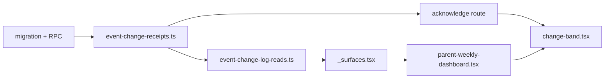

# Work Plan: Event Change Acknowledgment Implementation

Date: 2026-08-18
Status: Local implementation complete; isolated-QA promotion and real-session proof pending
Approach: Vertical slice (from Design Doc)

## Related Documents

- Design: [`docs/design/event-change-acknowledgment-design.md`](../design/event-change-acknowledgment-design.md)
- ADR: [`docs/adr/0002-server-side-event-change-receipts.md`](../adr/0002-server-side-event-change-receipts.md) — status `Accepted`
- Direction: [`docs/product-direction-2026-08.md`](../product-direction-2026-08.md) — direction 2
- Gate ledger: [`docs/backlog-closeout-2026-07-27.md`](../backlog-closeout-2026-07-27.md)

**Decision gate cleared:** ADR 0002 is `Accepted`; Phase 1 may begin when implementation work is
authorized.

## Verification Strategy (from Design Doc)

### Correctness Proof Method

Correct means three things simultaneously: two devices show one truth for the same guardian;
acknowledgment happens only on human activation; an out-of-scope write is denied in SQL. Verified by
cross-device equivalence tests, an interaction test proving no acknowledgment without activation, and
an executed denial test.

### Early Verification Point

The migration and RPC with its denial test, before any UI work. Success: literal policy assertions
pass and the denial test denies. Failure response: halt and revise ADR 0002. A receipt system that
cannot deny is worse than today's watermark because it manufactures evidence.

### Proof Strategy

Local repository evidence only. No hosted execution, provider operation, or production acceptance is
claimed. Hosted proof remains `EXT-HOSTED-SESSION` and `EXT-RLS-ACTOR-ACTION`.

## Quality Assurance Mechanisms (from Design Doc)

| Mechanism | Command | Status |
| --- | --- | --- |
| Type contracts | `npm run typecheck` | adopted |
| Unit and policy assertions | `npm test` | adopted |
| Literal RLS policy names | `supabase/rls-policy.test.ts` | adopted |
| RLS boundary proof | `npm run qa:rls-proof` | adopted |
| Lint | `npm run lint` | adopted |
| Build | `npm run build` | adopted |
| Executed 403-denial test | new test in Phase 1 | adopted |

## Design-to-Plan Traceability

| AC | Requirement | Phase | Task |
| --- | --- | --- | --- |
| AC-001 | Cross-device seen/acknowledged state | 2, 3 | 2.2, 3.3 |
| AC-002 | No receipt reads as unseen | 2 | 2.2 |
| AC-003 | Receipt failure degrades, never errors | 3 | 3.4 |
| AC-004 | High-impact requires explicit control | 3 | 3.2 |
| AC-005 | Activation persists and reflects | 3 | 3.2 |
| AC-006 | Idempotent re-acknowledgment | 1 | 1.3 |
| AC-007 | Informational marks seen only | 3 | 3.2 |
| AC-008 | Out-of-scope write denied, executed test | 1 | 1.4 |
| AC-009 | No cross-family receipt exposure | 1, 2 | 1.2, 2.2 |

## Reference Contract Values

- `change_type` values: `created`, `time_changed`, `location_changed`, `cancelled`, `completed`, `restored`
- High-impact subset (requires acknowledgment): `time_changed`, `location_changed`, `cancelled`
- Read limit: bounded to 50, default 20 (`lib/supabase/event-change-log-reads.ts`)
- Route: `POST /api/parent/event-changes/acknowledge`
- Table: `public.event_change_receipts`, unique `(event_change_log_id, parent_user_id)`
- RPC: `public.acknowledge_event_change`

## Failure Mode Checklist

| Failure mode | Countermeasure | Task |
| --- | --- | --- |
| Receipt query fails | Render unconfirmed, no error | 3.4 |
| Duplicate acknowledgment | Unique constraint + idempotent RPC returns original timestamp | 1.3 |
| Out-of-scope change id | SQL authorization denies; executed test | 1.4 |
| Concurrent acknowledgment from two devices | `on conflict do nothing` plus returning original row | 1.3 |
| Offline activation | Control disabled; no optimistic success | 3.4 |
| Policy renamed, test loosened | Forbidden — update assertion to new literal name, never weaken | 1.2 |

## ADR Bindings

| Decision | Binding constraint on implementation |
| --- | --- |
| ADR 0002 — derived, not stored | No status/requirement column. Derive from `change_type`. |
| ADR 0002 — SQL authorization | Route resolves actor only; scope decided in the RPC. |
| ADR 0001 — human in the loop | Nothing auto-acknowledges. Render sets `seen_at` only. |
| `codex-rules.md` rule 5 | No new workflow states. Receipt timestamps are not event states. |
| `codex-rules.md` rule 4 | `ChangeBand` imports no Supabase client. |
| `codex-rules.md` rule 1 | `lib/domain/` is not touched by this plan. |

## Connection Map

## Objective

Make a guardian's awareness of a schedule change durable across devices and provable for the change
types that carry safety consequence, without touching the domain layer, the change-log write path, or
any provider gate.

## Background

`components/family/change-band.tsx` keeps its "since you last looked" watermark in `localStorage` and
advances it on render. Awareness therefore does not cross devices, does not represent a human having
read anything, and leaves no organizational record for time, venue, or cancellation changes. The
server-side acknowledgment pattern already exists for official communications and is reused here.

## Risks and Countermeasures

### Technical Risks

| Risk | Impact | Countermeasure |
| --- | --- | --- |
| Adding a write to a read-only family surface | Medium | SQL authorization, idempotency, executed denial test before UI |
| `rls-policy.test.ts` literal-string coupling | Low | Add new assertions; never loosen existing ones |
| Receipt rows grow per change per guardian | Low | Cascade delete from `event_change_logs`; state retention explicitly in Phase 1 |
| Single `ChangeBand` call site prop change | Low | Same-commit update; typecheck catches drift |

### Schedule Risks

| Risk | Countermeasure |
| --- | --- |
| Implementation diverges from accepted ADR 0002 | Stop and amend or supersede the ADR before continuing |
| Scope creep into notification delivery | Non-Scope list in the Design Doc; delivery stays behind `DEC-PROVIDER` |

## Implementation Phases

### Phase 1: Schema, RPC, and denial proof (Estimated commits: 1)

Value unit: the receipt record exists and correctly refuses unauthorized writes.

#### Tasks

- [x] 1.1 Create `supabase/migrations/<YYYYMMDDHHMMSS>_event_change_receipts.sql` with the table, `unique (event_change_log_id, parent_user_id)`, and an index on `(parent_user_id, event_change_log_id)`
- [x] 1.2 Enable RLS and add named policies; add literal assertions to `supabase/rls-policy.test.ts`
- [x] 1.3 Add `public.acknowledge_event_change` — `security definer`, `set search_path = public`, idempotent via `on conflict`, returning the original timestamp
- [x] 1.4 Revoke execute from `public, anon`; grant to `authenticated, service_role`; add the executed 403-denial test
- [x] 1.5 State the receipt retention rule in the migration header comment

#### Phase Completion Criteria

- [x] `npm test` passes including new policy assertions and the denial test
- [ ] `npm run qa:rls-proof` passes
- [ ] Denial test fails closed when authorization is deliberately removed (verify the test can fail)

### Phase 2: Service and read integration (Estimated commits: 1)

Value unit: the read returns receipt state per change.

#### Tasks

- [x] 2.1 Add `lib/supabase/event-change-receipts.ts` with the RPC wrapper and scoped receipt read
- [x] 2.2 Extend `listParentEventChangeLogs` to attach `seenAt`, `acknowledgedAt`, and derived `requiresAcknowledgment` (AC-001, AC-002, AC-009)
- [x] 2.3 Extend `lib/supabase/event-change-log-reads.test.ts` for present, absent, and failed receipt reads
- [x] 2.4 Add `app/api/parent/event-changes/acknowledge/route.ts` using `requireAuthenticatedRouteUser`
- [x] 2.5 Add route tests for 200, 401, 400, and 403

#### Phase Completion Criteria

- [x] `npm run typecheck` and `npm test` pass
- [x] The read adds exactly one query (NFR-4), asserted in the existing call-recording test harness

### Phase 3: Surface (Estimated commits: 1)

Value unit: a guardian sees and acknowledges changes, identically on any device.

#### Tasks

- [x] 3.1 Remove the `localStorage` watermark and `useSyncExternalStore` from `ChangeBand`; remove `storageKey` from its props
- [x] 3.2 Add the acknowledgment control for high-impact types only; informational types record seen without a control (AC-004, AC-005, AC-007)
- [x] 3.3 Remove storage-key construction in `components/parent-weekly-dashboard.tsx:270-276`; thread receipt state and the acknowledge handler (AC-001)
- [x] 3.4 Implement degraded and offline states per the UI Error State table (AC-003)
- [x] 3.5 Update `components/parent-weekly-dashboard.test.tsx` and add `change-band` interaction tests, including "no acknowledgment without activation"

#### Phase Completion Criteria

- [x] Interaction tests prove acknowledgment requires activation
- [x] Cross-device equivalence test passes (same guardian, two simulated clients, one truth)
- [x] No Supabase client import appears in `ChangeBand`

### Final Phase: Quality Assurance (Required) (Estimated commits: 1)

#### Tasks

- [x] 4.1 `make validate` (docker compose config, typecheck, full Vitest suite)
- [x] 4.2 `npm run build` and `npm run lint`
- [ ] 4.3 `npm run qa:rls-proof` and `npm run qa:contrast-proof` — focused `/parent` contrast passes; guarded real-session RLS remains pending on a fresh isolated QA fixture set
- [x] 4.4 Responsive and accessibility proof for the changed band at 320/390/768/1024/1440 in family-light, device-light, device-dark, and forced-colors, matching the LP-UX-004 harness
- [x] 4.5 Confirm every AC-001 through AC-009 has a named passing test
- [x] 4.6 Update `docs/Features.md` and `docs/capability-matrix.md`
- [x] 4.7 Record the slice as the next `lp-ux-NNN` entry and update `00-engagement-status.md`, including the correction that the "write-only `event_change_logs`" finding was stale
- [x] 4.8 Confirm the implementation matches accepted ADR 0002; amend or supersede the ADR before
      merging any intentional deviation

## Completion Criteria

1. **Implementation Complete** — Phases 1–3 tasks checked.
2. **Quality Complete** — typecheck, full suite, lint, build, RLS proof, contrast proof all pass; `npm audit` posture is recorded separately and no package dependency changed in this slice. The guarded real-session RLS proof remains open because the existing local QA fixtures are stale and were not rewritten.
3. **Integration Complete** — family surface renders receipt state end to end against local evidence; hosted proof explicitly deferred to `EXT-HOSTED-SESSION` and `EXT-RLS-ACTOR-ACTION`.

No item in this plan claims hosted execution, provider operation, or production acceptance.

## Progress Tracking

### Phase 1
- [ ] Started
- [ ] Complete

### Phase 2
- [ ] Started
- [ ] Complete

### Phase 3
- [ ] Started
- [ ] Complete

### Final Phase
- [ ] Started
- [ ] Complete

## Notes

- `docs/plans/` is not currently gitignored in this repository, contrary to the note in the
  documentation-criteria skill. Resolve that before treating plans as disposable.
