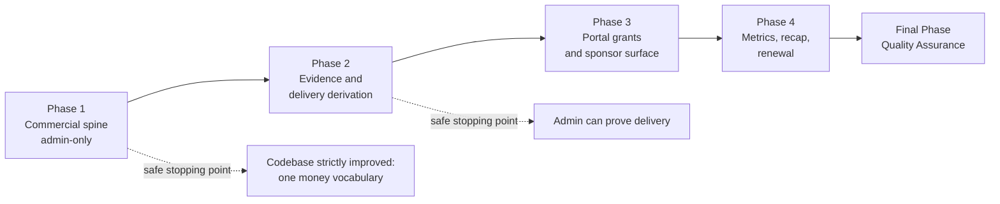
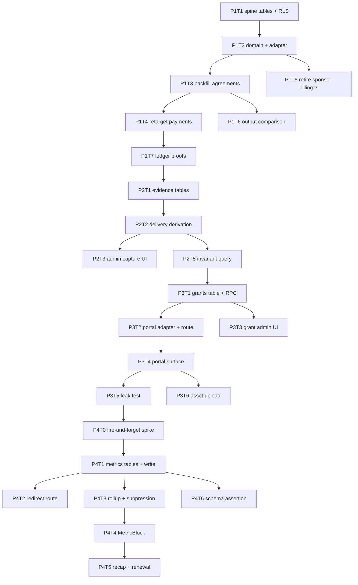

# Work Plan: Sponsor Program and Sponsor Portal Implementation

Created Date: 2026-08-19
Type: feature
Estimated Duration: 18-24 working days across 4 slices
Estimated Impact: ~34 files (10 migrations/tables, 3 new adapters, 2 extended adapters, 4 routes, 1 new page, 2 domain files, 1 deleted domain file, ~8 test files, 3 doc updates)
Related Issue/PR: n/a
Review Scope: `lib/domain/sponsor-*`, `lib/supabase/sponsor-*`, `lib/supabase/payments.ts`, `app/sponsor-portal/**`, `app/sponsor-link/**`, `app/api/admin/sponsors/**`, `components/sponsor-hub.tsx`, `supabase/migrations/*sponsor*`

## Related Documents

- Design Doc(s):
  - `docs/design/sponsor-program-design.md`
- ADR:
  - `docs/adr/0003-sponsor-revenue-spine-persistence.md`
  - `docs/adr/0004-sponsor-portal-access-without-a-fourth-role.md`
  - `docs/adr/0005-privacy-safe-sponsor-placement-metrics.md`
- UI Spec: `docs/ui-spec/sponsor-portal-ui-spec.md`
- PRD: `docs/prd/sponsor-program-prd.md`

## Verification Strategy (from Design Doc)

### Correctness Proof Method

- **Correctness definition**: every portal money figure equals the ledger fold for that invoice; no
  deliverable reports `delivered` without an evidence row; the portal response contains no
  family-originated value; no metrics table contains a person-identifying column; existing public
  placement output is unchanged.
- **Verification method**: property test over random ledger sequences; invariant query for
  `delivered` with zero evidence; executed leak test against a fully populated demo tenant; CI schema
  assertion over `sponsor_placement_*`; JSON output comparison of all six placement helpers.
- **Verification timing**: ledger and evidence proofs at end of Phase 2; leak test at end of Phase 3;
  schema assertion from Phase 4 onward and on every subsequent migration; output comparison during
  Phase 1 before the `sponsors.status` narrowing merges.

### Early Verification Point

- **First verification target**: Sponsor Hub reading a persisted agreement, invoice, and ledger, with
  a manual payment moving `paymentState` to `paid` and a dispute entry moving it to `disputed`.
- **Success criteria**: transitions occur with no status column written anywhere, provable by a
  database diff containing only ledger inserts; `getSponsorPlacement` output byte-identical.
- **Failure response**: stop before Phase 2. Every later phase assumes ledger derivation is cheap and
  correct; if it is not, the model must be reassessed rather than worked around.

### Proof Strategy

- **Proof obligation source**: red-test annotations in the Phase 1 and Phase 2 test skeletons for
  derivation and idempotency; for the privacy claims, the named artifact sources are the executed
  leak test output and the CI schema assertion, not code review.
- **Per-task propagation**: every task below carrying a claim records its proof obligation in the
  task's completion criteria.

## Quality Assurance Mechanisms (from Design Doc)

| Mechanism | Enforces | Config Location | Covered Files |
|---|---|---|---|
| `npm run typecheck` | Type contracts | `tsconfig.json` | project-wide |
| `npm test` | Unit and component behaviour | `package.json` | project-wide |
| `npm run build` | Route and render integrity | `next.config` | project-wide |
| `npm run lint` | Style and rule compliance | eslint config | project-wide |
| `make validate` | compose config + typecheck + test | `Makefile` | project-wide |
| `supabase/rls-policy.test.ts` | Literal policy-name assertions | `supabase/rls-policy.test.ts` | all 10 new tables |
| `npm run qa:sponsor-stripe-readiness` | Payment boundary contracts | `scripts/verify-sponsor-stripe-readiness.mjs` | sponsor payment sources |
| `npm run qa:sponsor-fulfillment-readiness` | Fulfillment contracts | `scripts/verify-sponsor-fulfillment-readiness.mjs` | sponsor fulfillment sources |
| Sponsor privacy schema assertion (new) | No person-identifying column on `sponsor_placement_*` | new verifier script | sponsor metrics migrations |

## Design-to-Plan Traceability

| Design Doc | DD Section | DD Item | Category | Covered By Task(s) | Gap Status | Notes |
|---|---|---|---|---|---|---|
| sponsor-program-design.md | Implementation Path Mapping | `sponsorship_agreements`, `sponsorship_invoices`, `sponsor_payment_ledger_entries` tables | impl-target | Phase 1 Task 1 | covered | |
| sponsor-program-design.md | Implementation Path Mapping | `sponsor_fulfillment_requirements`, `sponsor_fulfillment_evidence` | impl-target | Phase 2 Task 1 | covered | |
| sponsor-program-design.md | Implementation Path Mapping | `sponsor_portal_grants` + resolution RPC | impl-target | Phase 3 Task 1 | covered | |
| sponsor-program-design.md | Implementation Path Mapping | `sponsor_placement_events`, `sponsor_placement_daily_rollups` | impl-target | Phase 4 Task 1 | covered | |
| sponsor-program-design.md | Implementation Path Mapping | `sponsor_recap_reports`, `sponsor_renewal_reviews` | impl-target | Phase 4 Task 5 | covered | |
| sponsor-program-design.md | Main Components | `lib/domain/sponsor-program.ts` extension | contract-change | Phase 1 Task 2, Phase 2 Task 2, Phase 4 Task 3 | covered | Protected dir; authorized by ADR 0003 |
| sponsor-program-design.md | Interface Change Matrix | Retire `lib/domain/sponsor-billing.ts` | contract-change | Phase 1 Task 5 | covered | Deleted in the same commit as its last call site |
| sponsor-program-design.md | Interface Change Matrix | `createSponsorInvoiceCheckout` parameter rename + legacy fallback | contract-change | Phase 1 Task 4 | covered | |
| sponsor-program-design.md | Integration Points List | Stripe settlement writes a ledger entry | connection-switching | Phase 1 Task 4 | covered | |
| sponsor-program-design.md | Integration Points List | Placement anchors point at `/sponsor-link/[placementId]` | connection-switching | Phase 4 Task 2 | covered | |
| sponsor-program-design.md | Integration Points List | Route topology registration | connection-switching | Phase 3 Task 3, Phase 4 Task 2 | covered | |
| sponsor-program-design.md | Migration Strategy | Agreement backfill before `sponsors.status` narrowing | prerequisite | Phase 1 Task 3 | covered | |
| sponsor-program-design.md | Verification Strategy | Output comparison of six placement helpers | verification | Phase 1 Task 6 | covered | |
| sponsor-program-design.md | Verification Strategy | Ledger property test and dedupe proof | verification | Phase 1 Task 7 | covered | |
| sponsor-program-design.md | Verification Strategy | `delivered` implies evidence invariant query | verification | Phase 2 Task 5 | covered | |
| sponsor-program-design.md | Verification Strategy | Portal leak test | verification | Phase 3 Task 5 | covered | |
| sponsor-program-design.md | Verification Strategy | CI schema assertion on `sponsor_placement_*` | verification | Phase 4 Task 6 | covered | |
| sponsor-program-design.md | Security Considerations | Rate limits on both public routes | impl-target | Phase 3 Task 2, Phase 4 Task 2 | covered | |
| sponsor-program-design.md | Security Considerations | Redirect destination from stored URL only | impl-target | Phase 4 Task 2 | covered | |
| sponsor-program-design.md | Risks | Fire-and-forget write semantics spike | prerequisite | Phase 4 Task 0 | covered | Blocks Phase 4 Task 1 |
| sponsor-program-design.md | Test Boundaries | Demo tenant seeds all six golden states | verification | Phase 3 Task 4 | covered | |

## Reference Contract Values

| Design Doc (§ Section) | Contract Type | Required Observable Value (verbatim) | Covered By Task(s) |
|---|---|---|---|
| sponsor-program-design.md (§ State Transitions and Invariants) | state-lifecycle-negative | "No column anywhere stores a deliverable state or a payment state" | Phase 1 Task 2, Phase 2 Task 2 |
| sponsor-program-design.md (§ State Transitions and Invariants) | state-lifecycle-negative | "delivered is unreachable without an evidence row" | Phase 2 Task 2, Phase 2 Task 5 |
| sponsor-program-design.md (§ State Transitions and Invariants) | state-lifecycle-negative | "The ledger is append-only; enforced by a `before update or delete` trigger that raises, because the service-role adapter client bypasses RLS" | Phase 1 Task 1, Phase 1 Task 7 |
| sponsor-portal-ui-spec.md (§ Visual Acceptance) | derived-display | Golden state 2 — "No element anywhere on the page reads `live`, `delivered`, or `fulfilled`" when placements exist with zero evidence | Phase 3 Task 4 |
| sponsor-portal-ui-spec.md (§ Component: MetricBlock) | derived-display | Below threshold, the value is replaced by "below reporting threshold"; on read error the block shows "Measurement temporarily unavailable" and **never renders 0** | Phase 4 Task 4 |
| sponsor-portal-ui-spec.md (§ Component: ProofStrip) | structure-order | Five checkpoints in fixed order: agreement signed, payment received, logo approved, placements scheduled, recap delivered — never reordered or truncated | Phase 3 Task 4 |
| sponsor-program-design.md (§ Data Contracts) | derived-display | Every metric value is "either suppressed, unavailable, or a rollup-derived number" | Phase 4 Task 3, Phase 4 Task 4 |

## Failure Mode Checklist

| Category | Applies? | Covered By Task(s) |
|---|---|---|
| same-value | yes | Phase 1 Task 7 — duplicate `(provider, provider_event_id)` yields one row and returns success |
| no-op | yes | Phase 3 Task 2 — revoking an already-revoked grant is idempotent success |
| empty input | yes | Phase 3 Task 4 — agreement with zero requirements renders `EmptyState`, not a crash or a false `fulfilled` |
| invalid option | yes | Phase 3 Task 2 — malformed token rejected by pattern before hashing; Phase 4 Task 2 — non-uuid `placementId` returns 404 with no write |
| missing config | yes | Phase 1 Task 4 — payment gate closed and no Stripe account configured must degrade to manual recording, not error |
| unavailable boundary | yes | Phase 4 Task 3 — rollup read failure returns unavailable, never 0; Phase 4 Task 1 — event write failure leaves the host response unchanged |
| shared-state dependency | yes | Phase 1 Task 5 — the two money vocabularies must never both compile; deletion ships with the last call-site removal |
| rollback-only visibility | yes | Phase 1 Task 3 — agreement backfill must be verified reversible before `sponsors.status` narrowing merges |
| missing-sort-key ordering | yes | Phase 2 Task 3 — evidence list ordered by `observed_at` with a deterministic tiebreak on `id`; Phase 3 Task 4 — outstanding assets sort before approved |

## UI Spec Component → Task Mapping

| UI Spec Component (section heading) | States to Cover | Covered By Task(s) | Gap Status | Notes |
|---|---|---|---|---|
| § Component: ProgramStatusChip | default / loading / error / partial | Phase 3 Task 4 | covered | `disputed` overrides all other states |
| § Component: ProofStrip | default / loading / error / partial | Phase 3 Task 4 | covered | Fixed five-item order |
| § Component: DeliverableRow | default / loading / empty / error / partial | Phase 3 Task 4 | covered | |
| § Component: DeliveryStateBadge | default / loading / error | Phase 3 Task 4 | covered | Outline vs filled treatment |
| § Component: MetricBlock | default / loading / empty / error / partial / below-threshold | Phase 4 Task 4 | covered | "Not measured" list asserted non-empty |
| § Component: AssetChecklist | default / loading / empty / error / partial | Phase 3 Task 6 | covered | |
| § Component: LinkNoLongerActive | default | Phase 3 Task 2 | covered | Indistinguishable across all failure causes |
| § Component: SponsorGrantManager (admin, S-10) | default / loading / empty / error / partial / token-just-created | Phase 3 Task 3 | covered | Plaintext shown exactly once |

## ADR Bindings

| ADR | Source Section | Axis | Binding Decision | Covered By Task(s) |
|---|---|---|---|---|
| ADR 0003 | Decision | persistence | Payment ledger is append-only with `unique (provider, provider_event_id)`; balances are never stored | Phase 1 Task 1 |
| ADR 0003 | Implementation Guidance | contract_schema | `sponsor_packages` is adopted, not duplicated | Phase 1 Task 1 |
| ADR 0003 | Decision | contract_schema | No new enum value or workflow-state column for sponsor-facing status | Phase 1 Task 2, Phase 2 Task 2 |
| ADR 0003 | Implementation Guidance | data_flow | `provider: "manual"` is a first-class ledger provider | Phase 1 Task 4 |
| ADR 0003 | Decision | dependency_direction | `lib/supabase/sponsor-program.ts` depends on `lib/domain/sponsor-program.ts`, never the reverse | Phase 1 Task 2 |
| ADR 0004 | Decision | persistence | Grant stores SHA-256 hash only, constrained `~ '^[0-9a-f]{64}$'`, scoped to one `agreement_id` | Phase 3 Task 1 |
| ADR 0004 | Decision | data_flow | Grant resolution happens in a `security definer` RPC; the route authorizes nothing | Phase 3 Task 2 |
| ADR 0004 | Implementation Guidance | contract_schema | Portal adapter uses column allow-lists; `select("*")` prohibited | Phase 3 Task 2 |
| ADR 0004 | Implementation Guidance | data_flow | Sponsor-originated writes enter the existing `sponsor_assets` review queue as `pending` | Phase 3 Task 6 |
| ADR 0005 | Decision | persistence | No person-identifying column on any metrics table; `occurred_on` is `date` granularity | Phase 4 Task 1 |
| ADR 0005 | Implementation Guidance | data_flow | Suppression is applied in the read adapter, not by consumers | Phase 4 Task 3 |
| ADR 0005 | Implementation Guidance | data_flow | Rollups are the only read surface; raw events are never queried by a consumer | Phase 4 Task 3 |
| ADR 0001 | Decision | data_flow | Renewal recommendations require human approval before a sponsor sees them | Phase 4 Task 5 |
| ADR 0002 | Implementation Guidance | data_flow | Idempotent write returns the original result rather than erroring | Phase 1 Task 7 |

## Connection Map

| Boundary | Owner (left side) | Owner (right side) | Serialized Format | Consumer Parse Rule | Expected Signal | Covered By Task(s) |
|---|---|---|---|---|---|---|
| Admin UI → sponsor → portal URL | `SponsorGrantManager` | `app/sponsor-portal/[token]/page.tsx` | URL path segment, base64url, ≥ 43 chars | `^[A-Za-z0-9_-]{43,}$` then SHA-256 to 64 lowercase hex, matched against `token_hash` | A created grant's link resolves to that agreement; a rotated link does not | Phase 3 Task 1, Phase 3 Task 2 |
| Placement anchor → redirect route | placement render surfaces | `app/sponsor-link/[placementId]/route.ts` | URL path segment, uuid | uuid parse; unknown or inactive placement returns 404 with no write | 302 to the stored HTTPS sponsor URL; one `outbound_click` row; nothing about the requester persisted | Phase 4 Task 2 |
| Stripe webhook → ledger | `lib/supabase/payments.ts` | `sponsor_payment_ledger_entries` | Stripe event id string | Composite unique with `provider` | Replayed event leaves exactly one row and returns success | Phase 1 Task 4, Phase 1 Task 7 |
| Metric write → rollup | `lib/supabase/sponsor-metrics.ts` | `sponsor_placement_daily_rollups` | `date` (`occurred_on`) | Grouped by `(placement_id, surface_key, event_kind, occurred_on)` | Seeded events aggregate to the expected daily counts | Phase 4 Task 1, Phase 4 Task 3 |

## Objective

Make LeaguePilot able to sell a sponsorship it can prove. Persist the commercial spine that already
exists as pure TypeScript, make delivery provable through evidence rather than assertion, measure
placement exposure without ever identifying a person, and give the sponsor a surface where they can
see all of it without an account.

## Background

`docs/production-task-board.md:38` ranks sponsor billing priority 1 while
`docs/product-direction-2026-08.md:148` records `DEC-BILLING` as "keep proof-only." ADR 0003
resolves the contradiction in scoped form: build the sponsor product, keep the payment rails gated.
The prerequisites are unusually favourable — `lib/domain/sponsor-program.ts` already models the
correct spine and is already tested, `sponsor_packages` already exists as an orphan table waiting to
be adopted, and `lib/supabase/payments.ts` already contains a working gated Stripe Connect path.
What is missing is persistence, evidence, measurement, and a sponsor-facing surface.

## Risks and Countermeasures

### Technical Risks

- **Risk**: The portal read path widens over time until family data becomes reachable.
  - **Impact**: Catastrophic — a child-privacy breach to a commercial third party.
  - **Countermeasure**: Column allow-lists enforced by a static assertion, an executed leak test in
    CI against a fully populated demo tenant, and an ADR-level rule that broadening grant scope
    requires a new ADR.

- **Risk**: `sponsors.status` narrowing silently changes existing public placement output.
  - **Impact**: High — sponsors disappear from live pages.
  - **Countermeasure**: Agreement backfill precedes narrowing; JSON output comparison across all six
    placement helpers must show an empty diff before merge.

- **Risk**: Fire-and-forget write semantics on family-facing render paths are unconfirmed.
  - **Impact**: Medium — degraded family page performance.
  - **Countermeasure**: Phase 4 Task 0 is a blocking spike. If unconfirmed, counting moves entirely
    to the redirect endpoint and an explicit non-blocking queue, and render counting is dropped
    rather than forced.

- **Risk**: Stripe idempotency key change duplicates an in-flight Checkout session.
  - **Impact**: High — a sponsor charged twice.
  - **Countermeasure**: Migrated rows retain `sponsor-billing:{legacyId}`; only new invoices use
    `sponsor-invoice:{invoiceId}`.

### Schedule Risks

- **Risk**: Four slices is large enough to stall midway, leaving two money vocabularies coexisting.
  - **Impact**: High.
  - **Countermeasure**: Phase 1 is self-contained and ends with `sponsor-billing.ts` deleted. If work
    stops after Phase 1, the codebase is strictly better than it started.

- **Risk**: ~~Open items TBD-01 through TBD-04 block Phase 3 and Phase 4.~~
  - **Status**: Largely retired. TBD-01, TBD-02, and TBD-03 were resolved by the product owner on
    2026-08-19. Only TBD-04 (contrast check) remains, and it is an implementer task inside Phase 3
    rather than a blocker.

## Implementation Phases

Structure: **Option A — Vertical Slice**, per the Design Doc implementation approach.

### Phase Structure Diagram

### Task Dependency Diagram

---

### Phase 1: Commercial Spine, Admin Only (Estimated commits: 6)

**Purpose**: First vertical slice. Persist the money model and prove derivation works against real
rows. No sponsor-facing surface exists at the end of this phase, deliberately.

**Verification**: Early verification point from the Verification Strategy.

**Entry criteria**: ADR 0003 moved to Accepted — **done 2026-08-19**. Phase approved by the product
owner 2026-08-19.

#### Tasks

- [x] **Task 1**: Migration — `sponsorship_agreements`, `sponsorship_invoices`,
      `sponsor_payment_ledger_entries`; extend `sponsor_packages` with `season_id` and typed
      `benefits`; RLS mirroring `0017`; ledger append-only enforced by a raising trigger as well as
      RLS, because the service-role client bypasses RLS; unique
      `(provider, provider_event_id)`; `legacy_billing_record_id` preserved on invoices.
- [x] **Task 2**: Extend `lib/domain/sponsor-program.ts` (authorized by ADR 0003) and add
      `lib/supabase/sponsor-program.ts`. **Proof obligation**: no status column is written by any
      code path in this task.
- [x] **Task 3**: Backfill — one `active` agreement per existing active sponsor for the current
      season; verify reversibility before narrowing `sponsors.status`.
- [x] **Task 4**: Retarget `lib/supabase/payments.ts` — Checkout reads `sponsorship_invoices` with a
      legacy id fallback; webhook settlement inserts a ledger entry via
      `normalizeSponsorProviderPaymentEvent`; add manual payment recording with `provider: "manual"`;
      audit event on manual recording.
- [x] **Task 5**: Replace `buildSponsorBillingProofs` at its three real call sites —
      `lib/domain/money-sponsors.ts:192`, `components/feature-panels.tsx:4022`, and
      `lib/domain/domain.test.ts:944` — remove `export * from "./sponsor-billing"` from
      `lib/domain/index.ts`, drop the dead `SponsorBillingProof` / `SponsorBillingInput` /
      `SPONSOR_BILLING_WORKFLOW_STATES` / `SponsorBillingWorkflowState` /
      `SPONSOR_PAYMENT_PROOF_STATUSES` / `SponsorPaymentProofStatus` declarations from
      `lib/domain/contracts.ts`, and delete `lib/domain/sponsor-billing.ts` **in the same commit**.
      `SPONSOR_BILLING_STATUSES` / `SponsorBillingStatus` are retained: they describe the persisted
      `sponsor_billing_records.status` enum, which this phase keeps readable, and they are referenced
      by the status-token union at `lib/domain/contracts.ts:320`.
- [x] **Task 6**: Output comparison across `getSponsorPlacement`, `getTeamPortalSponsorPlacement`,
      `getScheduleSponsorPlacement`, `getMediaGallerySponsorPlacement`, `getEmailSponsorPlacement`,
      `getBannerSponsorPlacement`. **Proof obligation**: empty JSON diff.
- [x] **Task 7**: Ledger proofs — property test folding random sequences; duplicate-event test
      yielding one row and success; executed test proving `update` and `delete` are rejected for
      every connection including a service-role client; cross-organization denial test.
- [x] Quality check (staged): `make validate`, `npm run build`, `npm run lint`.

#### Phase Completion Criteria

- [x] Early verification point passed: manual payment moves `paymentState` to `paid` and a dispute
      entry to `disputed`, with a database diff showing only ledger inserts.
- [x] `getSponsorPlacement` output byte-identical before and after.
- [x] Exactly one money vocabulary compiles in the repository.
- [x] `supabase/rls-policy.test.ts` carries literal policy names for all three new tables.
- [x] `npm run qa:sponsor-stripe-readiness` passes with updated source contract paths.

---

### Phase 2: Fulfillment Evidence and Delivery Derivation (Estimated commits: 4)

**Purpose**: Make `delivered` mean something. This is the phase that separates this product from a
billing screen.

**Verification**: Invariant query — zero rows where state is `delivered` and evidence count is 0.

#### Tasks

- [ ] **Task 1**: Migration — `sponsor_fulfillment_requirements`, `sponsor_fulfillment_evidence`
      with `kind` in (`screenshot`, `link`, `event_recap`, `attendance_summary`, `campaign_note`),
      `observed_at`, `captured_by_user_id`, artifact reference; requirements generated from package
      benefits; RLS org-scoped.
- [ ] **Task 2**: `deriveDeliverableState(requirement, placements, evidence)` in
      `lib/domain/sponsor-program.ts`. **Proof obligation**: `delivered` unreachable without an
      evidence row, proven by test, not by inspection.
- [ ] **Task 3**: Admin evidence capture — `app/api/admin/sponsors/evidence/route.ts` plus Sponsor
      Hub UI; `observed_at` in the future is rejected; evidence list ordered by `observed_at` with an
      `id` tiebreak.
- [ ] **Task 4**: Extend `listSponsorAdminData` with requirements and derived delivery state; Sponsor
      Hub shows scheduled versus delivered per deliverable.
- [ ] **Task 5**: Invariant query added to the fulfillment readiness verifier; extend
      `npm run qa:sponsor-fulfillment-readiness` with evidence contracts.
- [ ] Quality check (staged).

#### Phase Completion Criteria

- [ ] An admin can attach evidence and watch a deliverable move from `scheduled` to `delivered`.
- [ ] Invariant query returns zero rows and is wired into the verifier.
- [ ] No deliverable state is stored in any column.
- [ ] Cross-organization denial tests pass for both new tables.

---

### Phase 3: Portal Grants and Sponsor Surface (Estimated commits: 6)

**Purpose**: The sponsor sees it. Highest-risk phase — first external principal, first surface
outside authenticated roles.

**Verification**: Executed leak test against a fully populated demo tenant.

**Entry criteria**: ADR 0004 Accepted. TBD-01 resolved 2026-08-19 (**grant expiry = season end**);
TBD-02 resolved 2026-08-19 (**HTTPS URL, not file upload**).

#### Tasks

- [ ] **Task 1**: Migration — `sponsor_portal_grants` with
      `token_hash text not null unique check (token_hash ~ '^[0-9a-f]{64}$')`, `agreement_id`,
      `expires_at`, `revoked_at`, `last_accessed_at`, `access_count`; `security definer` RPC
      `resolve_sponsor_portal_grant(target_token_hash)` with `set search_path = public` and execution
      revoked from `public, anon`.
- [ ] **Task 2**: `lib/supabase/sponsor-portal.ts` — hash, resolve, allow-listed reads. **Proof
      obligation**: static assertion that no `select("*")` appears in this module. Add
      `PUBLIC_RATE_LIMITS.sponsorPortalLookup`. Invalid, expired, and revoked return one
      indistinguishable result.
- [ ] **Task 3**: `app/api/admin/sponsors/grants/route.ts` + `SponsorGrantManager` UI; plaintext token
      shown exactly once with an explicit warning; revoke is idempotent; audit events on create and
      revoke; **token never logged in any path**.
- [ ] **Task 4**: `app/sponsor-portal/[token]/page.tsx` and portal components per the UI Spec —
      `PortalHeader`, `ProgramStatusChip`, `ProofStrip`, `NextStepCard`, `DeliverableRow`,
      `DeliveryStateBadge`, `EvidenceList`, `InvoiceSummary`, `LedgerTimeline`. Register both public
      routes in `lib/navigation/route-topology.ts`, nav-excluded. Extend
      `scripts/bootstrap-demo-tenant.mjs` so UI Spec golden states 1–6 are all reachable.
- [ ] **Task 5**: Leak test — assert the portal response contains no value from `players`,
      `profiles`, `guardian_authorizations`, `emergency_contacts`, `player_health_notes`,
      `team_memberships`, or any media table, run against a tenant where all are populated. Assert
      revoked, expired, and never-existed responses are identical.
- [ ] **Task 6**: Sponsor asset upload — creates `sponsor_assets` with `status = 'pending'`; proves no
      placement goes live; HTTPS validation reused from `saveSponsor`.
- [ ] **Task 7**: Responsive and accessibility proof at 320, 390, 768, 1024, 1440 px into
      `output/playwright/sponsor-portal/`; resolve TBD-04 contrast check.
- [ ] Quality check (staged).

#### Phase Completion Criteria

- [ ] A sponsor opens a link and sees their agreement with correct scheduled/delivered states.
- [ ] Leak test passes; revoked/expired/invalid are indistinguishable.
- [ ] Golden state 2 verified: with placements and zero evidence, no element reads `live`,
      `delivered`, or `fulfilled`.
- [ ] Zero WCAG 2.2 AA violations at all five widths.
- [ ] `USER_ROLES` unchanged; no RLS helper modified.

---

### Phase 4: Metrics, Recap, and Renewal (Estimated commits: 6)

**Purpose**: Give the sponsor a number that is true, and a reason to renew.

**Verification**: CI schema assertion plus threshold and redirect tests.

**Entry criteria**: ADR 0005 Accepted. TBD-03 resolved 2026-08-19 (**recap is a server-rendered page
at a stable URL**; no PDF dependency, so no additional ADR is required).

#### Tasks

- [ ] **Task 0** *(blocking spike)*: Confirm fire-and-forget write semantics in this Next.js version.
      If unconfirmed, drop render counting from the render path and count only through the redirect
      endpoint plus an explicit non-blocking queue. **Blocks Task 1.**
- [ ] **Task 1**: Migration — `sponsor_placement_events` (`occurred_on date`, `event_kind`,
      `surface_key` reusing the existing five `placement_key` values) and
      `sponsor_placement_daily_rollups`; 90-day retention on raw events. **Proof obligation**: no
      `user_id`, session id, IP, user agent, referrer, or device column exists. Add
      `recordPlacementRender` with bot and prefetch exclusion at write time.
- [ ] **Task 2**: `app/sponsor-link/[placementId]/route.ts` — 302 to the stored HTTPS sponsor URL
      only, never a request value; 404 without a write for unknown or inactive placements;
      `PUBLIC_RATE_LIMITS.sponsorLinkRedirect`; placement anchors repointed.
- [ ] **Task 3**: Rollup job plus `loadPlacementMetrics` with suppression applied **in the adapter**;
      consumers cannot query raw events.
- [ ] **Task 4**: `MetricBlock` per the UI Spec. **Proof obligation**: component test asserts a
      non-empty "not measured" list, that 24 events render threshold copy, that 25 render a number,
      and that a read error renders "temporarily unavailable" and never 0.
- [ ] **Task 5**: `sponsor_recap_reports` and `sponsor_renewal_reviews`;
      `lib/services/sponsor-recap/` assembly from evidence and rollups only. **Proof obligation**:
      every recap claim traces to a persisted row. Renewal recommendation is not displayed to the
      sponsor until `approved_at` is set (ADR 0001).
- [ ] **Task 6**: Sponsor privacy schema assertion verifier wired into CI, failing on any
      person-identifying column added to a `sponsor_placement_*` table.
- [ ] **Task 7**: Latency measurement proving placement counting adds < 15 ms p95; test proving a
      metric write failure leaves the host response unchanged in status and body.
- [ ] Quality check (staged).

#### Phase Completion Criteria

- [ ] Renders and outbound clicks accrue and display with honest labels.
- [ ] Threshold behaviour proven at 24 and 25 events.
- [ ] Schema assertion green and wired into CI.
- [ ] Recap contains no modelled or interpolated value.
- [ ] Unapproved renewal recommendation is not visible in the portal.
- [ ] Added latency under 15 ms p95 on placement-rendering surfaces.

---

### Final Phase: Quality Assurance (Required) (Estimated commits: 1)

**Purpose**: Cross-cutting quality assurance and Design Doc consistency verification.

#### Tasks

- [ ] Verify all Design Doc acceptance criteria AC-001 through AC-019 achieved
- [ ] Security review: portal allow-lists, token handling, redirect safety, rate limits, RLS denials
- [ ] Quality checks: `make validate`, `npm run build`, `npm run lint`
- [ ] Execute all tests including leak, denial, and threshold tests
- [ ] Coverage review for changed behaviour; record any gap with the alternative verification used
- [ ] Update `docs/Features.md` (definition of done requires it)
- [ ] Update `docs/capability-matrix.md` sponsor management and money+sponsors rows
- [ ] Update `docs/production-task-board.md` LP-020 and LPM-010 with actual state and remaining gates
- [ ] Move ADR 0003, 0004, 0005 to Accepted with dates
- [ ] Record explicitly which gates remain open: hosted proof, Supabase readback, RLS live proof,
      Stripe sandbox and settlement, finance reconciliation, accessibility audit, production sponsor
      acceptance

### Quality Assurance

- [ ] Quality check (staged)
- [ ] All tests pass
- [ ] Static check pass
- [ ] Lint check pass
- [ ] Build success

## Completion Criteria

- [ ] All phases completed
- [ ] Design Doc acceptance criteria satisfied
- [ ] Staged quality checks completed (zero errors)
- [ ] All tests pass
- [ ] `docs/Features.md`, `docs/capability-matrix.md`, `docs/production-task-board.md` updated
- [ ] No claim of hosted, provider, finance, or production acceptance is made from local evidence
- [ ] User review approval obtained

## Progress Tracking

### Phase 1
- Start: 2026-08-19
- Complete: 2026-08-19
- Notes: Approved 2026-08-19; ADR 0003 Accepted. Task 5 scope corrected after code inspection: the
  retired builder's real call sites are `money-sponsors.ts`, `feature-panels.tsx`, and
  `domain.test.ts`, not `sponsor-hub.tsx` as originally written.
- Two deviations from the written plan, both strengthening it:
  1. Append-only is enforced by a raising `before update or delete` trigger in addition to withheld
     grants. RLS alone was insufficient because `createSupabaseAdminClient` connects as
     `service_role` and bypasses row level security. The trigger permits referential cascade cleanup
     by checking whether the parent invoice still exists.
  2. `charge.refunded` and `charge.dispute.created` were added to the webhook handler. The domain
     normalizer already supported both, and without them a reversed payment would keep folding to
     "paid", which would have failed AC-004.
- `sponsors.status` was not narrowed by constraint. The column keeps `pending | active | expired` and
  every stored value; only its meaning changed, with deal state moving to
  `sponsorship_agreements.status`. This is what makes the Task 6 output comparison a real guard
  rather than a circular one.
- Local evidence only: typecheck, 786 tests, lint, production build,
  `npm run qa:sponsor-stripe-readiness`, and `npm run qa:sponsor-fulfillment-readiness` all pass.
  Hosted proof, Supabase readback, executed RLS denial proof, executed append-only trigger proof
  against a live target, Stripe sandbox settlement proof, and finance reconciliation remain open.
- The default 5s vitest timeout flakes under this machine's parallel load; a different unrelated file
  times out on each run. At `--testTimeout=30000` all 133 files and 786 tests pass. This is a
  pre-existing environment characteristic, not a regression from this phase.

### Phase 2
- Start: —
- Complete: —
- Notes:

### Phase 3
- Start: —
- Complete: —
- Notes: TBD-01 and TBD-02 resolved 2026-08-19; TBD-04 remains an in-phase implementer task.

### Phase 4
- Start: —
- Complete: —
- Notes: Task 0 remains a blocking spike. TBD-03 resolved 2026-08-19 (stable URL).

## Notes

- Phase 1 is a safe stopping point. If work halts after it, the repository is strictly better than it
  started: one money vocabulary instead of three, and `sponsor_packages` no longer dead schema.
- Local browser evidence under `output/playwright/sponsor-portal/` is local proof only and is never
  hosted or production acceptance, consistent with how every other slice in this repository records
  its evidence.
- TBD-01 (season end), TBD-02 (HTTPS URL), and TBD-03 (stable URL) were resolved by the product
  owner on 2026-08-19 and are recorded in the UI Spec and ADR 0004. TBD-04 remains and is an
  implementer task inside Phase 3.
