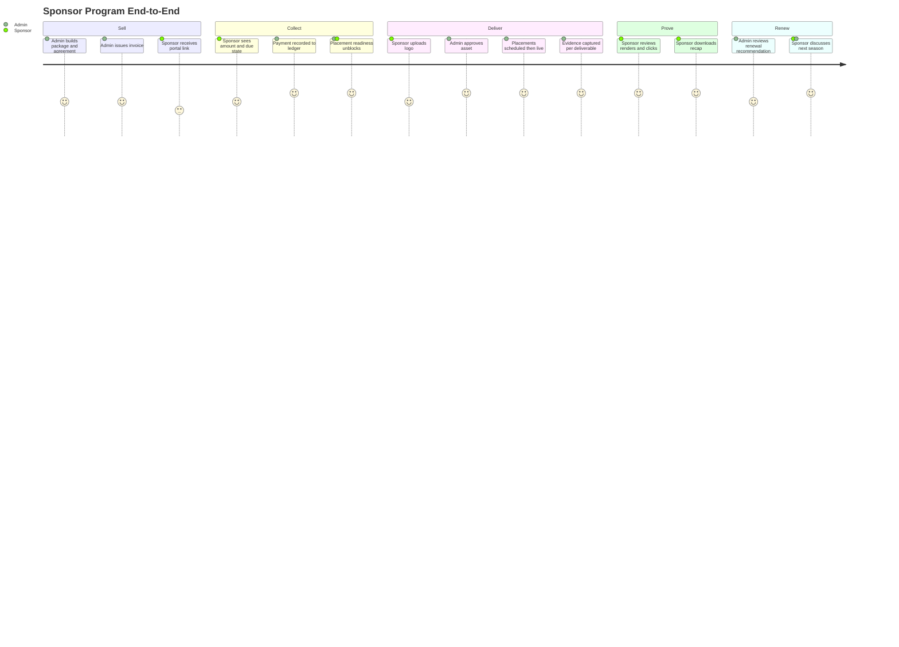
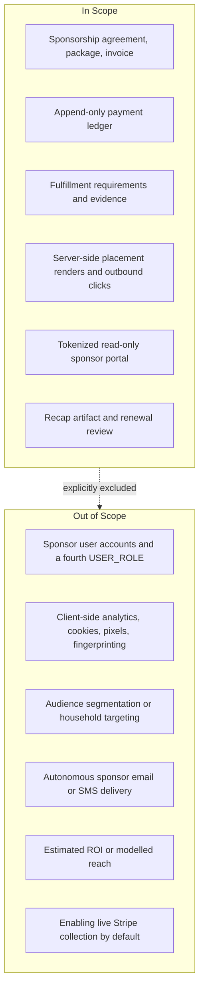

# PRD: Sponsor Program and Sponsor Portal

## Overview

### One-line Summary

Turn LeaguePilot's sponsor records into a provable commercial program — agreement, invoice, payment ledger, fulfillment evidence, honest placement metrics, and renewal review — with a sponsor-facing portal that shows a sponsor exactly what they bought, what has been delivered, and what evidence exists for it.

### Background

LeaguePilot can currently sell a sponsorship but cannot prove one. `/admin/sponsors` supports organization-scoped CRUD, placement settings, logo review, and admin-only billing records. `lib/domain/sponsor-program.ts` models the correct commercial spine — sponsor, agreement, package, invoice, normalized payment ledger, fulfillment requirements — but is pure TypeScript wired to nothing. `sponsor_packages` (migration `0002_platform_hardening.sql:298`) is written only by the demo seed and read by zero application code. There is no sponsor-facing surface of any kind; `grep` for `sponsor-portal` across the repository returns no hits.

The consequence is a commercial dead end. A sponsor pays and then goes blind. The league admin is the only person who can see whether the logo was approved, whether the placement is live, or whether anything was delivered. At renewal time there is nothing to show, so the renewal conversation is a favor request rather than a value review.

This is also the product's most credible monetization path. A sponsor buys local visibility and community trust **from a league**, so sponsor revenue does not depend on family adoption scale the way registration fees do. One league with forty families and eight local sponsors is a real sponsor business.

### Documented contradiction resolved by this PRD

`docs/production-task-board.md:38` ranks sponsor billing as priority 1. `docs/product-direction-2026-08.md:148` records `DEC-BILLING` as "revenue infrastructure for a product without users. Keep proof-only." Both statements are current and they conflict.

This PRD resolves the conflict in scoped form, recorded in ADR 0003:

- **Build** the sponsor program spine, fulfillment evidence, metrics, portal, and renewal review. These are league-facing and sponsor-facing product, not payment infrastructure, and their value does not depend on family install base.
- **Keep** live charge collection behind the existing payment gate (`loadPaymentGate`, `lib/supabase/payments.ts:191`). Invoices may be issued and payment recorded manually; Stripe collection stays disabled until a league explicitly enables it.

`DEC-BILLING`'s concern was building payment rails for nobody. This PRD does not build payment rails; it builds sponsor proof, which is what makes the sponsor conversation possible in the first place.

## User Stories

### Primary Users

| User | Relationship to LeaguePilot | Current state |
|---|---|---|
| League admin | Authenticated `admin` role, org-scoped | Has CRUD, has no deal or delivery model |
| Sponsor contact | **Not a LeaguePilot account holder** | Has no surface at all |
| Coach | Authenticated `coach` role | Sees approved placements on team portal |
| Parent / family | Authenticated `parent` role | Sees approved placements; must never be measured as a sponsor audience |

### User Stories

```
As a league admin
I want one screen that shows every sponsor's deal state, payment state, and delivery state
So that I know who to invoice, whose logo I am still waiting on, and who is ready to renew
```

```
As a sponsor contact
I want to open a link and see exactly what I purchased and what has actually run
So that I can trust the league delivered, without emailing the admin for a status update
```

```
As a sponsor contact
I want to see evidence for each deliverable, not a seasonal summary
So that I can justify the spend internally and decide whether to renew
```

```
As a league admin
I want a renewal review that names what performed and what did not
So that my renewal conversation is a value review rather than a favor request
```

```
As a parent
I want sponsor placement to never involve tracking me, my child, or my household
So that supporting local business does not cost my family its privacy
```

### Use Cases

1. Admin creates a sponsorship agreement from a package, issues an invoice, records a manual payment, and watches placement readiness flip from blocked to ready.
2. Admin sends a sponsor a portal link. The sponsor opens it, sees "awaiting your logo," uploads a logo, and the asset lands in the existing admin review queue as `pending`.
3. Admin approves the logo, schedules two placements, and the sponsor's portal moves from `asset collection` to `scheduled`.
4. Placements go live. Server-side render and outbound-click counts accrue. The sponsor's portal moves to `live` and shows per-deliverable counts with an explicit unproven column.
5. Season ends. Admin generates a recap. The portal shows delivered evidence per deliverable and a renewal recommendation the admin has reviewed.
6. A sponsor disputes a charge. The ledger records `DisputeOpened`, payment state becomes `disputed`, and placement readiness reflects it without an admin editing a status by hand.

### User Journey Diagram



### Scope Boundary Diagram



## Functional Requirements

### Must Have (P1 - MVP)

- [ ] **FR-1: Persist the commercial spine.** Agreement, package, invoice, and an append-only payment ledger become Supabase tables under organization-scoped RLS.
  - AC-001: Given an organization admin creates an agreement from a package, when the agreement is saved, then a `sponsorship_agreements` row exists scoped to that organization with status `draft`.
  - AC-002: Given a payment ledger entry arrives twice with the same `(provider, provider_event_id)`, when the second write is attempted, then it is rejected by a unique constraint and the ledger contains exactly one row.
  - AC-003: Given an invoice of 50000 cents with one `PaymentSucceeded` of 50000 cents, when the program summary is computed, then `paymentState` is `paid` and `outstandingCents` is 0.
  - AC-004: Given a `DisputeOpened` entry exists, when the program summary is computed, then `paymentState` is `disputed` regardless of prior paid total.

- [ ] **FR-2: Separate scheduled from delivered.** A deliverable is `delivered` only when at least one fulfillment evidence row exists for it.
  - AC-005: Given a placement row exists with an open date window and no evidence row, when the deliverable state is computed, then it reports `scheduled` and never `delivered`.
  - AC-006: Given a placement row plus one evidence row of kind `screenshot`, when the deliverable state is computed, then it reports `delivered` with the evidence `observed_at` timestamp.
  - AC-007: The portal shall render the words "scheduled" and "delivered" as visually distinct states with distinct labels, never merged into a single "active" badge.

- [ ] **FR-3: Sponsor portal without an account.** A sponsor reaches a read-only portal through a scoped, expiring, revocable tokenized link.
  - AC-008: Given a valid unexpired grant token, when the sponsor opens `/sponsor-portal/[token]`, then the portal renders scoped to exactly one agreement.
  - AC-009: Given a revoked or expired token, when the portal is opened, then the response is a non-enumerating "this link is no longer active" page and no sponsor data is rendered.
  - AC-010: The portal shall expose no child name, no player record, no parent contact, no roster, no private media, and no internal admin note, verified by an executed leak test rather than by inspection.
  - AC-011: Given a sponsor uploads a logo through the portal, when the upload completes, then a `sponsor_assets` row is created with status `pending` and no placement becomes live without admin approval.

- [ ] **FR-4: Honest placement metrics.** Metrics are server-measured, person-free, and labelled by what they actually prove.
  - AC-012: Placement render counting shall occur server-side during response construction, with no cookie, no client script, no device or browser fingerprint, and no IP address persisted.
  - AC-013: Outbound clicks shall be counted through a server-side redirect endpoint that issues a 302 to the sponsor URL and persists no visitor identity.
  - AC-014: Given a metric bucket below the suppression threshold of 25 events, when the portal renders that metric, then it displays "below reporting threshold" rather than the raw count.
  - AC-015: Every metric block shall carry an explicit "not measured" list naming what the number does not prove.
  - AC-016: No metric shall be attributable to an individual person, household, family, child, or authenticated user, verified by schema review showing no person-identifying column on any metrics table.

- [ ] **FR-5: Derived state, never stored state.** The sponsor-facing status is computed from records.
  - AC-017: No new enum value and no new workflow-state column shall be introduced for sponsor status; the portal status chip shall be a pure function of agreement status, ledger contents, requirement rows, and evidence rows.

### Should Have (P2)

- [ ] **FR-6: Recap artifact.** A season recap is generated as a durable, sponsor-downloadable artifact reflecting only recorded evidence.
  - AC-018: Given a recap is generated, when it is rendered, then every claim in it traces to a persisted evidence row or a persisted metric rollup, with no modelled or interpolated value.

- [ ] **FR-7: Renewal review.** A renewal recommendation is drafted from delivery completeness and metric trend, and requires human approval before a sponsor sees it.
  - AC-019: Given a renewal recommendation is drafted, when an admin has not approved it, then the sponsor portal does not display it.

### Could Have (P3)

- [ ] Multi-season sponsor history and year-over-year delivery comparison.
- [ ] Per-deliverable admin reminders when a fulfillment window opens with no evidence captured.
- [ ] Package builder UI with benefit templates.

### Won't Have (this release)

- **Sponsor user accounts / a fourth `USER_ROLE`.** `USER_ROLES` is frozen at `admin | coach | parent` (`lib/domain/contracts.ts:1`). Adding a fourth principal would rework every RLS helper and guard. Tokenized access is used instead (ADR 0004).
- **Client-side analytics of any kind.** No pixels, no cookies, no third-party scripts, no fingerprinting. Incompatible with hard rule 6 and with the trust position the product sells.
- **Unique visitor, reach, or impression-audience metrics.** These require visitor identity, which this design refuses to collect. "Renders" and "outbound clicks" are reported instead.
- **Estimated ROI, modelled value, or CPM equivalence.** No evidence exists for them.
- **Autonomous sponsor email.** Hard rule 5 keeps provider sends disconnected. Portal links are copied by an admin.
- **Live Stripe collection enabled by default.** Remains behind `loadPaymentGate`.

## Non-Functional Requirements

### Performance

- Sponsor portal server render: p95 under 800 ms with metrics read from daily rollups rather than raw event scans.
- Placement render counting must add no more than 15 ms to the host page response, achieved by fire-and-forget buffered writes that never block the response.
- Admin sponsor program summary for 100 sponsors: single-page load under 2 s.

### Reliability

- A failed metric write shall never fail the host page render. Metrics are best-effort; commercial records are not.
- Ledger writes are idempotent by `(provider, provider_event_id)`.
- Portal degrades to "delivery status temporarily unavailable" rather than erroring when the metrics rollup read fails.

### Security

- Portal tokens are bearer credentials: minimum 32 bytes of entropy, stored as SHA-256 hash only, scoped to one agreement, expiring, revocable, and access-audited. This follows the established `invite_token_hash` pattern (`0026_parent_invite_acceptance.sql`, `0029_temporary_caregiver_authorizations.sql:45`).
- Portal token lookup is rate-limited through the existing `PUBLIC_RATE_LIMITS` mechanism to prevent enumeration.
- All sponsor commercial tables are organization-scoped with RLS restricting write to active org admins, matching `sponsor_billing_records` (`0017_sponsor_billing_and_team_builder.sql`).
- The portal route performs reads through `lib/supabase/` adapters only; no Supabase client is imported into `app/` or `components/` (hard rule 3).

### Scalability

- Raw placement events are rolled up daily and the raw table is retention-bounded to 90 days; portal reads never scan raw events.

### Accessibility

- Compliance standard: WCAG 2.2 AA.
- Target assistive technologies: screen reader (NVDA, VoiceOver), full keyboard operation.
- Status must never be conveyed by colour alone — every state chip carries a text label.
- Known constraint: sponsor-supplied logo images have no controllable alt text; alt is generated as the sponsor business name.

## Success Criteria

### Quantitative Metrics

1. **Sponsor status self-service**: 80% of sponsor status questions answerable from the portal without admin contact, measured by admin-reported inbound status requests before and after, over one full season.
2. **Delivery provability**: 100% of deliverables marked `delivered` have at least one persisted evidence row, measured by a scheduled integrity query, continuously.
3. **Renewal conversation rate**: 60% of sponsors with a completed recap enter a renewal review, measured by `sponsor_renewal_reviews` rows against completed agreements, at season end.
4. **Privacy invariant**: 0 person-identifying columns on any sponsor metrics table, measured by an automated schema assertion in CI, on every migration.
5. **Metric honesty**: 100% of displayed metric blocks carry a populated "not measured" list, measured by a component test asserting the element is present and non-empty.

### Qualitative Metrics

1. A sponsor can answer "what did I buy, what ran, and what proof exists" from one screen without asking anyone.
2. An admin can answer "who owes me money and whose logo am I waiting on" from one screen.
3. No sponsor-facing number requires a caveat the portal does not already state itself.

### UI Quality Metrics

1. Sponsor completes logo upload on first attempt at a rate of 90% or better in moderated review.
2. Accessibility audit: zero WCAG 2.2 AA violations on the portal at 320, 390, 768, 1024, and 1440 px.

## Technical Considerations

### Dependencies

- Existing: `sponsors`, `sponsor_packages`, `sponsor_placements`, `sponsor_assets`, `sponsor_billing_records`, `audit_events`, `organization_memberships`.
- Existing: `lib/domain/sponsor-program.ts` pure summary logic, extended rather than replaced.
- Existing: `lib/supabase/payments.ts` Stripe Connect Checkout and webhook settlement path.
- Existing: `PUBLIC_RATE_LIMITS` (`lib/supabase/public-rate-limit.ts:26`).

### Constraints

- Hard rule 1: `lib/domain/` is protected — this PRD explicitly authorizes changes to `lib/domain/sponsor-program.ts` and the retirement of `lib/domain/sponsor-billing.ts`.
- Hard rule 2: no new enum values or workflow states to make a screen pass.
- Hard rule 3: no Supabase client in `app/` or `components/`.
- Hard rule 5: no autonomous provider sends.
- Hard rule 6: child privacy defaults hold absolutely, including in metrics.
- Hard rule 7: role boundaries stay visible; the sponsor is a non-role principal and must be visibly modelled as such.

### Assumptions

- Sponsor contacts will accept a link-based portal without an account. Validation: first-league pilot feedback.
- Server-side render counting is sufficient signal for sponsor value discussion. Validation: sponsor interview after first season.
- Leagues will capture evidence manually at first. Validation: measure evidence rows per delivered requirement in pilot.

### Risks and Mitigation

| Risk | Impact | Probability | Mitigation |
|---|---|---|---|
| Portal link forwarded outside sponsor organization | Medium | High | Scope to one agreement, expire per season, log every access, allow rotation; no child or family data is reachable through it under any circumstance |
| Low-volume leagues produce metrics too small to be meaningful | Medium | High | Suppression threshold of 25 with explicit "below reporting threshold" copy; days-live and evidence count carry the value story instead |
| Sponsors expect impressions and unique visitors | Medium | Medium | Name the metric honestly in the UI and state the "not measured" list; sell delivery proof rather than reach |
| Metrics table quietly becomes an ad-tech surface over time | High | Low | Schema assertion in CI that no person-identifying column exists; ADR 0005 records this as a kill criterion |
| Manual evidence capture does not happen | High | Medium | Portal shows the gap to the sponsor, which creates admin pressure; P3 reminders follow |
| Scope is large enough to stall | High | Medium | Four vertical slices, each independently shippable; slice 1 has no sponsor-facing surface at all |

## Appendix

### References

- `docs/production-task-board.md:38` — priority ranking
- `docs/product-direction-2026-08.md:148` — `DEC-BILLING`
- ADR 0003, ADR 0004, ADR 0005
- `docs/ui-spec/sponsor-portal-ui-spec.md`
- `docs/design/sponsor-program-design.md`

### Glossary

- **Agreement**: a per-season deal between a league and a sponsor. Carries commercial status.
- **Sponsor**: the durable business entity, surviving across seasons.
- **Placement**: a location where a sponsor is displayed. Existing table.
- **Fulfillment requirement**: one promised deliverable derived from a package benefit.
- **Fulfillment evidence**: a persisted artifact proving a requirement was actually delivered.
- **Render**: a server-confirmed instance of a sponsor placement being included in a response. Not an impression.
- **Outbound click**: a server-confirmed redirect through LeaguePilot to a sponsor URL.
- **Grant**: a tokenized, scoped, expiring portal access record for a non-account sponsor contact.
