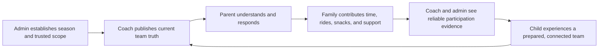

# LeaguePilot Role Journey Map

## Hypothesis status

`Draft hypothesis map — not validated by customer interviews`

This artifact maps the current LeaguePilot experience for the three primary adult roles. Repository-backed touchpoints are distinguished from unvalidated acquisition, emotion, and market assumptions. Use the [community discovery interview guide](leaguepilot-community-discovery-interview-guide.md) to replace hypotheses with observed evidence.

## Evidence base and limits

- Current routes and product boundaries: [`docs/Features.md`](../Features.md), [`docs/capability-matrix.md`](../capability-matrix.md), [`docs/production-task-board.md`](../production-task-board.md), and [`lib/navigation/route-topology.ts`](../../lib/navigation/route-topology.ts).
- Local implementation exists for the approved MVP queue, but `EXT-HOSTED-SESSION` remains the definition-of-shipped gate.
- The public product currently serves family discovery and access requests. A dedicated organization-buyer acquisition, demo, contract, and tenant-provisioning funnel is not established in the canonical route topology.
- Live provider sends, full registration payment collection, private media storage, native distribution, and Preview OpenAI are not assumed available.
- Emotion labels are hypotheses to test, not measured user sentiment.

## Community value loop

The loop succeeds only when operational truth and community participation reinforce one another. A feed, chat room, or sponsor surface alone does not create this loop.

## Persona 1 — Organization administrator

**Job to be done:** When a season is approaching, help me turn registrations, people, teams, schedules, permissions, and communications into a launch-ready league without losing data or trust.

### Organization admin journey

| Stage | Touchpoint | User action | Hypothesized emotion | Pain point or risk | Opportunity |
| --- | --- | --- | --- | --- | --- |
| Awareness | Referral, market search, league network | Looks for a system that reduces manual season operations. | Curious, skeptical | LeaguePilot has no dedicated buyer journey or proof-rich organization landing flow. | Explain the complete registration-to-team-to-family loop with explicit proof boundaries. |
| Consideration | Public site, demo material, competitor comparison | Compares registration, payments, rostering, scheduling, communication, safety, mobile access, and support. | Cautious | Full enrollment, waivers, and fee collection are not current LeaguePilot launch claims. | Position current operational strengths honestly; research whether payment parity is a purchase blocker. |
| Acquisition | Human agreement and tenant setup; no canonical self-service flow | Decides whether to trial one organization or division. | Anxious | Tenant provisioning, contract, migration, and implementation support are not represented as one product journey. | Define a bounded pilot and an organization identity/readiness checklist before building self-service acquisition. |
| Onboarding | `/admin/health`, `/admin/teams`, `/admin/imports`, `/admin/registrations`, `/admin/invites` | Creates the season, imports or enters people, resolves duplicates, assigns coaches, reviews registrations, builds teams, and establishes family access. | Busy, risk-aware | Data cleanup, missing guardians/coaches, invitation handling, and publish readiness create concentrated workload. | Make launch blockers, ownership, and the next safe action unmistakable; preserve atomic publish and audit evidence. |
| Engagement | `/admin`, schedule, communication, media, operations, security, sponsor, and report surfaces | Monitors readiness, resolves exceptions, approves sensitive work, and coordinates organization-wide changes. | In control when evidence is current | Dense queues, stale evidence, provider uncertainty, and cross-tenant risk can undermine trust. | Prioritize exception-based operations, scoped queues, visible freshness, and outcome readback. |
| Retention | Season health, archive, reports, transition review | Reviews whether the system saved time and whether the next season can reuse clean records safely. | Relieved or exhausted | Archive/restore proof, reporting completeness, and season rollover remain externally gated. | Measure hours saved, support cases, activation completion, missed events, and safe season rollover. |
| Advocacy | League peer network, board reporting | Recommends the product when launch and weekly operations were measurably calmer. | Confident | Local tests or attractive screens are not persuasive operational proof. | Produce privacy-safe outcome summaries and references from validated leagues. |

**Aha moment:** The administrator can see why the league is not ready, correct the exact blocker, publish the intended teams, and read back the resulting assignments and audit evidence.

**Moments of truth:** Import quality; registration approval; team publication; first official schedule change; cross-tenant denial; season close.

**Churn triggers:** Manual reconciliation persists; families cannot activate; communication truth is ambiguous; payments require unacceptable duplicate systems; support burden does not fall.

## Persona 2 — Volunteer coach or team manager

**Job to be done:** When I am preparing a team with limited time, help me know who, where, when, and what needs attention so I can coach rather than administer.

### Coach journey

| Stage | Touchpoint | User action | Hypothesized emotion | Pain point or risk | Opportunity |
| --- | --- | --- | --- | --- | --- |
| Awareness | League invitation or mandate | Learns which team and system the league expects them to use. | Obligated, time-conscious | Coaches may resist another app without immediate value. | Lead with assigned-team truth and today’s next action, not setup tours. |
| Consideration | Coach route preview, peer recommendation | Evaluates whether the tool replaces spreadsheets, group text, calendar edits, and attendance chasing. | Skeptical | Advanced features can look like additional work. | Demonstrate fewer repeated tasks and clear delegation boundaries. |
| Acquisition | Account/session and assigned-team membership | Accepts access and opens the assigned coach context. | Impatient | Wrong-team access or missing membership blocks trust immediately. | Fail closed with a clear repair path and no ambiguous empty state. |
| Onboarding | `/coach`, roster, schedule, attendance, messages | Confirms roster, next event, family readiness, and communication channel. | Focused | Incomplete parent access, missing RSVP, and unclear official messages force manual chasing. | Provide one prioritized readiness queue with explicit owners and status. |
| Engagement | Schedule, attendance, messages, weather/fields, snacks/volunteers, Parent Replay | Runs practices and games, updates families, delegates responsibilities, and publishes reviewed coaching context. | Productive when fast | Connectivity, duplicate reminders, message noise, and too many actions create abandonment. | Keep game-day actions mobile-fast, idempotent, offline-aware, and scoped to the assigned team. |
| Retention | Repeated weekly coordination and season timeline | Reuses plans and trusts family responses without recreating the process. | Supported | If the app cannot reduce administrative work, the coach returns to familiar group tools. | Measure follow-up messages avoided, RSVP completion, responsibility coverage, and recap reuse. |
| Advocacy | Coach network, incoming volunteers | Recommends the tool when a new coach can run a prepared week without specialized training. | Proud | Scorekeeping, statistics, or video may be expected in sport-specific markets. | Research whether to integrate rather than build those categories; protect the operational core. |

**Aha moment:** The coach opens the app and can act on the current event, attendance gaps, and family communication without assembling truth from multiple channels.

**Moments of truth:** First assigned-team load; first RSVP deadline; last-minute venue/weather change; delegated volunteer responsibility; first Parent Replay publication.

**Churn triggers:** Too many taps on game day; missing or stale family responses; messages are not trusted as official; offline failure loses work; the system adds documentation rather than removing it.

## Persona 3 — Parent or guardian household coordinator

**Job to be done:** When my family joins and participates in a team, help me understand what is official, what my child needs next, and how I can contribute without exposing private family information.

### Parent or guardian journey

| Stage | Touchpoint | User action | Hypothesized emotion | Pain point or risk | Opportunity |
| --- | --- | --- | --- | --- | --- |
| Awareness | Public league site, schedule, referral | Determines whether the league appears legitimate, safe, current, and welcoming. | Hopeful, cautious | Public information can be stale or unclear about access timing. | Show verified league identity, review window, privacy posture, and a clear access request. |
| Consideration | `/`, `/schedule`, `/sponsors`, `/registration`, `/auth` | Reviews schedule, league information, family expectations, and how to join. | Interested | The current request-access model is not a full enrollment, waiver, or fee flow. | Learn whether families expect one complete registration transaction or accept league-admin review. |
| Acquisition | `/registration`, access status, invitation acceptance | Requests access, waits for review, receives a manually handed-off fragment link, and accepts with the verified account. | Vulnerable, impatient | Delay, expired links, wrong accounts, and unclear status create support and distrust. | Preserve enumeration safety while making status, owner, and next step clear. |
| Onboarding | `/parent/setup`, `/parent`, family access | Confirms child/team scope, preferences, shared-device behavior, and first next event. | Relieved if correct | An incorrect child/team link is a severe trust failure; provider preferences are not delivery proof. | Make the first verified child/team/next-event view the time-to-value milestone. |
| Engagement | Home, schedule, RSVP, messages, photos, transportation, family access, Parent Replay | Coordinates the week, responds, acknowledges changes, contributes, and stays connected to the child’s development. | Connected when calm | Multiple children, conflicting events, notification noise, inaccessible media, and uncertain responsibility create friction. | Unify next actions while preserving separate official, conversational, and private evidence lanes. |
| Retention | Weekly family mission control and season memories | Returns because the app reduces surprises and preserves meaningful, approved team context. | Trusting | If official truth differs from chat or calendar, the household stops relying on the app. | Track next-event comprehension, acknowledgment, contribution coverage, and Parent Replay usefulness. |
| Advocacy | Other families, volunteers, league feedback | Recommends the league when the family felt informed, welcomed, and able to help. | Belonging | Families with limited time, language support, connectivity, or app access may be excluded. | Support inclusive communication patterns and contribution options that do not punish limited availability. |

**Aha moment:** After verified activation, the parent sees the correct child, team, next event, required action, and source of official truth in one place.

**Moments of truth:** Access request; invitation acceptance; first schedule change; first RSVP; first volunteer/ride contribution; first published Parent Replay; media consent change.

**Churn triggers:** Wrong child/team scope; missed or contradictory schedule changes; excessive notifications; pressure to volunteer; private data exposure; unclear support path.

## Supporting journeys

| Role | Core job | Boundary |
| --- | --- | --- |
| Temporary caregiver | Access only the approved child, events, and pickup scope for a limited period. | No guardian membership, medical/custody authority, roster access, delegation, or indefinite access. |
| Public visitor | Understand the league and request access without exposing private team data. | Public information cannot grant team access. |
| Sponsor or local business | Understand approved public support and whether promised placements were fulfilled. | No access to child profiles, parent contacts, private media, or internal billing evidence; no sponsor self-service portal is claimed. |
| Child/player | Experience a prepared, supportive team and developmentally positive sport environment. | Children do not log in; adults control access and consent; child display remains privacy-safe. |

## Cross-role opportunity map

| Priority | Opportunity | Community effect | Current boundary |
| ---: | --- | --- | --- |
| 1 | Complete `EXT-HOSTED-SESSION` against the exact isolated deployment and project. | Establishes trust that the core activation and role journeys actually work together. | Requires explicit publication and hosted authority; remains open. |
| 2 | Make registration approval, assignment, invitation, and first parent value one measurable activation funnel. | Welcomes families and prevents silent exclusion before the season starts. | Local implementation exists; hosted readback remains. |
| 3 | Center schedule, RSVP, official changes, and acknowledgments as the weekly habit. | Reduces surprises and creates shared operational truth. | Local contracts exist; provider delivery is not required for in-app truth. |
| 4 | Present volunteer, snack, ride, caregiver, and delegated game-day work as one contribution system. | Lets more adults help in bounded ways and distributes labor beyond coaches. | Existing seams are fragmented; do not create broader access grants. |
| 5 | Deepen Parent Replay as the developmental connection loop. | Aligns coach, parent, and child around learning rather than only logistics or results. | Coach review and family privacy remain mandatory. |
| 6 | Research full enrollment, waivers, and family fee collection as commercial table stakes. | May reduce organization fragmentation but does not directly create belonging. | Requires a new explicit product and billing decision; sponsor proof-only policy does not authorize it. |
| 7 | Expand approved team identity and memories after privacy-safe hosted proof. | Creates shared history and recognition. | Media remains link-only; storage remains postponed. |

## Role-based backlog view

This is a cleaner role lens on the approved queue. It does not replace the canonical rank order in [`docs/production-task-board.md`](../production-task-board.md).

### Shared platform trust backlog

These items matter across admin, coach, and family roles because they determine whether the same system can be trusted as the source of truth.

| Current priority | Item | Primary role effect | Why it stays high |
| --- | --- | --- | --- |
| 1 | `LPM-020` public-configuration proof | Parent, public visitor, admin | Proves the hosted public league identity and review-window context are correct before access even begins. |
| 5 | Three security defect fixes | Admin, coach, parent | Prevents cross-team schedule leakage, dead-end media consent, and wrong-role weather drafting. |
| 8 | `EXT-HOSTED-SESSION` hosted acceptance | Admin, coach, parent | Remains the definition of shipped because every core role depends on the hosted path actually behaving as documented. |

### Organization admin backlog

These are the highest-value tasks for the league operator who must turn registration and staffing into a safe, launch-ready season.

| Current priority | Item | Admin job it supports | Current state |
| --- | --- | --- | --- |
| 2 | Registration approval and assigned-team activation | Review requests, activate the right household, and prevent silent access mistakes. | `done-local`; hosted lifecycle readback remains under rank 8. |
| 3 | Team-builder publication | Publish trusted teams from reviewed inputs with audit evidence. | `done-local`; hosted publish/readback remains under rank 8. |
| 4 | Admin tenant scope | Keep every admin surface bound to the intended organization. | `done-local`; hosted populated denial remains under rank 8. |
| Post-MVP research | Full enrollment, waivers, and family billing | Evaluate whether operators require an end-to-end commercial system to adopt or renew. | Research only; not an approved implementation lane. |

### Coach and team-manager backlog

These are the tasks that reduce weekly chasing, ambiguity, and game-day friction for the volunteer running the team.

| Current priority | Item | Coach job it supports | Current state |
| --- | --- | --- | --- |
| 5 | Weather draft authorization fix | Keeps only the right staff in control of high-impact official changes. | `done-local`; broader hosted proof remains under rank 8. |
| 8 | Hosted acceptance for signed-in coach journeys | Confirms the real coach route, role scope, and core workflows work against the intended tenant. | `external` |
| Post-MVP research | Weekly truth and acknowledgment | Test whether official-change certainty and receipt-style readback are the strongest next coach trust driver. | Hypothesis only. |
| Post-MVP research | Community contribution system | Test whether volunteers, snacks, rides, and caregiver handoffs reduce or increase coach burden. | Hypothesis only. |
| Post-MVP research | Parent Replay investment | Test whether practice-to-home continuity is meaningful enough to become a stronger coach recommendation driver. | Hypothesis only. |

### Parent and guardian backlog

These are the tasks that most directly determine whether a household can join, trust the app, and coordinate the week without confusion.

| Current priority | Item | Parent job it supports | Current state |
| --- | --- | --- | --- |
| 1 | `LPM-020` public-configuration proof | Trust the public league identity and understand how access review works. | `done-local`; hosted replay remains under rank 8. |
| 2 | Registration approval and assigned-team activation | Receive the correct child/team access after review. | `done-local`; hosted lifecycle readback remains under rank 8. |
| 6 | Minimum public-intake abuse protection | Keep the public registration path reliable under real internet traffic. | `done-local`; deployed shared-store proof remains under rank 8. |
| 7 | Link-media hide/restore | Ensure the current link-only media surface honors authorized hide/restore decisions. | `done-local`; hosted behavior remains under rank 8. |
| 8 | Hosted acceptance for signed-in parent journeys | Confirm the real parent routes behave correctly for access, role scope, and core weekly use. | `external` |

### Public visitor and buyer backlog

These items affect people evaluating the league before they become a signed-in family or operator.

| Current priority | Item | Visitor or buyer question | Current state |
| --- | --- | --- | --- |
| 1 | `LPM-020` public-configuration proof | “Am I looking at the right league and the right access policy?” | `done-local`; hosted replay remains under rank 8. |
| 6 | Minimum public-intake abuse protection | “Can I submit an access request without the public form breaking or being abused?” | `done-local`; hosted burst/readback remains under rank 8. |
| Post-MVP research | Buyer adoption and switching evidence | “Is LeaguePilot credible enough to replace current tools?” | Interview and synthesis work pending. |

### What remains postponed by role

This keeps the role view honest about work that is not part of the approved MVP queue.

| Role lens | Postponed or gated work |
| --- | --- |
| Admin | Sponsor billing and fulfillment stay proof-only; full enrollment and fees remain research, not implementation. |
| Coach | Provider sends remain draft/internal; advanced scorekeeping, statistics, video, and streaming are not approved build lanes. |
| Parent | Private media storage, upload, scanning, and richer memory surfaces remain outside the current link-only posture. |
| Shared | Native mobile remains PWA-first, Preview OpenAI remains disabled, and any reopened `DEC-*` lane requires explicit evidence and authorization. |

## Research coverage matrix

Use this matrix to make sure interviews cover the roles and hypotheses needed to validate each major opportunity, rather than over-weighting whichever participant type is easiest to recruit.

| Opportunity | Primary roles to validate | Key hypotheses | What would count as meaningful confirmation |
| --- | --- | --- | --- |
| Hosted acceptance stays first | Admin, coach, parent | H-01, H-06 | Participants treat wrong access, stale state, or missing proof as a blocker to trust or rollout. |
| Activation funnel improvements | Admin, parent | H-01, H-06 | Access, invite, and assignment friction repeatedly cause support load or household drop-off. |
| Weekly truth and acknowledgment | Coach, parent, admin | H-01, H-03, H-06 | Schedule change confusion or missed response loops repeatedly create real weekly harm. |
| Community contribution system | Coach, parent | H-04 | Snack, ride, volunteer, or caregiver coordination creates either belonging or friction often enough to affect retention. |
| Parent Replay investment | Coach, parent | H-05 | Families and coaches describe real value from practice-to-home continuity, not just polite interest. |
| Full enrollment and billing research | Admin | H-02 | League buyers explicitly treat waivers, fees, or end-to-end registration as a purchase or renewal requirement. |
| Expanded media and team identity | Parent, coach, admin | H-04, H-05, H-06 | Media or memory gaps materially affect trust, belonging, or retention more than the current coordination gaps do. |

## Measurement plan

Collect baselines before setting numeric targets.

| Outcome | Candidate measure | Source |
| --- | --- | --- |
| Family activation | Median time from access request to verified assigned-team home; completion and repair rates. | Registration, invitation, membership, and audit records. |
| Weekly certainty | Percentage of active households that view the next event and complete required actions before cutoff. | Guardian-scoped reads, RSVP, and event receipt records. |
| Communication trust | High-impact change acknowledgment rate and time; correction/review incidents. | Event-change receipts and official communication versions. |
| Community contribution | Percentage of events with required snack, volunteer, ride, or delegated roles covered without staff intervention. | Existing responsibility records and audited actions. |
| Coach workload | Follow-up messages and manual reconciliations per team/week; self-reported time spent. | Interviews plus privacy-safe aggregate operational events. |
| Developmental connection | Published Parent Replays viewed and intentionally used by guardians; qualitative usefulness. | Published-only engagement plus interviews; never child ranking. |
| Retention | Organization, coach, and family return intent supported by actual renewal or continued-use behavior. | Season transition and account activity, not survey intent alone. |

## Prioritized improvements after research

1. Preserve the approved MVP queue and complete hosted acceptance before expanding scope.
2. Run interviews across all three primary roles and synthesize role-specific patterns.
3. Promote only evidence-backed community opportunities into the canonical backlog with `active`, `postponed`, `done-local`, or `external` state.
4. Do not reopen provider sends, storage, billing, native, or Preview OpenAI from journey-map enthusiasm alone; each requires its existing explicit decision boundary.
5. Treat Python, AI, scorekeeping, streaming, and advanced analytics as implementation or market options to evaluate against demonstrated jobs—not as community outcomes by themselves.

## Canonical handoff

This map is not the backlog. After interviews validate or disconfirm these hypotheses:

- Update [`docs/production-task-board.md`](../production-task-board.md) if the ranked post-MVP sequence changes.
- Update [`docs/product-direction-2026-08.md`](../product-direction-2026-08.md) if the product thesis or competitive framing changes.
- Update [`docs/Features.md`](../Features.md) and [`docs/capability-matrix.md`](../capability-matrix.md) only when repository capability truth changes, not when a hypothesis changes.
- Leave postponed decisions in place until evidence is strong enough to justify reopening them.

## Default decision ledger before interviews

Until validated field evidence says otherwise, preserve the current repo decisions and queue posture.

| Topic | Current default | What interview evidence would justify change | Canonical target if changed |
| --- | --- | --- | --- |
| `EXT-HOSTED-SESSION` | Remains the definition of shipped and stays ahead of post-MVP expansion. | Repeated evidence that a different missing proof or workflow blocks real adoption more than hosted acceptance. | `docs/production-task-board.md` |
| Provider delivery | Remains draft/internal only under `DEC-PROVIDER`. | Strong repeated evidence that in-app truth alone cannot sustain adoption or trust for core weekly coordination. | `docs/production-task-board.md`; `docs/product-direction-2026-08.md` |
| Media posture | Remains link-only under `DEC-MEDIA`. | Repeated evidence that link-only media blocks retention or trust more than coordination gaps do. | `docs/production-task-board.md`; `docs/Features.md` |
| Sponsor billing | Remains proof-only under `DEC-BILLING`. | Evidence from league buyers that family registration and operations are not sufficient to win trials without integrated collection. | `docs/product-direction-2026-08.md`; `docs/production-task-board.md` |
| Mobile posture | Remains PWA-first under `DEC-MOBILE`. | Clear evidence that the PWA fails a required family or coach job that materially hurts adoption. | `docs/production-task-board.md`; `docs/product-direction-2026-08.md` |
| Preview OpenAI | Remains disabled under `DEC-PREVIEW-OPENAI`. | Evidence that deterministic workflows fail a core job and AI assistance would solve it without weakening trust boundaries. | `docs/production-task-board.md`; `docs/Features.md` |
| Parent Replay investment | Remains a differentiated post-MVP opportunity, not a proof gate. | Repeated evidence that it drives retention, belonging, or coach-parent trust more than other postponed work. | `docs/product-direction-2026-08.md`; `docs/production-task-board.md` |
| Full enrollment and family billing | Remains unapproved expansion work. | Repeated buyer evidence that registration, waivers, and fees are mandatory to win or retain a league. | `docs/product-direction-2026-08.md`; backlog docs |

## Post-interview ranking rubric

Use this rubric when comparing one proposed post-MVP investment against another. Score each dimension as `higher`, `similar`, or `lower` relative to the currently approved sequence rather than inventing absolute numbers.

| Dimension | Higher if... | Lower if... |
| --- | --- | --- |
| Activation impact | It clearly improves league adoption, family access, or first-week trust. | It mainly adds optional depth after activation already succeeds. |
| Weekly coordination impact | It reduces missed events, unclear responsibilities, or message ambiguity in ordinary season use. | It is occasional, peripheral, or mostly administrative reporting. |
| Cross-role value | It helps admins, coaches, and families, or materially helps one role without harming the others. | It benefits a narrow slice while creating burden or ambiguity elsewhere. |
| Trust and safety effect | It closes a meaningful privacy, authorization, delivery-truth, or audit-confidence gap. | It mostly improves convenience or novelty. |
| Fit with current decisions | It fits the current `DEC-*` posture and can advance without reopening paused categories. | It depends on reopening provider, billing, storage, mobile, or AI decisions first. |
| Proof readiness | It can become a clear local or hosted proof target with bounded scope. | It introduces broad undefined implementation, operational, or provider dependency. |

If a proposal is mostly `similar` or `lower`, leave the current order in place.
