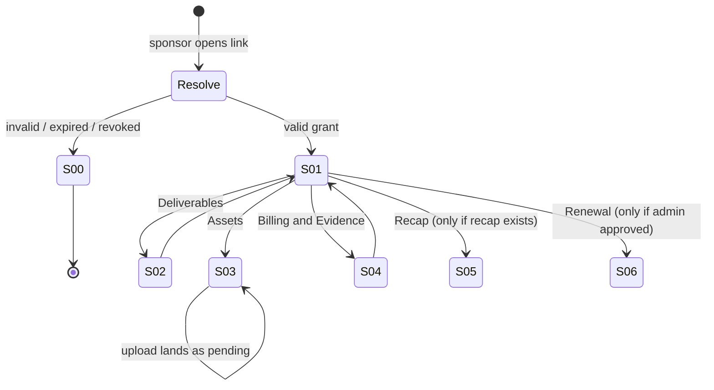

# Sponsor Portal UI Specification

## Overview

Defines the sponsor-facing portal at `/sponsor-portal/[token]` — a read-only, account-free surface
where a sponsor sees what they purchased, what state their deal is in, what has actually been
delivered, what evidence exists for it, and what has not been measured. It also defines the two
admin-side additions that feed it: grant management and evidence capture inside the existing Sponsor
Hub.

The portal's design problem is not layout. It is credibility. Every element must make the
scheduled/delivered and paid/fulfilled distinctions visually impossible to confuse, because merging
those is the failure mode that destroys sponsor trust.

### Target PRD

- PRD path: `docs/prd/sponsor-program-prd.md`
- Feature scope: FR-2 (scheduled vs delivered), FR-3 (portal without an account), FR-4 (honest
  metrics), FR-5 (derived status), FR-6 (recap), FR-7 (renewal review).

### Design Source

| Source | Path | Version |
|---|---|---|
| Prototype code | None supplied | n/a |
| Design system | `components/ui/primitives.tsx`, `app/globals.css` | working tree at `68a2ec8` |

## Prototype Management

No prototype was supplied. This document plus `docs/design/sponsor-program-design.md` are the
canonical specification. The frozen static MVP at `public/prototype/` is **not** a source for this
feature and must not be edited.

## External Resources Used

| Resource (project-tier label) | Feature-specific identifier | Notes |
|---|---|---|
| Design System | `StatusBadge`, `EmptyState`, `SkeletonBlock`, `ResponsiveTable`, `Timeline`, `PageHeader`, `Divider` from `components/ui/primitives.tsx` | Reused unmodified except where the reuse map says extend |
| Design Origin | `app/globals.css` custom-property token set (lines 35–107) | Portal inherits the league token set; no new palette |
| Visual Verification Environment | `output/playwright/sponsor-portal/` | Local browser evidence at 320, 390, 768, 1024, 1440 px; local proof is not hosted acceptance |

## AC Traceability (PRD → Screens)

| AC ID | AC Summary | Screen / State | Component | Adoption Decision |
|---|---|---|---|---|
| AC-005 | Placement with no evidence reports `scheduled`, never `delivered` | S-01 default | `DeliverableRow` | Adopted |
| AC-006 | Placement plus evidence reports `delivered` with timestamp | S-01 default | `DeliverableRow` | Adopted |
| AC-007 | `scheduled` and `delivered` are visually distinct with distinct labels | S-01, S-02 | `DeliveryStateBadge` | Adopted |
| AC-008 | Valid token renders portal scoped to one agreement | S-01 default | `SponsorPortalPage` | Adopted |
| AC-009 | Revoked/expired token renders non-enumerating notice | S-00 | `LinkNoLongerActive` | Adopted |
| AC-010 | No child, parent, roster, media, or admin-note data present | All screens | `SponsorPortalPage` | Adopted |
| AC-011 | Sponsor upload creates `pending` asset, nothing goes live | S-03 | `AssetChecklist` | Adopted |
| AC-014 | Bucket below threshold shows "below reporting threshold" | S-01, S-04 | `MetricBlock` | Adopted |
| AC-015 | Every metric block carries a "not measured" list | S-01, S-04 | `MetricBlock` | Adopted |
| AC-017 | Status chip is derived, never a stored value | S-01 header | `ProgramStatusChip` | Adopted |
| AC-018 | Recap claims trace to persisted evidence or rollups | S-05 | `RecapSummary` | Adopted |
| AC-019 | Unapproved renewal recommendation is not shown to sponsor | S-06 | `RenewalPanel` | Adopted |

## Screen List and Transitions

### Screen List

| Screen ID | Screen Name | Description | Entry Condition |
|---|---|---|---|
| S-00 | Link Not Active | Single indistinguishable notice for invalid, expired, or revoked tokens | Grant resolution fails for any reason |
| S-01 | Portal Overview | First view: identity, derived status, next step, proof strip, deliverables summary | Valid grant resolves |
| S-02 | Deliverables | Per-deliverable detail: what, where, when, state, evidence | Tab from S-01 |
| S-03 | Assets | Logo/asset requirements, approval state, upload | Tab from S-01 |
| S-04 | Billing & Evidence | Invoice, payment state, fulfillment evidence list, metric blocks | Tab from S-01 |
| S-05 | Recap | End-of-season summary, downloadable | Tab from S-01; enabled only when recap exists |
| S-06 | Renewal | Renewal review, admin-approved only | Tab from S-01; enabled only when approved |
| S-10 | Admin — Grants | Admin creates, copies once, rotates, revokes portal links | `/admin/sponsors`, sponsor detail |
| S-11 | Admin — Evidence Capture | Admin attaches evidence to a fulfillment requirement | `/admin/sponsors`, deliverable row |

### Transition Conditions

| Source | Destination | Trigger | Guard Condition |
|---|---|---|---|
| (external link) | S-01 | Sponsor opens `/sponsor-portal/[token]` | Grant exists, not revoked, `expires_at > now()` |
| (external link) | S-00 | Sponsor opens portal | Any resolution failure — never distinguished |
| S-01 | S-02 / S-03 / S-04 | Tab selection | Always available |
| S-01 | S-05 | Tab selection | `recap_report` row exists for the agreement |
| S-01 | S-06 | Tab selection | `renewal_review.approved_at is not null` |
| S-03 | S-03 (uploaded) | Sponsor submits asset | HTTPS URL or accepted upload; result is always `pending` |
| S-10 | S-10 (token shown once) | Admin creates grant | Plaintext token displayed exactly once, never re-retrievable |

### Screen Transition Diagram



## Component Decomposition

### Component Tree

```
SponsorPortalPage (server component, /sponsor-portal/[token])
  +-- PortalHeader
  |   +-- SponsorIdentity        (name, package, season)
  |   +-- ProgramStatusChip      (derived state)
  +-- NextStepCard               (single next action + owner)
  +-- ProofStrip                 (5 fixed checkpoints)
  +-- PortalTabs
      +-- OverviewPanel
      |   +-- DeliverableRow[]   (summary mode)
      |   +-- MetricBlock        (season totals)
      +-- DeliverablesPanel
      |   +-- DeliverableRow[]   (detail mode)
      |       +-- DeliveryStateBadge
      |       +-- EvidenceList
      +-- AssetChecklist
      +-- BillingEvidencePanel
      |   +-- InvoiceSummary
      |   +-- LedgerTimeline
      |   +-- EvidenceList
      |   +-- MetricBlock[]      (per deliverable)
      +-- RecapSummary
      +-- RenewalPanel
```

### Component: ProgramStatusChip

Renders the single derived state. This component holds no state logic of its own — it displays the
value returned by `buildSponsorshipProgramSummary`, per AC-017.

States displayed: `awaiting approval`, `awaiting payment`, `asset collection`, `scheduled`, `live`,
`fulfilled`, `renewal review`, `disputed`.

#### State x Display Matrix

| State | Default | Loading | Empty | Error | Partial |
|---|---|---|---|---|---|
| Display | `StatusBadge` with text label plus icon; colour is secondary to the label | `SkeletonBlock variant="text" lines={1}` sized to the widest label | Not possible — a resolved grant always has an agreement | Chip renders `status unavailable` in neutral tone; page continues | `disputed` overrides all other states and renders in `--danger` with the label "payment disputed" |

#### Interaction Definition

| AC ID | EARS Condition | User Action | System Response | State Transition | Error Handling |
|---|---|---|---|---|---|
| AC-017 | (ubiquitous) | None — display only | Renders derived state from summary | None | Neutral `status unavailable`, never a guessed state |
| AC-007 | While the deal is scheduled but unproven | None | Renders `scheduled`, never `live` or `fulfilled` | None | n/a |

### Component: ProofStrip

The five fixed checkpoints from the sponsor's first view: agreement signed, payment received, logo
approved, placements scheduled, recap delivered. Fixed set, fixed order — never reordered or
truncated, because a missing checkpoint is the information.

#### State x Display Matrix

| State | Default | Loading | Empty | Error | Partial |
|---|---|---|---|---|---|
| Display | Five items, each `done` / `pending` / `blocked` with text label and icon | `SkeletonBlock variant="text" lines={1}` x5, preserving layout height | Not possible — always five items | All five render `unknown` in neutral tone with a single "status temporarily unavailable" note | Individually resolvable: any checkpoint may be `unknown` while others resolve |

#### Interaction Definition

| AC ID | EARS Condition | User Action | System Response | State Transition | Error Handling |
|---|---|---|---|---|---|
| AC-007 | While placements exist without evidence | None | "Placements scheduled" is `done`; "recap delivered" stays `pending` | None | n/a |
| — | (ubiquitous) | Keyboard focus on a checkpoint | Reveals one-sentence plain-language explanation | None | n/a |

### Component: DeliverableRow

One promised benefit. This is the component the whole portal exists for.

#### State x Display Matrix

| State | Default | Loading | Empty | Error | Partial |
|---|---|---|---|---|---|
| Display | Deliverable label, plain-language placement location, start and end date, `DeliveryStateBadge`, evidence count | `SkeletonBlock variant="table-row" lines={3}` | `EmptyState` "No deliverables are recorded on this agreement yet" + "Contact your league" text (no CTA — sponsor cannot self-serve this) | Row renders label and dates; state badge shows `unavailable`; evidence count hidden | Dates known, state unknown: badge renders `unavailable`, row still lists what was purchased |

#### Interaction Definition

| AC ID | EARS Condition | User Action | System Response | State Transition | Error Handling |
|---|---|---|---|---|---|
| AC-005 | If a placement exists with no evidence row, then | None | Badge renders `scheduled` with the sentence "This placement is set up. Delivery has not been recorded yet." | None | n/a |
| AC-006 | When at least one evidence row exists | None | Badge renders `delivered` with the evidence `observed_at` date | `scheduled` → `delivered` | n/a |
| — | When the row is expanded | Click / Enter on row | Expands `EvidenceList` inline via `ExpandableRow` | collapsed → expanded | Expansion with zero evidence shows "No evidence recorded yet" |

### Component: DeliveryStateBadge

Deliberately separated from `ProgramStatusChip` so the two vocabularies can never be styled into
each other. Values: `not started`, `awaiting assets`, `scheduled`, `delivered`, `blocked`.

#### State x Display Matrix

| State | Default | Loading | Empty | Error | Partial |
|---|---|---|---|---|---|
| Display | Text label + shape-differentiated icon; `scheduled` uses an outline treatment and `delivered` a filled treatment so the two differ without colour | Inherits parent skeleton | n/a | `unavailable`, neutral | n/a |

#### Interaction Definition

| AC ID | EARS Condition | User Action | System Response | State Transition | Error Handling |
|---|---|---|---|---|---|
| AC-007 | (ubiquitous) | None | `scheduled` and `delivered` never share a fill treatment, a label, or an icon | None | n/a |

### Component: MetricBlock

Renders one measured quantity with its own honesty footer. Per AC-015 the "not measured" list is
content, not decoration, and an empty list is a test failure.

#### State x Display Matrix

| State | Default | Loading | Empty | Error | Partial |
|---|---|---|---|---|---|
| Display | Metric name in honest vocabulary (`placement renders`, `outbound clicks`), value, period, and a "What this does not measure" list | `SkeletonBlock variant="card"` | "No measurement recorded for this period" + unchanged "not measured" list | "Measurement temporarily unavailable" — **never renders 0** | Some metrics resolve, others show unavailable; the "not measured" list always renders |
| Below threshold | Value replaced by "below reporting threshold", with the explanation "Fewer than 25 recorded events. We do not report numbers this small because they can be misleading." | — | — | — | — |

#### Interaction Definition

| AC ID | EARS Condition | User Action | System Response | State Transition | Error Handling |
|---|---|---|---|---|---|
| AC-014 | If the bucket count is under 25, then | None | Renders threshold copy in place of the number | None | n/a |
| AC-015 | (ubiquitous) | None | Renders a non-empty "What this does not measure" list | None | Missing list is a build-blocking test failure |
| — | If a read fails, then | None | Renders "temporarily unavailable" | None | Never substitutes zero for unknown |

### Component: AssetChecklist

#### State x Display Matrix

| State | Default | Loading | Empty | Error | Partial |
|---|---|---|---|---|---|
| Display | Per-asset requirement: what is needed, format guidance, current state (`needed` / `submitted, in review` / `approved` / `changes requested`) | `SkeletonBlock variant="card"` | `EmptyState` "This package does not require assets from you" | "Asset status unavailable" + upload remains available | Some approved, some outstanding — outstanding sort first |

#### Interaction Definition

| AC ID | EARS Condition | User Action | System Response | State Transition | Error Handling |
|---|---|---|---|---|---|
| AC-011 | When the sponsor submits an asset HTTPS URL (TBD-02) | Submit form | Creates `sponsor_assets` row with `status = 'pending'`; row shows "submitted, in review" | `needed` → `submitted, in review` | Non-HTTPS or unparseable URL is rejected inline with a specific reason, never a generic failure |
| AC-011 | (ubiquitous) | Submit | No placement becomes live and no state advances without admin approval | None | n/a |

### Component: LinkNoLongerActive

#### State x Display Matrix

| State | Default | Loading | Empty | Error | Partial |
|---|---|---|---|---|---|
| Display | Single neutral message: "This link is no longer active. Contact your league for an updated link." No sponsor name, no organization name, no reason | n/a — rendered server-side | n/a | Identical message | n/a |

#### Interaction Definition

| AC ID | EARS Condition | User Action | System Response | State Transition | Error Handling |
|---|---|---|---|---|---|
| AC-009 | If the token is invalid, expired, or revoked, then | Open link | Identical response in all three cases; nothing distinguishes them | None | n/a |

### Component: SponsorGrantManager (admin, S-10)

#### State x Display Matrix

| State | Default | Loading | Empty | Error | Partial |
|---|---|---|---|---|---|
| Display | Grant list: label, created date, expiry, last accessed, access count, revoke action | `SkeletonBlock variant="table-row"` | `EmptyState` "No portal link yet" + `Button` "Create sponsor portal link" | `Alert` error + `Button` retry | List renders; access counts may show "unavailable" |
| Token just created | One-time panel showing the plaintext link with a copy control and the warning "This link is shown once. It cannot be retrieved later." | — | — | — | — |

#### Interaction Definition

| AC ID | EARS Condition | User Action | System Response | State Transition | Error Handling |
|---|---|---|---|---|---|
| AC-008 | When an admin creates a grant | Click "Create link" | Generates token, persists hash only, shows plaintext once | none → active | Failure shows reason; no partial grant is persisted |
| — | When an admin revokes a grant | Click "Revoke" + confirm | Sets `revoked_at`; portal immediately returns S-00 | active → revoked | Confirmation is required; revoke is not undoable |
| — | (ubiquitous) | Navigate away from the one-time panel | Plaintext is unrecoverable by design | — | UI states this before the admin can dismiss |

## Design Tokens and Component Map

### Environment Constraints

- Target browsers: current Chrome, Safari, Firefox, Edge.
- Theme support: inherits the existing light/dark handling in `app/globals.css`.
- The portal renders **outside** the authenticated `AppShell`. It gets a minimal public chrome with
  no navigation into league surfaces, because a sponsor has nowhere else to go in this product.

#### Responsive Behavior

| Breakpoint | Width | Key Changes |
|---|---|---|
| Mobile | < 768 px | Single column; proof strip becomes a vertical list; deliverables become stacked cards rather than a table; tabs become a horizontally scrollable strip |
| Tablet | 768–1023 px | Two-column overview; deliverables remain cards |
| Desktop | ≥ 1024 px | Overview and next-step side by side; deliverables render as `ResponsiveTable`; metric blocks in a 3-up grid |

### Existing Component Reuse Map

| UI Element | Decision | Existing Component | Notes |
|---|---|---|---|
| Status badge | Extend | `components/ui/primitives.tsx` `StatusBadge` | Add outline vs filled treatment so `scheduled` and `delivered` differ without colour |
| Empty state | Reuse | `EmptyState` | No modification |
| Loading skeleton | Reuse | `SkeletonBlock` | Uses existing `text` / `card` / `table-row` variants |
| Deliverables table | Reuse | `ResponsiveTable` | Existing responsive behaviour matches requirement |
| Ledger history | Reuse | `Timeline` | `ok` / `warning` / `danger` types map to payment, refund, dispute |
| Expandable evidence | Reuse | `ExpandableRow` | No modification |
| Page header | Reuse | `PageHeader` | No modification |
| Section divider | Reuse | `Divider` | No modification |
| `ProofStrip` | New | — | No five-checkpoint progress component exists |
| `MetricBlock` | New | — | `DataGrid` shows deltas but has no honesty footer, which is the point of this component |
| `DeliveryStateBadge` | New | — | Deliberately separate from `StatusBadge` to prevent vocabulary merging |
| App chrome | New | — | Portal must not mount `AppShell`; it has no league navigation |

### Design Tokens

Tokens are inherited from `app/globals.css`. No new palette is introduced.

#### Color Roles

| Role | Token | Value | Usage |
|---|---|---|---|
| Background Surface | `--bg` | `#fdf8f1` | Page background |
| Background Surface | `--surface` | `#ffffff` | Cards, panels |
| Background Surface | `--surface-soft` | `#fffaf4` | Proof strip, metric block interiors |
| Text | `--text` | `#1c2438` | Headings, values |
| Text | `--muted` | `#68665f` | "Not measured" lists, captions, period labels |
| Brand / Accent | `--accent` | `#1f3a63` | Section headings, links |
| Action | `--action` | `#c94f17` | Primary sponsor action (upload asset, download recap) |
| Status | `--ok` / `--ok-soft` | `#057a55` / `#d8f8e7` | `delivered`, `paid` |
| Status | `--warning` / `--warning-soft` | `#92400e` / `#fff3c4` | `scheduled`, `awaiting payment`, `in review` |
| Status | `--danger` / `--danger-soft` | `#b42318` / `#fee4e2` | `blocked`, `disputed` |
| Border | `--line` | `#e7ded1` | Card borders, dividers |

#### Typography Hierarchy

| Role | Font | Size | Weight | Line Height |
|---|---|---|---|---|
| Sponsor name (H1) | `--font-sans` | `--text-xl` (1.35 rem) | 700 | 1.2 |
| Section heading (H2) | `--font-sans` | `--text-lg` (1.2 rem) | 600 | 1.3 |
| Metric value | `--font-sans` | `--text-xl` | 700 | 1.1 |
| Body | `--font-sans` | `--text-base` (1 rem) | 400 | 1.5 |
| "Not measured" list | `--font-sans` | `--text-sm` (0.875 rem) | 400 | 1.5 |
| Caption / period | `--font-sans` | `--text-xs` (0.75 rem) | 400 | 1.4 |

#### Spacing, Elevation, Radius

Inherited: `--shadow-sm` for cards, `--shadow` for the one-time token panel, `--radius` (12 px) for
cards, `--radius-pill` for badges, `--radius-lg` (16 px) for the proof strip container.

## Visual Acceptance

### Golden States

1. **Awaiting payment, nothing delivered.** Status chip `awaiting payment`; proof strip shows one
   `done` and four `pending`; every deliverable `not started`; metric blocks show
   "No measurement recorded for this period" with populated "not measured" lists.
2. **Scheduled but unproven.** Placements exist, zero evidence rows. Every deliverable badge reads
   `scheduled` in outline treatment. **No element anywhere on the page reads `live`, `delivered`, or
   `fulfilled`.** This is the single most important visual acceptance state.
3. **Partially delivered.** Two of four deliverables `delivered` with evidence dates, two
   `scheduled`. Proof strip shows placements `done`, recap `pending`.
4. **Below reporting threshold.** Render count of 18 displays the threshold copy, not "18" and not
   "0".
5. **Disputed.** Ledger contains `DisputeOpened`. Status chip reads `payment disputed` in `--danger`
   and overrides every other status; deliverable states are unchanged, because a dispute is a
   payment fact, not a delivery fact.
6. **Link revoked.** Bare neutral notice, no sponsor name, no league name, no reason.

### Layout Constraints

- Content max-width 960 px, centred; the portal is a document, not a dashboard.
- No horizontal page scroll at 320 px. Wide tables scroll inside their own container.
- Proof strip must fit one viewport width at 320 px without truncating any label.
- The "not measured" list is never collapsed behind a disclosure control at any breakpoint.

## Accessibility Requirements

### Keyboard Navigation

| Component | Tab Order | Key Binding | Behavior |
|---|---|---|---|
| `PortalTabs` | 1 | Arrow Left/Right, Home/End | Roving tabindex; follows the WAI-ARIA tabs pattern |
| `ProofStrip` items | 2 | Tab | Each checkpoint focusable; focus reveals its plain-language explanation |
| `DeliverableRow` | 3 | Enter / Space | Expands and collapses the evidence list |
| `AssetChecklist` upload | 4 | Enter / Space | Opens the file/URL control |
| Recap download | 5 | Enter | Triggers download |

### Screen Reader

| Component | Role | Accessible Name | Live Region |
|---|---|---|---|
| `ProgramStatusChip` | `status` | "Sponsorship status: {state}" | `polite` |
| `ProofStrip` | `list` | "Delivery checkpoints" | none |
| `DeliveryStateBadge` | `img` with label, or text | "{deliverable}: {state}" | none |
| `MetricBlock` | `group` | "{metric name} for {period}" | none |
| "Not measured" list | `list` | "What this measurement does not prove" | none |
| Upload result | `status` | "Asset submitted and awaiting league review" | `polite` |
| `LinkNoLongerActive` | `alert` | "This link is no longer active" | `assertive` |

### Contrast Requirements

| Element | Foreground | Background | Ratio Target |
|---|---|---|---|
| Body text | `--text` `#1c2438` | `--surface` `#ffffff` | ≥ 4.5:1 |
| "Not measured" list | `--muted` `#68665f` | `--surface-soft` `#fffaf4` | ≥ 4.5:1 — verify; darken the token locally for this use if it fails |
| `delivered` badge | `--ok` `#057a55` | `--ok-soft` `#d8f8e7` | ≥ 4.5:1 |
| `scheduled` badge | `--warning` `#92400e` | `--warning-soft` `#fff3c4` | ≥ 4.5:1 |
| `disputed` badge | `--danger` `#b42318` | `--danger-soft` `#fee4e2` | ≥ 4.5:1 |

State is never conveyed by colour alone: every badge carries a text label, and `scheduled` versus
`delivered` additionally differ by fill treatment.

## Open Items

| ID | Description | Owner | Deadline |
|---|---|---|---|
| TBD-01 | ~~Default grant expiry~~ | Product owner | **Resolved 2026-08-19: season end.** Grant `expires_at` is set from the agreement season end date. |
| TBD-02 | ~~File upload versus HTTPS URL~~ | Product owner | **Resolved 2026-08-19: HTTPS URL.** The sponsor submits an HTTPS URL, reusing the `saveSponsor` validation at `lib/supabase/operations.ts:1613`. No storage provider is engaged, so no provider gate opens. |
| TBD-03 | ~~Recap artifact format~~ | Product owner | **Resolved 2026-08-19: stable URL.** The recap is a server-rendered page at a stable URL. No PDF dependency, so no additional ADR is required. |
| TBD-04 | Confirm `--muted` on `--surface-soft` meets 4.5:1; if not, define a portal-local darker muted token | Implementer | Phase 3 |

*TBD-01 through TBD-03 were resolved by the product owner on 2026-08-19. TBD-04 remains open and is scoped to Phase 3 implementation.*

## Update History

| Date | Version | Changes | Author |
|---|---|---|---|
| 2026-08-19 | 1.0 | Initial version | Michael Major |
